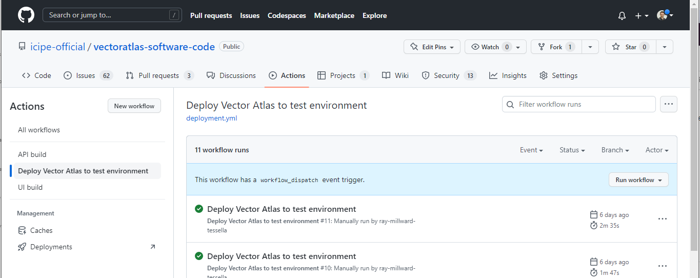
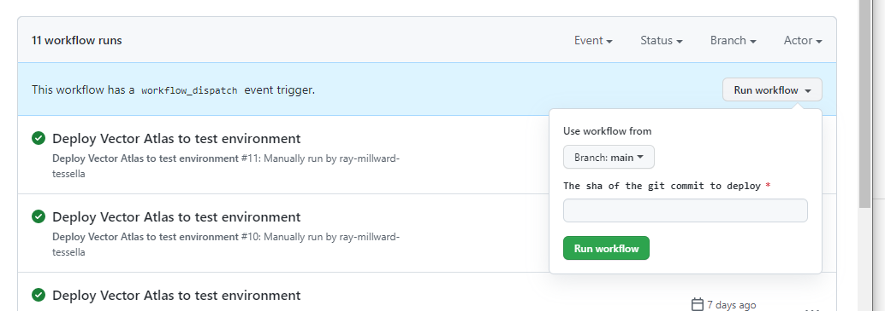

# Deployment

## Doing a regular simple deployment

For a simple deployment with configuration changes (or if those configuration changes can be made after deployment), there is a GitHub action for deploying the system.

The system must have been set up and configured for the first time prior to running this action (see **First time  set up for a new environment** below).


To run the deployment go to the **Actions** tab, pick the **Deploy Vector Atlas to test environment** in the left hand list. There is a button to on the right with **Run workflow**, click on this and it will need the commit sha of the commit to be deployed to the environment.



The deployment then needs to be approved by one of the core team - there is a limit of 6 people for this so it may not be the whole team.

The action proceeds to ssh into the environment and run the deployment script, which is the same steps as the manual deployment below.

## Logging into the base machine

You will need to get access to the certificate file for ssh access to the test machine. With that then you can ssh to the machine from a WSL terminal (you may also need to remove permissions on the certificate file with `chmod og-rwx {certificate file name}`) using the following:
```
ssh -i {certificate pem file here} vectoratlasadmin@20.87.47.170
```

The certificate and other credentials are stored in the Hybrid Intelligence Notes Project Database under technical notes for the project. ICIPE ICT also maintains access to the system.

## Manually updating the system
If a deployment is more complex than is possible with the automated deployment then log into the virtual machine and run:
```
cd ~/vector-atlas/vectoratlas-software-code/src/Docker
docker-compose down
git fetch
git checkout --force [sha of the desired commit]

cd ..
chmod +x buildVersionFiles.sh
./buildVersionFiles.sh

cd Docker
docker-compose build
docker-compose up --detach
```

### Running database migrations
Migrations are normally run as part of the docker compose stack but if any migrations need to be run manually on the database (in the `src/API/src/db/migrations` folder), run the following command to apply these migrations to the db:
```
docker run -it -e POSTGRES_USER=$VA_DB_USER -e POSTGRES_PASSWORD=$VA_DB_PASSWORD -e POSTGRES_HOST=vectoratlas-db.postgres.database.azure.com -e POSTGRES_DB=postgres -e DB_ENCRYPT_CONNECTION=true docker-api npm run migrations:runallprod
```

## First time set up for a new environment
### Configuring the base machine
Once logged into a new virtual machine some basic software for the environment needs to be installed. These include git:
```
sudo apt install git
```
and docker:
```
sudo apt update
sudo apt install apt-transport-https ca-certificates curl software-properties-common
curl -fsSL https://download.docker.com/linux/ubuntu/gpg | sudo apt-key add -
sudo add-apt-repository "deb [arch=amd64] https://download.docker.com/linux/ubuntu focal stable"
apt-cache policy docker-ce
sudo apt install docker-ce
sudo systemctl status docker
sudo usermod -aG docker ${USER}
```
Full guide here
https://www.digitalocean.com/community/tutorials/how-to-install-and-use-docker-on-ubuntu-20-04

Log out and in again to apply groups.

Install docker compose
```
sudo curl -L "https://github.com/docker/compose/releases/download/v2.11.0/docker-compose-linux-x86_64" -o /usr/local/bin/docker-compose
sudo chmod +x /usr/local/bin/docker-compose
```
Check for a later release here https://github.com/docker/compose/releases - we are currently using 2.11.0.


### Clone the repo
```
mkdir vector-atlas
cd vector-atlas
git clone https://github.com/icipe-official/vectoratlas-software-code.git
cd vectoratlas-software-code/
```

### Initialising the database
From the Vector Atlas virtual machine, run:
```
sudo apt install postgresql postgresql-contrib postgis
cd ~/vector-atlas/vectoratlas-software-code/src/Database
psql -U [admin users] -d postgres -h vectoratlas-db.postgres.database.azure.com -a -f init_db.sql
```
Then enter the admin user password when prompted to run the script.

### Set up the tile server
```
cd ~/vector-atlas/vectoratlas-software-code/src/TileServer
chmod +x installTools.sh
chmod +x getMapData.sh
chmod +x generateTiles.sh
sudo ./installTools.sh
./getMapData.sh

cd data/
mkdir blobStore
cd blobStore/
wget https://github.com/icipe-official/vectoratlas-software-code/files/9478888/an_gambiae_map.zip
unzip an_gambiae_map.zip
rm -rf an_gambiae_map.zip
cd ../..
./generateTiles.sh
```

### Adding the version numbers
```
cd ~/vector-atlas/vectoratlas-software-code/src
chmod +x buildVersionFiles.sh
./buildVersionFiles.sh
```

### Generating the token key
```
cd ~/vector-atlas/vectoratlas-software-code/src
chmod +x generateTokenKey.sh
./generateTokenKey.sh
```

### Adding the configuration
```
cd ~/vector-atlas/vectoratlas-software-code/src/UI
cp .env.production.template .env.production
```
Then the `.env.production` files needs to be edited to insert the Auth0 secrets.

Secondly edit the `~/.bashrc` file to add additional environment variables at the end. Insert the lines:
```
export VA_DB_USER=[db user here]
export VA_DB_PASSWORD=[db password here]
```
Also configure the token secret with:
```
key=`head -c 20 /dev/random | base64`
echo "export VA_TOKEN_SECRET=\"$key\"" >> ~/.bashrc
```
then run `source ~/.bashrc` to load the changes or log out and in again (both will reload the contents of the file).

Create a folder in `/etc` for the API config and copy the config files in.
```
mkdir -p /etc/vector-atlas/api
cp ~/vector-atlas/vectoratlas-software-code/src/API/public/*.json /etc/vector-atlas/api
```
then edit any flags or settings that are different in the environment.

### Start the system
```
cd ~/vector-atlas/vectoratlas-software-code/src/Docker
docker-compose build
docker-compose up --detach
```

### Setting up certificates

Install nginx
```
sudo apt install nginx
sudo systemctl start nginx
```
Then edit `/etc/nginx/sites-available/default` to replace the section:
```
location / {
    # First attempt to serve request as file, then
    # as directory, then fall back to displaying a 404.
    try_files $uri $uri/ =404;
}
```
with
```
location / {
    proxy_pass http://127.0.0.1:3000;
}
```

Install and run certbot to create and update the configuration of the nginx server to use ssl.
```
sudo snap install --classic certbot
sudo ln -s /snap/bin/certbot /usr/bin/certbot
sudo certbot --nginx
```

Certificates are stored here
```
/etc/letsencrypt/live/vectoratlas.icipe.org/fullchain.pem
/etc/letsencrypt/live/vectoratlas.icipe.org/privkey.pem
```

### Setting up analytics
These are the steps to set up analytics:
1. Navigate to `http://vectoratlas.icipe.org/analytics`, and log in to the server with the username `admin` and password `umami`
1. Once logged in, click on `Settings` then `Accounts`. Edit the admin account and change the password to something sensible, making a note of it somewhere secure.
1. Click on `Websites` under `Settings`. This should display the `You don't have any websites configured` message. Click on `Add website`.
1. In the dialog box, enter `vector-atlas` as the name and `vectoratlas.icipe.org` as the domain. Click on `Save`.
1. The new website should be displayed on the screen. Click the `</>` icon and copy the `data-website-id` and `src` parameters.
1. Navigate to the UI code, and paste the `data-website-id` as the `NEXT_PUBLIC_ANALYTICS_ID` in both `.env.local` and `.env.production`. Paste the `src` value as `NEXT_PUBLIC_ANALYTICS_URL` in these files too.
1. Navigate to the Docker folder, and run the following to restart the ui container:
```
docker compose stop ui
docker compose build ui
docker compose up ui
```
1. Once the UI is running again, navigate to the UI homepage. This visit should appear in the dashboard of the analytics site.

