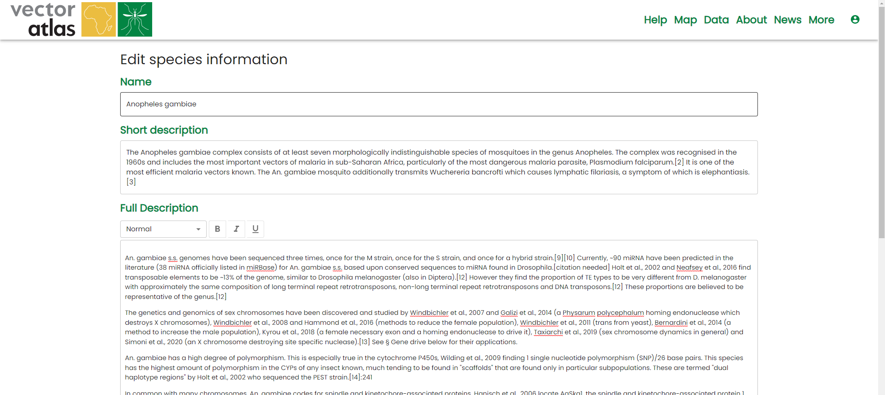
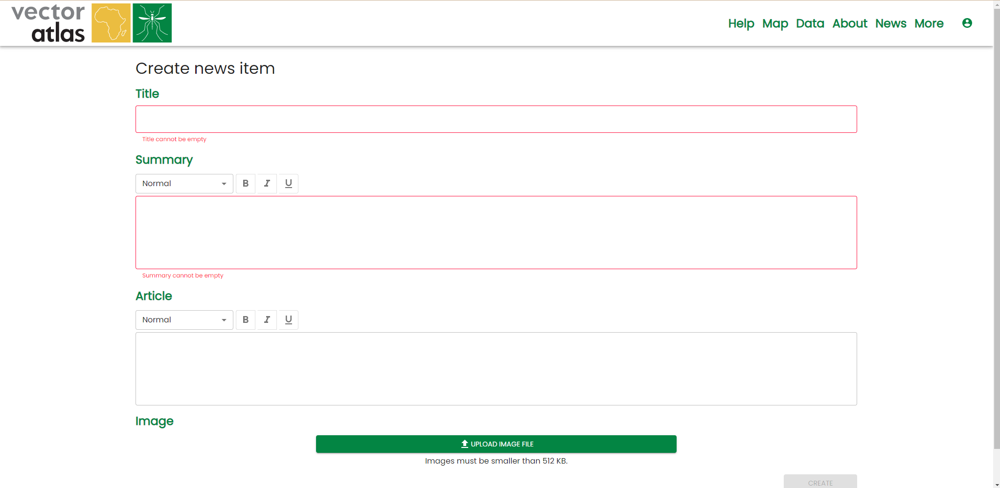
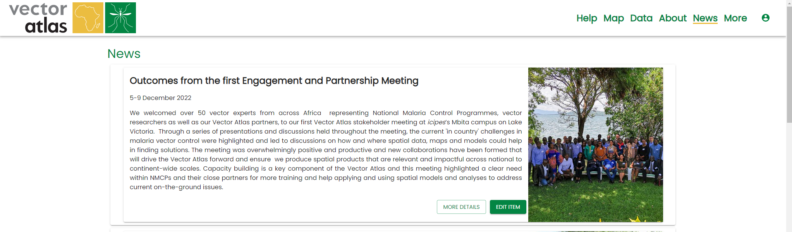
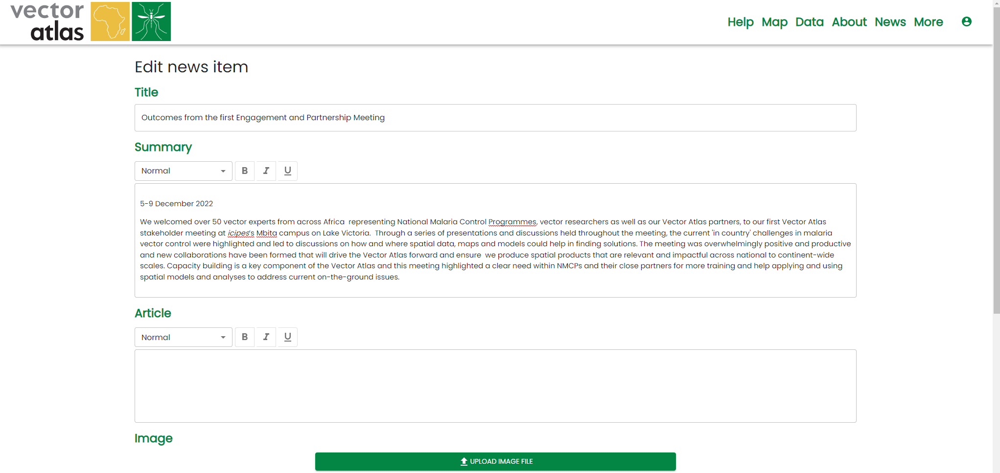

# Editor maintenance

## Editing species information

To edit species pages you will need the `Editor` role. 

### Creating a new species page

To create a new species page go to the [/species/edit](https://vectoratlas.icipe.org/species/edit) route. This will bring up the species editor where you can include a name, short description and full description for the species. An image can also be uploaded for the species but currently this is restricted to 512KB so that users on low bandwidth connections do not have to download too much information.

Once the page is ready then click `Create`.

### Editing a species page

Currently there is no direct route for an editor to load the details for an existing page into the editor. To get there an editor has to go to the [species list](https://vectoratlas.icipe.org/species) page, click on the item to be edited to go to the details page. The details page will be a url like `/species/details?id=8abc-123`, change this to the `/species/edit` route instead of `/species/details`, so the result will be something like `/species/edit?id=8abc-123`

Once finished editing, click `Update` to apply the changes.

## Editing news stories

To edit news items you will need the `Editor` role. 

### Creating new news stories

To create a new news story go to the [/news/edit](https://vectoratlas.icipe.org/news/edit) route. This will bring up the news editor where you can include a title, summary and more details for the article. Only the title and summary are shown on the home page and the news list page. The details are shown for the specific page for that story.

An image can also be uploaded for the story but currently this is restricted to 512KB so that users on low bandwidth connections do not have to download too much information.

Once the story is ready then click `Create`.

### Editing an existing news story

Go to the [news list](https://vectoratlas.icipe.org/news) page and find the story you want to edit. If you have the editor role then you will see the `Edit item` button, clicking on that button will direct you to the same editor as for a new item but with the existing details filled in.

Make the changes to the story and press `Update`. Note that this will bring that story to the top of the list because they are ordered by when they were last updated.

