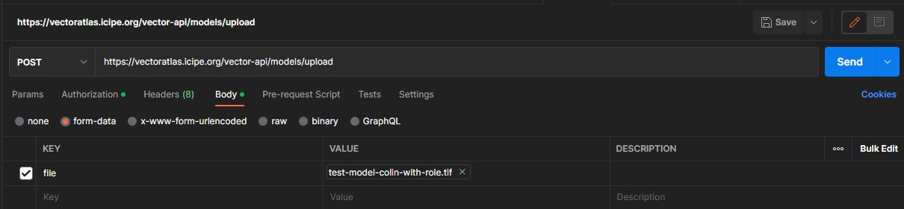

# Vector Atlas System Test Script

## Contents
### 1. Introduction
### 2. System Test Script (Functional Testing)
### 3. Production Deployment Test Script (Functional Testing)
### 4. Non-Functional Test Script

---

## 1. Introduction
### 1.1 Purpose of this document

This document is the System Test Script for project 10942.

### 1.2 Scope of this document

This documents the test cases to test new functionality and, where available, existing dependent regression testing for the existing system. It also provides non-functional test cases where appropriate.

### 1.3 Context of this issue
This System Test Script has been produced during the project and any subsequent changes will be documented as the project progresses.

## 2. System Test Script (Functional Testing)

System testing is carried out as part of every sprint to ensure the completed stories and updated system meet all the applicable requirements. For full details on the system testing process, please consult the project test plan.

**Template for Test Cases**
> **TC-** - **TITLE**<br>
> **DATE:** Date<br>
> **TESTER:** Name<br>
> **PRE-CONDITION/ASSUMPTIONS:**<br>None
>
> | REF ID(s): | [REF UNIQUE ID(s)](URL to ISSUE) | OVERALL RESULT: | Pass/Fail/Blocked |
> | ------------ | --------- | --------- | ------|
> | **Step** | **Description** | **Expected Result** | **Result** |
> | 1 |  |  |  |
> | 2 |  |  |  |
> | 3 |  |  |  |
> | 4 |  |  |  |
> | 5 |  |  |  |
> 
> Comments: 

### Test data ###

**Vector Atlas homepage:** https://vectoratlas.icipe.org<br>
**Vector Atlas help site:** https://vectoratlas.icipe.org/help/<br>
**Vector Atlas map page:** https://vectoratlas.icipe.org/map<br>
**Vector Atlas about page:** https://vectoratlas.icipe.org/about<br>
**Vector Atlas secure URL:** https://vectoratlas.icipe.org/<br>
**Vector Atlas sources page:** https://vectoratlas.icipe.org/sources<br>
**Vector Atlas species list page:** https://vectoratlas.icipe.org/species<br>
**Vector Atlas new sources:** https://vectoratlas.icipe.org/new_source/<br>
**Vector Atlas API route:** https://vectoratlas.icipe.org/vector-api/graphql<br>
**Vector Atlas data hub page:** https://vectoratlas.icipe.org/hub<br>
**Vector Atlas model upload page:** https://vectoratlas.icipe.org/model_upload<br>
**Vector Atlas data upload page:** https://vectoratlas.icipe.org/upload<br>
**Vector Atlas user settings page:** https://vectoratlas.icipe.org/upload<br>
**Case study text:** `docs\System Test Script\test-documents\case-study-text.md`<br>
**Test Data folder:** `docs\System Test Script\test-data\`<br>

***
> **TC-0.1** - **Vector Atlas help site exists and displays screenshots**<br>
> **DATE:** 08/09/2022<br>
> **TESTER:** Colin Turner<br>
> **PRE-CONDITION/ASSUMPTIONS:**<br>None
>
> | REF ID(s): | [10](https://github.com/icipe-official/vectoratlas-software-code/issues/10) | OVERALL RESULT: | Pass |
> | ------------ | --------- | --------- | ------|
> | **Step** | **Description** | **Expected Result** | **Result** |
> | 1 | Navigate to Vector Atlas homepage | Vector Atlas homepage appears | Pass |
> | 2 | Open a new tab on your browser | A new tab opens| Pass |
> | 2 | In the new tab, navigate to Vector Atlas help site | Vector Atlas help site appears | Pass |
> | 3 | Click on "How to upload Vector Atlas data" link and check that an image is displayed | How to upload Vector Atlas data page appears and an image is displayed | Pass | 
>
> **Comments:** None

***

> **TC-0.2** - **A UI and API version is displayed on the website**<br>
> **DATE:** 08/09/2022<br>
> **TESTER:** Colin Turner<br>
> **PRE-CONDITION/ASSUMPTIONS:**  <br><br>Tester is logged out of the website and has a Vector Atlas website account
>
> | REF ID(s): | [12](https://github.com/icipe-official/vectoratlas-software-code/issues/12) | OVERALL RESULT: | Pass |
> | ------------ | --------- | --------- | ------|
> | **Step** | **Description** | **Expected Result** | **Result** |
> | 1 | Navigate to Vector Atlas homepage, scroll to the bottom of the page | UI and API Version are displayed | Pass |
> | 2 | Click on "Login", login into the website | User is logged in and taken to the Vector Atlas homepage | Pass |
> | 4 | Navigate to Vector Atlas homepage, ensure you are still shown as logged in, scroll to the bottom of the page | UI and API Version are displayed | Pass |
> 
> **Comments:** Logging into the website redirects to port 3000, being logged in and manually navigating to port 1234 will display the UI and API versions correctly. This should only be an issue while using locally hosted environments.

***

> **TC-0.3** - **News section Feature flag exists and can be disabled**<br>
> **DATE:** 01/09/2022<br>
> **TESTER:** Colin Turner<br>
> **PRE-CONDITION/ASSUMPTIONS:**  <br>The feature flag for HOME_NEWS is set to true in src\API\public\feature_flags.json and tester is logged into the website
>
> | REF ID(s): | [12](https://github.com/icipe-official/vectoratlas-software-code/issues/12), [22](https://github.com/icipe-official/vectoratlas-software-code/issues/22) | OVERALL RESULT: | Pass |
> | ------------ | --------- | --------- | ------|
> | **Step** | **Description** | **Expected Result** | **Result** |
> | 1 | Navigate to Vector Atlas homepage | Vector Atlas homepage appears | Pass |
> | 2 | Check that the News section is visible | News section is visible | Pass |
> | 3 | Set the feature flag for HOME_NEWS to false in src\API\public\feature_flags.json | Feature flag for HOME_NEWS is set to false | Pass |
> | 4 | Refresh the Vector Atlas webpage, News section is no longer visible. | After page refresh, the News section is no longer visible | Pass |
> 
> **Comments:**

***

> **TC-0.4** - **Stats section Feature flag exists and can be disabled**<br>
> **DATE:** 01/09/2022<br>
> **TESTER:** Colin Turner<br>
> **PRE-CONDITION/ASSUMPTIONS:**  <br>The feature flag for HOME_STATS is set to true in src\API\public\feature_flags.json and tester is logged into the website
>
> | REF ID(s): | [12](https://github.com/icipe-official/vectoratlas-software-code/issues/12), [22](https://github.com/icipe-official/vectoratlas-software-code/issues/22) | OVERALL RESULT: | Pass |
> | ------------ | --------- | --------- | ------|
> | **Step** | **Description** | **Expected Result** | **Result** |
> | 1 | Navigate to Vector Atlas homepage | Vector Atlas homepage appears | Pass |
> | 2 | Check that the Stats section is visible | Stats section is visible | Pass |
> | 3 | Set the feature flag for HOME_STATS to false in src\API\public\feature_flags.json | Feature flag for HOME_STATS is set to false | Pass |
> | 4 | Refresh the Vector Atlas webpage, Stats section is no longer visible. | After page refresh, the Stats section is no longer visible | Pass |
> 
> **Comments:**

***

> **TC-0.5** - **Map section Feature flag exists and can be disabled**<br>
> **DATE:** 01/09/2022<br>
> **TESTER:** Colin Turner<br>
> **PRE-CONDITION/ASSUMPTIONS:**  <br>The feature flag for MAP is set to true in src\API\public\feature_flags.json and tester is logged into the website
>
> | REF ID(s): | [12](https://github.com/icipe-official/vectoratlas-software-code/issues/12) | OVERALL RESULT: | Pass |
> | ------------ | --------- | --------- | ------|
> | **Step** | **Description** | **Expected Result** | **Result** |
> | 1 | Navigate to Vector Atlas homepage | Vector Atlas homepage appears | Pass |
> | 2 | Check that the Map section is visible | Map section is visible | Pass |
> | 3 | Set the feature flag for MAP to false in src\API\public\feature_flags.json | Feature flag for MAP is set to false | Pass |
> | 4 | Refresh the Vector Atlas homepage, Map section is no longer visible. | After page refresh, the Map section is no longer visible | Pass |
> 
> **Comments:**

***

> **TC-0.7** - **Vector Atlas homepage exists**<br>
> **DATE:** 01/09/2022<br>
> **TESTER:** Colin Turner<br>
> **PRE-CONDITION/ASSUMPTIONS:**  <br>None
>
> | REF ID(s): | [21](https://github.com/icipe-official/vectoratlas-software-code/issues/21) | OVERALL RESULT: | Pass |
> | ------------ | --------- | --------- | ------|
> | **Step** | **Description** | **Expected Result** | **Result** |
> | 1 | Navigate to Vector Atlas homepage | Vector Atlas homepage appears | Pass |
> 
> **Comments:** 

***

> **TC-0.8** - **Vector Atlas homepage has a navigation bar at the top of the page that contains the Vector Atlas logo**<br>
> **DATE:** 01/09/2022<br>
> **TESTER:** Colin Turner<br>
> **PRE-CONDITION/ASSUMPTIONS:**  <br>None
>
> | REF ID(s): | [21](https://github.com/icipe-official/vectoratlas-software-code/issues/21) | OVERALL RESULT: | Pass |
> | ------------ | --------- | --------- | ------|
> | **Step** | **Description** | **Expected Result** | **Result** |
> | 1 | Navigate to Vector Atlas homepage | Vector Atlas homepage appears | Pass |
> | 2 | Check that a navigation bar is visible at the top of the homepage and that the Vector Atlas logo is visible  | Navigation bar and logo are visible | Pass |
> 
> **Comments:** 

***

> **TC-0.9** - **The navigation bar contains a Map link**<br>
> **DATE:** 01/09/2022<br>
> **TESTER:** Colin Turner<br>
> **PRE-CONDITION/ASSUMPTIONS:**  <br>The feature flag for MAP needs to be set to true in src\API\public\feature_flags.json
>
> | REF ID(s): | [21](https://github.com/icipe-official/vectoratlas-software-code/issues/21), [22](https://github.com/icipe-official/vectoratlas-software-code/issues/22) | OVERALL RESULT: | Pass |
> | ------------ | --------- | --------- | ------|
> | **Step** | **Description** | **Expected Result** | **Result** |
> | 1 | Navigate to Vector Atlas homepage | Vector Atlas homepage appears | Pass |
> | 2 | Check that the navigation bar at the top of the homepage has a "Map" option  | Navigation bar is visible and has a link to a map page | Pass |
> 
> **Comments:** 

***

> **TC-0.10** - **The navigation bar Map link navigates to a page displaying an interactive map**<br>
> **DATE:** 08/09/2022<br>
> **TESTER:** Colin Turner<br>
> **PRE-CONDITION/ASSUMPTIONS:**  <br>The feature flag for MAP needs to be set to true in src\API\public\feature_flags.json
>
> | REF ID(s): | [21](https://github.com/icipe-official/vectoratlas-software-code/issues/21),[22](https://github.com/icipe-official/vectoratlas-software-code/issues/22) | OVERALL RESULT: | Pass |
> | ------------ | --------- | --------- | ------|
> | **Step** | **Description** | **Expected Result** | **Result** |
> | 1 | Navigate to Vector Atlas homepage | Vector Atlas homepage appears | Pass |
> | 2 | Check that the Map page can be navigated to by clicking Map in the navigation bar | A page appears with an interactive map visible  | Pass |
> 
> **Comments:** 

***

> **TC-0.12** - **The background map image should load in under 20s**<br>
> **DATE:** 01/09/2022<br>
> **TESTER:** Colin Turner<br>
> **PRE-CONDITION/ASSUMPTIONS:**  <br><br>The feature flag for MAP needs to be set to true in src\API\public\feature_flags.json<br>TC-9 and TC-10 pass<br>The browser being used has been throttled to simulate a connection speed of 1MB/s (i.e. Dev tools in Chrome)
>
> | REF ID(s): | [22](https://github.com/icipe-official/vectoratlas-software-code/issues/22) | OVERALL RESULT: | Pass |
> | ------------ | --------- | --------- | ------|
> | **Step** | **Description** | **Expected Result** | **Result** |
> | 1 | Navigate to Vector Atlas map page | Vector Atlas map page appears | Pass |
> | 2 | The load time of the map page on a poor connection (1Mb/s) should be <20s | The target map page load time should be <20s | Pass - see comments |
> 
> **Comments:** Average map page load time on a simulated 1Mb/s connection: 7s to 8s

***

> **TC-1.1** - **An About page exists and can be navigated to**<br>
> **DATE:** 24/01/2022<br>
> **TESTER:** Colin Turner<br>
> **PRE-CONDITION/ASSUMPTIONS:**
>
> | REF ID(s): | [32](https://github.com/icipe-official/vectoratlas-software-code/issues/32) | OVERALL RESULT: | Pass |
> | ------------ | --------- | --------- | ------|
> | **Step** | **Description** | **Expected Result** | **Result** |
> | 1 | Naviagte to the Vector Atlas home page | Home page appears | Pass |
> | 2 | Click on About link in nav bar | About page appears |  Pass |
> 
> **Comments:**

***

> **TC-1.2** - **The About page contains a description of the project**<br>
> **DATE:** 20/09/2022<br>
> **TESTER:** Colin Turner<br>
> **PRE-CONDITION/ASSUMPTIONS:**
>
> | REF ID(s): | [32](https://github.com/icipe-official/vectoratlas-software-code/issues/32) | OVERALL RESULT: | Pass |
> | ------------ | --------- | --------- | ------|
> | **Step** | **Description** | **Expected Result** | **Result** |
> | 1 | Naviagte to the Vector Atlas about page | About page appears | Pass |
> | 2 | Check that an "About" section is visible | A section tiltled "About" is visible and contains a description of the project | Pass |
> 
> **Comments:**

***

> **TC-1.3** - **The About page contains contact details**<br>
> **DATE:** 20/09/2022<br>
> **TESTER:** Colin Turner<br>
> **PRE-CONDITION/ASSUMPTIONS:**
>
> | REF ID(s): | [32](https://github.com/icipe-official/vectoratlas-software-code/issues/32) | OVERALL RESULT: | Pass |
> | ------------ | --------- | --------- | ------|
> | **Step** | **Description** | **Expected Result** | **Result** |
> | 1 | Naviagte to the Vector Atlas about page | About page appears | Pass |
> | 2 | Check that contact details are visible somewhere on the page | A section containing contact details is visible | Pass |
> 
> **Comments:**

***

> **TC-1.4** - **The About page contains team details**<br>
> **DATE:** 20/09/2022<br>
> **TESTER:** Colin Turner<br>
> **PRE-CONDITION/ASSUMPTIONS:**
>
> | REF ID(s): | [32](https://github.com/icipe-official/vectoratlas-software-code/issues/32) | OVERALL RESULT: | Pass |
> | ------------ | --------- | --------- | ------|
> | **Step** | **Description** | **Expected Result** | **Result** |
> | 1 | Naviagte to the Vector Atlas about page | About page appears | Pass |
> | 2 | Check that details of team members are somewhere on the page | A section containing details of team members is visible | Pass |
> 
> **Comments:**

***

> **TC-1.5** - **The About page contains a list of partners and their logos**<br>
> **DATE:** 20/09/2022<br>
> **TESTER:** Colin Turner<br>
> **PRE-CONDITION/ASSUMPTIONS:**
>
> | REF ID(s): | [32](https://github.com/icipe-official/vectoratlas-software-code/issues/32) | OVERALL RESULT: | Pass |
> | ------------ | --------- | --------- | ------|
> | **Step** | **Description** | **Expected Result** | **Result** |
> | 1 | Naviagte to the Vector Atlas about page | About page appears | Pass |
> | 2 | Check that a list of partners and their logos are somewhere on the page | A section listing partners and their logos is visible | Pass |
> 
> **Comments:**

***

> **TC-1.7** - **Changes to the Map feature flag can be seen on the website without needing to rebuild the environment**<br>
> **DATE:** 21/09/2022<br>
> **TESTER:** Colin Turner<br>
> **PRE-CONDITION/ASSUMPTIONS:**<br>Tester is logged into Vector Atlas website
>
> | REF ID(s): | [71](https://github.com/icipe-official/vectoratlas-software-code/issues/71) | OVERALL RESULT: | Pass |
> | ------------ | --------- | --------- | ------|
> | **Step** | **Description** | **Expected Result** | **Result** |
> | 1 | Set the feature flag for Map to `true` in src\API\public\feature_flags.json | Feature flag for Map is set to `true` | Pass |
> | 2 | If the flag was changed to `true`,  stop the environment then restart it with `docker compose up` | Map feature flag is set to `true` |Pass |
> | 3 | Naviagte to the Vector Atlas homepage, check that the Map section is visible | Map section is visible on the homepage | Pass |
> | 4 | Set the Map feature flag to `false` | Map feature flag set to `false` | Pass |
> | 5 | Stop the environment, then restart it with `docker compose up`| Environment is restarted | Pass |
> | 6 | Refresh the homepage, check that the Map section is no longer visible | Map section is no longer visible on the homepage | Pass |
> 
> Comments: Setting the map feature flag to false disables the map link on the homepage and removes the interactive map from the map page. A map image is still visible on the homepage that links to the map page (the interactive map is not visible)

***

> **TC-1.8** - **Changes to the News feature flag can be seen on the website without needing to rebuild the environment**<br>
> **DATE:** 21/09/2022<br>
> **TESTER:** Colin Turner<br>
> **PRE-CONDITION/ASSUMPTIONS:**<br>Tester is logged into Vector Atlas website
>
> | REF ID(s): | [71](https://github.com/icipe-official/vectoratlas-software-code/issues/71) | OVERALL RESULT: | Pass |
> | ------------ | --------- | --------- | ------|
> | **Step** | **Description** | **Expected Result** | **Result** |
> | 1 | Set the feature flag for News to `true` in src\API\public\feature_flags.json | Feature flag for News is set to `true` | Pass |
> | 2 | If the flag was changed to `true`,  stop the environment then restart it with `docker compose up` | News feature flag is set to `true` |Pass |
> | 3 | Naviagte to the Vector Atlas homepage, check that the News section is visible | News section is visible on the homepage | Pass |
> | 4 | Set the News feature flag to `false` | News feature flag set to `false` | Pass |
> | 5 | Stop the environment, then restart it with `docker compose up`| Environment is restarted | Pass |
> | 6 | Refresh the homepage, check that the News section is no longer visible | News section is no longer visible on the homepage | Pass |
> 
> Comments: 

***

> **TC-1.9** - **Changes to the Stats feature flag can be seen on the website without needing to rebuild the environment**<br>
> **DATE:** 21/09/2022<br>
> **TESTER:** Colin Turner<br>
> **PRE-CONDITION/ASSUMPTIONS:**<br>Tester is logged into Vector Atlas website
>
> | REF ID(s): | [71](https://github.com/icipe-official/vectoratlas-software-code/issues/71) | OVERALL RESULT: | Pass |
> | ------------ | --------- | --------- | ------|
> | **Step** | **Description** | **Expected Result** | **Result** |
> | 1 | Set the feature flag for Stats to `true` in src\API\public\feature_flags.json | Feature flag for Stats is set to `true` | Pass |
> | 2 | If the flag was changed to `true`,  stop the environment then restart it with `docker compose up` | Stats feature flag is set to `true` | Pass |
> | 3 | Naviagte to the Vector Atlas homepage, check that the Stats section is visible | Stats section is visible on the homepage | Pass |
> | 4 | Set the Stats feature flag to `false` | Stats feature flag set to `false` | Pass |
> | 5 | Stop the environment, then restart it with `docker compose up`| Environment is restarted | Pass |
> | 6 | Refresh the homepage, check that the Stats section is no longer visible | Stats section is no longer visible on the homepage | Pass |
> 
> Comments:

***

> **TC-1.10** - **Changes to the map style can be seen on the website without needing to rebuild the environment**<br>
> **DATE:** 21/09/2022<br>
> **TESTER:** Colin Turner<br>
> **PRE-CONDITION/ASSUMPTIONS:**<br>Tester is logged into Vector Atlas website
>
> | REF ID(s): | [71](https://github.com/icipe-official/vectoratlas-software-code/issues/71) | OVERALL RESULT: | Pass |
> | ------------ | --------- | --------- | ------|
> | **Step** | **Description** | **Expected Result** | **Result** |
> | 1 | Ensure the map feature flag is set to `true` in src\API\public\feature_flags.json | Feature flag for Stats is set to `true` | Pass |
> | 2 | If the flag was changed to `true`,  stop the environment then restart it with `docker compose up` | Map feature flag is set to `true` |Pass |
> | 3 | Navigate to the Vector Atlas map page  | Map page and interactive map is visible | Pass |
> | 4 | Make the following changes to src\API\public\map_styles.json:<br><br>`oceans fillColor: [255,165,0,1]`<br><br>`countries fillColor:[238,130,238,0.25]`<br><br>`land fillColor: [255,0,0,0.5]`<br><br>`lakes_reservoirs fillColor: [0,0,0,1]`<br><br>`rivers_lakes strokeColor: [0,0,0,1]` | src\API\public\map_styles values are changed | Pass |
> | 5 | Stop the environment, then restart it with `docker compose up`| Environment is restarted | Pass |
> | 6 | Refresh the Map page | Map page appears, , the colours of the map have changed, oceans/seas are yellow, land is pink, rivers/lakes are dark red/black | Pass |
> 
> Comments:

***

> **TC-2.1** - **Interactive map has correct attribution**<br>
> **DATE:** 24/01/2022<br>
> **TESTER:** Colin Turner<br>
> **PRE-CONDITION/ASSUMPTIONS:**<br>None
>
> | REF ID(s): | [73](https://github.com/icipe-official/vectoratlas-software-code/issues/73) | OVERALL RESULT: | Pass |
> | ------------ | --------- | --------- | ------|
> | **Step** | **Description** | **Expected Result** | **Result** |
> | 1 | Go to map page | Check that atrributing "Natural Earth" is present next to the Vector Atlas logo on the map page| Pass |
> 
> Comments: 

***

> **TC-2.2** - **Interactive map zoom control styling**<br>
> **DATE:** 27/09/2022<br>
> **TESTER:** Colin Turner<br>
> **PRE-CONDITION/ASSUMPTIONS:**<br>None
>
> | REF ID(s): | [73](https://github.com/icipe-official/vectoratlas-software-code/issues/73) | OVERALL RESULT: | Pass |
> | ------------ | --------- | --------- | ------|
> | **Step** | **Description** | **Expected Result** | **Result** |
> | 1 | Go to map page and check the zoom control styling is similar to Open Layer | Map page appears, check styling of zoom control is similar to [Open Layer](https://openlayers.org/en/latest/examples/attributions.html) | Pass |
> 
> Comments: 

***

> **TC-3.1** - **Site is fully accessible via https**<br>
> **DATE:** 27/09/2022<br>
> **TESTER:** Colin Turner<br>
> **PRE-CONDITION/ASSUMPTIONS:**<br>None
>
> | REF ID(s): | [73](https://github.com/icipe-official/vectoratlas-software-code/issues/73) | OVERALL RESULT: | Pass |
> | ------------ | --------- | --------- | ------|
> | **Step** | **Description** | **Expected Result** | **Result** |
> | 1 | Go to secure URL | VA website is reachable via secure URL | Pass |
> | 2 | Check all pages and internal links are working correctly | All pages and internal links are reachable with no errors | Pass |
> 
> Comments:

***

> **TC-3.2** - **Azure database is accessible via SSH tunnel**<br>
> **DATE:** 06/10/2022<br>
> **TESTER:** Colin Turner<br>
> **PRE-CONDITION/ASSUMPTIONS:**<br>Tester has access to the .pem file
>
> | REF ID(s): | [136](https://github.com/icipe-official/vectoratlas-software-code/issues/136) | OVERALL RESULT: | Pass |
> | ------------ | --------- | --------- | ------|
> | **Step** | **Description** | **Expected Result** | **Result** |
> | 1 | Follow the instructions in the `Connecting to Azure database` section contained in `docs\SMG\10-working-with-database.md` | Able to connect to database successfully | Pass |
> 
> Comments: 

***

> **TC-3.5** - **A `user_role` table exists in the database**<br>
> **DATE:** 06/10/2022<br>
> **TESTER:** Colin Turner<br>
> **PRE-CONDITION/ASSUMPTIONS:**<br>None
>
> | REF ID(s): | [68](https://github.com/icipe-official/vectoratlas-software-code/issues/68) | OVERALL RESULT: | Pass |
> | ------------ | --------- | --------- | ------|
> | **Step** | **Description** | **Expected Result** | **Result** |
> | 1 | Connect to the database | Connected to database | Pass |
> | 2 | Check that a `user_role` table exists | `user_role` table exists | Pass |
> 
> Comments: 

***

> **TC-3.6** - **A protected API call will contain an authorisation token containing a user's role**<br>
> **DATE:** 07/10/2022<br>
> **TESTER:** Colin Turner<br>
> **PRE-CONDITION/ASSUMPTIONS:**<br>Tester has a Vector Atlas account that has the "admin" role assigned to it<br>Test is run using the Chrome browser
>
> | REF ID(s): | [68](https://github.com/icipe-official/vectoratlas-software-code/issues/68) | OVERALL RESULT: | Pass |
> | ------------ | --------- | --------- | ------|
> | **Step** | **Description** | **Expected Result** | **Result** |
> | 1 | Navigate to the Vector Atlas homepage and login | Logged into the Vector Atlas website | Pass |
> | 2 | Open Chrome developer tools - press F12 | Chrome developer tools opens | Pass |
> | 3 | Refresh the Vector Atlas webpage | Web page is refreshed | Pass |
> | 4 | Click the `Redux` tab in Chrome developer tools | Redux tab is displayed | Pass |
> | 5 | Ensure the Action is set to `Action`, under `filter...` find and click on `auth/getUserInfo/fulfilled` | Data is displayed in the `Action` window containing `type (pin):"auth/getUserInfo/fulfilled"` | Pass |
> | 6 | Expand the `payload` tree structure | `token` and `roles` can be seen.<br>`token` contains a token string<br>`roles` contains the `"admin"` role | Pass |
> 
> Comments: 

***

> **TC-3.7** - **An API call exists to return occurrence data**<br>
> **DATE:** 11/10/2022<br>
> **TESTER:** Colin Turner<br>
> **PRE-CONDITION/ASSUMPTIONS:**<br>
>
> | REF ID(s): | [98](https://github.com/icipe-official/vectoratlas-software-code/issues/98) | OVERALL RESULT: | Pass |
> | ------------ | --------- | --------- | ------|
> | **Step** | **Description** | **Expected Result** | **Result** |
> | 1 | Send the `POST` query: `query {allGeoData{site{longitude,latitude}}}` as a GraphQL query to the URL: `https://vectoratlas.icipe.org/vector-api/graphql` | The query returns data and a `200` status code. | Pass |
> 
> Comments: Insomnia was used to carry out this test but it should be possible to replicate the results with another API query tool such as Postman.

***

> **TC-3.8** - **Text on About page is left aligned**<br>
> **DATE:** 11/10/2022<br>
> **TESTER:** Colin Turner<br>
> **PRE-CONDITION/ASSUMPTIONS:**<br>
>
> | REF ID(s): | [95](https://github.com/icipe-official/vectoratlas-software-code/issues/95) | OVERALL RESULT: | Pass |
> | ------------ | --------- | --------- | ------|
> | **Step** | **Description** | **Expected Result** | **Result** |
> | 1 | Navigate to the Vector Atlas About page | Vector Atlas About page appears | Pass |
> | 2 | Check that the text on the page is left aligned | Alignment of the text on this page is left aligned | Pass |
> 
> Comments:

***

> **TC-3.10** - **API query returns a list of map overlays**<br>
> **DATE:** 11/10/2022<br>
> **TESTER:** Colin Turner<br>
> **PRE-CONDITION/ASSUMPTIONS:**<br>
>
> | REF ID(s): | [74](https://github.com/icipe-official/vectoratlas-software-code/issues/74) | OVERALL RESULT: | Pass |
> | ------------ | --------- | --------- | ------|
> | **Step** | **Description** | **Expected Result** | **Result** |
> | 1 | Send a `GET` query to the URL: `https://vectoratlas.icipe.org/vector-api/config/tile-server-overlays` | The query returns a list of overlays and a `200` status code. | Pass |
> 
> Comments: 

***

> **TC-4.1** - **Download All button - Occurrence data**<br>
> **DATE:** 21/10/2022<br>
> **TESTER:** Colin Turner<br>
> **PRE-CONDITION/ASSUMPTIONS:**<br>
>
> | REF ID(s): | [109](https://github.com/icipe-official/vectoratlas-software-code/issues/109) | OVERALL RESULT: | Pass |
> | ------------ | --------- | --------- | ------|
> | **Step** | **Description** | **Expected Result** | **Result** |
> | 1 | Check the number of rows of data in the `public.occurence` table by running the command:<br>`SELECT * FROM public.occurrence`  | Record the number of rows here: `4` | Pass |
> | 2 | Upload the `Test Data` file `occurrence-test-data.csv` |  Test data is successfully loaded into the database| Pass |
> | 3 | Navigate to the Vector Atlas homepage and click the "Download Data" button | A csv file is downloaded that contains an extra 4 lines of data to that recorded in Step 1 | Pass |
> | 4 | Upload the `Test Data` file `occurrence-test-data.csv` again | Test data is successfully loaded into the database| Pass |
> | 5 | Navigate to the Vector Atlas homepage and click the "Download Data" button | A csv file is downloaded that contains an extra 8 lines of data to that recorded in Step 1 | Pass |
> 
> Comments: 

***

> **TC-4.2** - **Rivers and maps are visble at all zoom levels**<br>
> **DATE:** 24/10/2022<br>
> **TESTER:** Colin Turner<br>
> **PRE-CONDITION/ASSUMPTIONS:**<br>
>
> | REF ID(s): | [160](https://github.com/icipe-official/vectoratlas-software-code/issues/160) | OVERALL RESULT: | Pass |
> | ------------ | --------- | --------- | ------|
> | **Step** | **Description** | **Expected Result** | **Result** |
> | 1 | Navigate to the Vector Atlas map page | Vector Atlas map page is displayed | Pass |
> | 2 | Check that rivers and lakes are visible | Rivers and lakes are visible without adjusting the zoom or pan | Pass |
> 
> Comments: 

***

> **TC-4.3** - **VA site has been registered with Google**<br>
> **DATE:** 24/10/2022<br>
> **TESTER:** Colin Turner<br>
> **PRE-CONDITION/ASSUMPTIONS:**<br>
>
> | REF ID(s): | [161](https://github.com/icipe-official/vectoratlas-software-code/issues/161) | OVERALL RESULT: | Pass |
> | ------------ | --------- | --------- | ------|
> | **Step** | **Description** | **Expected Result** | **Result** |
> | 1 | Search for `site:vectoratlas.icipe.org` using the Google search engine | A result that links to the `Vector Atlas secure URL` is returned | Pass |
> 
> Comments: 

***

> **TC-4.4** - **Occurrence data can be seen on the interactive Map**<br>
> **DATE:** 31/10/2022<br>
> **TESTER:** Colin Turner<br>
> **PRE-CONDITION/ASSUMPTIONS:**<br>
>
> | REF ID(s): | [99](https://github.com/icipe-official/vectoratlas-software-code/issues/99) | OVERALL RESULT: | Pass |
> | ------------ | --------- | --------- | ------|
> | **Step** | **Description** | **Expected Result** | **Result** |
> | 1 | Navigate to the Vector Atlas Map page | Vector Atlas About page appears | Pass |
> | 2 | Check that occurrence data points can be seen | Occurrence data points can be seen on the map | Pass |
>
>
> Comments:

***

> **TC-4.6** - **The overlay on the map page can be toggled on and off**<br>
> **DATE:** 01/11/2022<br>
> **TESTER:** Colin Turner<br>
> **PRE-CONDITION/ASSUMPTIONS:**<br>
>
> | REF ID(s): | [166](https://github.com/icipe-official/vectoratlas-software-code/issues/166) | OVERALL RESULT: | Pass |
> | ------------ | --------- | --------- | ------|
> | **Step** | **Description** | **Expected Result** | **Result** |
> | 1 | Navigate to the Vector Atlas Map page | Vector Atlas Map page appears, the overlay is visible | Pass |
> | 2 | Expand the menu to the left so that the overlay sub menu is visible | Overlay sub menu is visible | Pass |
> | 3 | Uncheck the box next to the `an_gambiae` overlay option | Overlay is no longer visible, the background map doesn't appear to flicker | Pass |
>
>
> Comments:

***

> **TC-4.7** - **Base Map layers on the map page can be toggled on and off**<br>
> **DATE:** 01/11/2022<br>
> **TESTER:** Colin Turner<br>
> **PRE-CONDITION/ASSUMPTIONS:**<br>
>
> | REF ID(s): | [166](https://github.com/icipe-official/vectoratlas-software-code/issues/166) | OVERALL RESULT: | Pass |
> | ------------ | --------- | --------- | ------|
> | **Step** | **Description** | **Expected Result** | **Result** |
> | 1 | Navigate to the Vector Atlas Map page | Vector Atlas Map page appears | Pass |
> | 2 | Expand the menu to the left so that the `Base Map` layers sub menu is visible | `Base Map` sub menu is visible | Pass |
> | 3 | Uncheck the box next to `countries` | Country borders are no longer visible, the background map doesn't appear to flicker | Pass |
> | 4 | Uncheck the box next to `lakes_reservoirs` | Lakes are no longer visible, the background map doesn't appear to flicker | Pass |
> | 5 | Uncheck the box next to `land` | Land is no longer visible - all land appears white, the background map doesn't appear to flicker | Pass |
> | 6 | Uncheck the box next to `oceans` | Oceans are no longer visible - all oceans appear white, the background map doesn't appear to flicker | Pass |
> | 7 | Uncheck the box next to `rivers_lakes` | Rivers are no longer visible, the background map doesn't appear to flicker | Pass |
>
>
> Comments: The `land` and `oceans` layers will turn white when toggling them `off`

***

> **TC-4.8** - **No base Map "flickering" when loading data**<br>
> **DATE:** 01/11/2022<br>
> **TESTER:** Colin Turner<br>
> **PRE-CONDITION/ASSUMPTIONS:**<br>
>
> | REF ID(s): | [166](https://github.com/icipe-official/vectoratlas-software-code/issues/166) | OVERALL RESULT: | Pass |
> | ------------ | --------- | --------- | ------|
> | **Step** | **Description** | **Expected Result** | **Result** |
> | 1 | Navigate to the Vector Atlas Map page | Vector Atlas Map page appears | Pass |
> | 2 | Refresh the map page by pressing F5 | Map page refreshes and loads data, the background map doesn't appear to flicker | Pass |
>
>
> Comments: The `land` and `oceans` layers will turn white when toggling them `off`

***

> **TC-5.1** - **A page exists that displays sources (references)**<br>
> **DATE:** 21/11/2022<br>
> **TESTER:** Colin Turner<br>
> **PRE-CONDITION/ASSUMPTIONS:**<br>
>
> | REF ID(s): | [225](https://github.com/icipe-official/vectoratlas-software-code/issues/255) | OVERALL RESULT: | Pass |
> | ------------ | --------- | --------- | ------|
> | **Step** | **Description** | **Expected Result** | **Result** |
> | 1 | Navigate to the Vector Atlas sources page | A page appears displaying a table of sources | Pass |
>
>
> Comments:

***

> **TC-5.2** - **A page exists for adding sources**<br>
> **DATE:** 21/11/2022<br>
> **TESTER:** Colin Turner<br>
> **PRE-CONDITION/ASSUMPTIONS:**<br> Tester has an account with the uploader role. User is not logged in.
>
> | REF ID(s): | [225](https://github.com/icipe-official/vectoratlas-software-code/issues/255) | OVERALL RESULT: | Pass |
> | ------------ | --------- | --------- | ------|
> | **Step** | **Description** | **Expected Result** | **Result** |
> | 1 | Navigate to the Vector Atlas new sources page | Tester is redirected to the login page | Pass |
> | 2 | Tester should login using an account with the uploader role | User is logged in and redirected to a page showing the "Add a new reference source" form | Pass |
>
>
> Comments:

***

> **TC-5.3** - **Only users with the uploader role can add sources**<br>
> **DATE:** 21/11/2022<br>
> **TESTER:** Colin Turner<br>
> **PRE-CONDITION/ASSUMPTIONS:**<br> Tester has an account without the uploader role. User is not logged in.
>
> | REF ID(s): | [225](https://github.com/icipe-official/vectoratlas-software-code/issues/255) | OVERALL RESULT: | Pass |
> | ------------ | --------- | --------- | ------|
> | **Step** | **Description** | **Expected Result** | **Result** |
> | 1 | Navigate to the Vector Atlas new sources page | Tester is redirected to the login page | Pass |
> | 2 | Tester should login using an account without the uploader role | User is logged in and redirected to a page informing the tester that they are not an uploader | Pass |
>
>
> Comments:

***

> **TC-5.4** - **Only users with the uploader role can upload data**<br>
> **DATE:** 24/11/2022<br>
> **TESTER:** Colin Turner<br>
> **PRE-CONDITION/ASSUMPTIONS:**<br> Tester has an account without the uploader role. User is not logged in.
>
> | REF ID(s): | [40](https://github.com/icipe-official/vectoratlas-software-code/issues/40) | OVERALL RESULT: | Pass |
> | ------------ | --------- | --------- | ------|
> | **Step** | **Description** | **Expected Result** | **Result** |
> | 1 | Navigate to the Vector Atlas home page and click the "Upload data" button | Tester is redirected to the login page | Pass |
> | 2 | Tester should login using an account without the uploader role | User is logged in and redirected to a page informing the tester that they are not an uploader | Pass |
>
>
> Comments:

***

> **TC-5.5** - **Add sources form allows sources to be added**<br>
> **DATE:** 24/01/2023<br>
> **TESTER:** Colin Turner<br>
> **PRE-CONDITION/ASSUMPTIONS:**<br> Tester has an account with the uploader role. User is not logged in.
>
> | REF ID(s): | [70](https://github.com/icipe-official/vectoratlas-software-code/issues/70) | OVERALL RESULT: | Pass |
> | ------------ | --------- | --------- | ------|
> | **Step** | **Description** | **Expected Result** | **Result** |
> | 1 | Navigate to the Vector Atlas new sources page | Tester is redirected to the login page | Pass |
> | 2 | Tester should login using an account with the uploader role | User is logged in and redirected to a page showing the add a source form | Pass |
> | 3 | Tester should enter the following information:<br>`Author:` (name of tester)<br>`Article Title:` Test - (date of test)<br>`Journal Title:` Test - (date of test)<br>`Citation:` Test - (date of test)<br>`Year:` 2022<br>`Report Type:` Test<br>Toggle both `Published` and `Vector data` selections to `Off` | The form is completed as shown | Pass |
> | 4 | Click the `SUBMIT` button | A pop-up message appears at the top centre of website stating the record has been created with an id # | Pass |
>
>
> Comments: Some fields only accept unique entries. If you are carrying out this test more than once in a day, it will be necessary to change the input by adding a number to the end of the field i.e. `Test - (date of test) - 2`

***

> **TC-5.6** - **Add sources form resets to its initial state**<br>
> **DATE:** 24/01/2023<br>
> **TESTER:** Colin Turner<br>
> **PRE-CONDITION/ASSUMPTIONS:**<br> Tester is logged in with an account that has the uploader role. User is logged in. Test TC-5.5 has been completed and passed.
>
> | REF ID(s): | [242](https://github.com/icipe-official/vectoratlas-software-code/issues/242[]) | OVERALL RESULT: | Pass |
> | ------------ | --------- | --------- | ------|
> | **Step** | **Description** | **Expected Result** | **Result** |
> | 1 | Navigate to the Vector Atlas new sources page | The add sources page can be seen | Pass |
> | 2 | Tester should enter the following information:<br>`Author:` (name of tester)<br>`Article Title:` Test - (date of test)<br>`Journal Title:` Test - (date of test)<br>`Citation:` Test - (date of test)<br>`Year:` 2022<br>`Report Type:` Test<br>Toggle both `Published` and `Vector data` selections to `Off` | The form is completed as instructed | Pass |
> | 4 | Click the `RESET` button | The form is reset to it's initial state, i.e. all fields are empty and `Published` and `Vector data` selections are set to `On` | Pass |
>
>
> Comments: Some fields only accept unique entries. If you are carrying out this test more than once in a day, it will be necessary to change the input by adding a number to the end of the field i.e. `Test - (date of test) - 2`

***

> **TC-5.7** - **Add sources form shows an error if a source that already exists is submitted**<br>
> **DATE:** 24/01/2023<br>
> **TESTER:** Colin Turner<br>
> **PRE-CONDITION/ASSUMPTIONS:**<br> Tester is logged in with an account that has the uploader role. User is logged in. Test TC-5.5 has been completed and passed.
>
> | REF ID(s): | [70](https://github.com/icipe-official/vectoratlas-software-code/issues/70) | OVERALL RESULT: | Pass |
> | ------------ | --------- | --------- | ------|
> | **Step** | **Description** | **Expected Result** | **Result** |
> | 1 | Navigate to the Vector Atlas new sources page | The add sources page can be seen | Pass |
> | 2 | Tester should enter the same information that was submitted in test `TC-5.5` | The form is completed as instructed | Pass |
> | 3 | Click the `SUBMIT` button | An error is shown stating the source already exists, the fields should be displayed as entered | Pass |
>
>
> Comments: Some fields only accept unique entries. If you are carrying out this test more than once in a day, it will be necessary to change the input by adding a number to the end of the field i.e. `Test - (date of test) - 2`

***

> **TC-5.8** - **Each column on the Sources page is sortable**<br>
> **DATE:** 24/11/2022<br>
> **TESTER:** Colin Turner<br>
> **PRE-CONDITION/ASSUMPTIONS:**<br> Tester is logged in with an account that has the uploader role. User is logged in. Test TC-5.5 has been completed and passed.
>
> | REF ID(s): | [70](https://github.com/icipe-official/vectoratlas-software-code/issues/70) | OVERALL RESULT: | Pass |
> | ------------ | --------- | --------- | ------|
> | **Step** | **Description** | **Expected Result** | **Result** |
> | 1 | Navigate to the Vector Atlas sources page | A page displaying a list of sources appears | Pass |
> | 2 | Click on each column heading a few times | Each column re-sorts ascending to descending, or vice-versa, each time the column heading is clicked | Pass |
>
>
> Comments: 

***

> **TC-5.9** - **The list of sources is filterable by ID and Title**<br>
> **DATE:** 24/11/2022<br>
> **TESTER:** Colin Turner<br>
> **PRE-CONDITION/ASSUMPTIONS:**<br> Tester is logged in with an account that has the uploader role. User is logged in. Test TC-5.5 has been completed and passed.
>
> | REF ID(s): | [70](https://github.com/icipe-official/vectoratlas-software-code/issues/70) | OVERALL RESULT: | Pass |
> | ------------ | --------- | --------- | ------|
> | **Step** | **Description** | **Expected Result** | **Result** |
> | 1 | Navigate to the Vector Atlas sources page | A page displaying a list of sources appears | Pass |
> | 2 | Enter `4` in the `Filter by id` field | The record with the id `4` is displayed | Pass |
> | 3 | Enter `-4` in the `Filter by id` field | All record IDs `4` or less are displayed | Pass |
> | 4 | Enter `4-` in the `Filter by id` field | All record IDs `4` or greater are displayed | Pass |
> | 5 | Enter `Anopheles` in the `Filter by Title` field | Only sources with `Anopheles` in the title are displayed | Pass |
>
>
> Comments: Filtering will only return results based on what data is in the database at the time of testing

***

> **TC-5.10** - **The opacity and colour of each Base Map layer can be adjusted**<br>
> **DATE:** 02/12/2022<br>
> **TESTER:** Colin Turner<br>
> **PRE-CONDITION/ASSUMPTIONS:**<br>
>
> | REF ID(s): | [167](https://github.com/icipe-official/vectoratlas-software-code/issues/167) | OVERALL RESULT: | Pass |
> | ------------ | --------- | --------- | ------|
> | **Step** | **Description** | **Expected Result** | **Result** |
> | 1 | Navigate to the Vector Atlas map page | The map page is displayed | Pass |
> | 2 | Expand the map control drawer on the left hand side, then expand the Base Map sub menu | The Base Map layer options are displayed | Pass |
> | 3 | Click on the coloured dot next to `Country borders` layer. | A control panel appears that contains a colour picker, an opacity slider, Hex and RGBA code input boxes and a selection of pre-determined colour options | Pass |
> | 4 | Make changes to each option | Any changes made appear in real time on the map | Pass |
> | 5 | Repeat Step 4 for all layers | Any changes made appear in real time on the map for all layers| Pass |
>
>
> Comments:

***

> **TC-5.11** - **The opacity and colour of the Overlay can be adjusted**<br>
> **DATE:** 02/12/2022<br>
> **TESTER:** Colin Turner<br>
> **PRE-CONDITION/ASSUMPTIONS:**<br>
>
> | REF ID(s): | [167](https://github.com/icipe-official/vectoratlas-software-code/issues/167) | OVERALL RESULT: | Pass |
> | ------------ | --------- | --------- | ------|
> | **Step** | **Description** | **Expected Result** | **Result** |
> | 1 | Navigate to the Vector Atlas map page | The map page is displayed | Pass |
> | 2 | Expand the map control drawer on the left hand side, then expand the Overlays sub menu | The Overlays layer options are displayed | Pass |
> | 3 | Ensure that the `Anopheles Gambiae` overlay option is checked | The `Anopheles Gambiae` overlay option can be seen on the map. | Pass |
> | 4 | Click on the coloured dot next to the `Anopheles Gambiae` overlay. | A control panel appears that contains a colour picker, an opacity slider, Hex and RGBA code input boxes and a selection of pre-determined colour options | Pass |
> | 5 | Make changes to each option | Any changes made appear in real time on the overlay displayed on the map | Pass |
>
>
> Comments:

***

> **TC-5.12** - **Clicking on a data point on the map will display its details**<br>
> **DATE:** 02/12/2022<br>
> **TESTER:** Colin Turner<br>
> **PRE-CONDITION/ASSUMPTIONS:**<br>
>
> | REF ID(s): | [209](https://github.com/icipe-official/vectoratlas-software-code/issues/209) | OVERALL RESULT: | Pass |
> | ------------ | --------- | --------- | ------|
> | **Step** | **Description** | **Expected Result** | **Result** |
> | 1 | Navigate to the Vector Atlas map page | The map page is displayed and data points can be seen on the map | Pass |
> | 2 | Click on a data point | Data, that includes species and source related to the data point, appears in a panel on the right side of the screen | Pass |
> | 3 | Click on a different data point | New data appears relating to the point clicked | Pass |
> | 4 | Repeat `Step 3` for a few more points | For each point clicked, new data appears | Pass |
>
>
> Comments:

***

> **TC-5.13** - **Data is returned when more than one filter is selected**<br>
> **DATE:** 12/12/2022<br>
> **TESTER:** Colin Turner<br>
> **PRE-CONDITION/ASSUMPTIONS:**<br>
>
> | REF ID(s): | [108](https://github.com/icipe-official/vectoratlas-software-code/issues/108) | OVERALL RESULT: | Pass |
> | ------------ | --------- | --------- | ------|
> | **Step** | **Description** | **Expected Result** | **Result** |
> | 1 | Navigate to the Vector Atlas map page | The map page is displayed and data points can be seen on the map | Pass |
> | 2 | Expand the map drawer and then apply the filter from `Filters` section: Country: Senegal | Filtered data points appear on the map | Pass |
> | 3 | Apply another filter: Country: Sudan | Extra data points appear on the map | Pass |
> | 4 | Apply another filter: Species: funestus | Extra data points appear on the map | Pass |
> | 5 | Apply another filter: Species: gambiae | Extra data points appear on the map | Pass |
>
>
> Comments: For this test try to select filters that return a small amount of data points (At time of test, Country: Senegal and Species: funestus return two data points). Filtering will only return results based on what data is in the database at the time of testing

***

> **TC-5.14** - **Downloaded data only includes filtered data**<br>
> **DATE:** 12/12/2022<br>
> **TESTER:** Colin Turner<br>
> **PRE-CONDITION/ASSUMPTIONS:**<br>
>
> | REF ID(s): | [206](https://github.com/icipe-official/vectoratlas-software-code/issues/206) | OVERALL RESULT: | Pass |
> | ------------ | --------- | --------- | ------|
> | **Step** | **Description** | **Expected Result** | **Result** |
> | 1 | Navigate to the Vector Atlas map page | The map page is displayed and data points can be seen on the map | Pass |
> | 2 | Expand the map drawer and then apply filters from `Filters` section  | Filtered data points appear on the map | Pass |
> | 3 | Click on the `Download Data` button | Only filtered data is included | Pass |
>
>
> Comments: Filtering will only return results based on what data is in the database at the time of testing

***

> **TC-5.15** - **An API call exists to filter data by lat/long**<br>
> **DATE:** 12/12/2022<br>
> **TESTER:** Colin Turner<br>
> **PRE-CONDITION/ASSUMPTIONS:**<br>
>
> | REF ID(s): | [100](https://github.com/icipe-official/vectoratlas-software-code/issues/100) | OVERALL RESULT: | Pass |
> | ------------ | --------- | --------- | ------|
> | **Step** | **Description** | **Expected Result** | **Result** |
> | 1 | Send following `POST` query as a GraphQL query to the URL: `https://vectoratlas.icipe.org/vector-api/graphql`| The query returns data within the latitude/longitude specified - the African continent laying on and south of the equator (including Madagascar) | Pass |
>```
> query Occurrence {
>   OccurrenceData(skip:0, take:100, filters: {},
>    bounds: {
>      locationWindowActive: true,
>			coords: [
>               {lat: 0, long: 0},
>               {lat: 0, long: 50}, 
>               {lat: -40, long: 50},
>               {lat: -40, long: 0}
>    	],
>    }
>  )
>   {
>      items {
>         year_start
>         id
>         site {
>            location
>          	country
>         }
>         sample {
>            n_all
>         }
>         recorded_species {
>            species
>         }
>      }
>      total
>      hasMore
>   }
>}
>```
> 
> Comments: Insomnia was used to carry out this test but it should be possible to replicate the results with another API query tool such as Postman.

***

> **TC-6.1** - **No console errors are seen in NPM tests**<br>
> **DATE:** 12/12/2022<br>
> **TESTER:** Colin Turner<br>
> **PRE-CONDITION/ASSUMPTIONS:**<br>
>
> | REF ID(s): | [273](https://github.com/icipe-official/vectoratlas-software-code/issues/273) | OVERALL RESULT: | Pass |
> | ------------ | --------- | --------- | ------|
> | **Step** | **Description** | **Expected Result** | **Result** |
> | 1 | Have the latest version of `main` running | The lastest version of `main` is running in a local dev system | Pass |
> | 2 | Using a console, navigate to the `src/UI` folder and run `npm run test` | The tests complete with no errors seen | Pass |
>
>
> Comments:

***

> **TC-6.2** - **The map view displayed can be downloaded as an image file and saved**<br>
> **DATE:** 12/12/2022<br>
> **TESTER:** Colin Turner<br>
> **PRE-CONDITION/ASSUMPTIONS:**<br>
>
> | REF ID(s): | [110](https://github.com/icipe-official/vectoratlas-software-code/issues/110) | OVERALL RESULT: | Pass |
> | ------------ | --------- | --------- | ------|
> | **Step** | **Description** | **Expected Result** | **Result** |
> | 1 | Navigate to the Vector Atlas map page | The interactive map page is displayed | Pass |
> | 2 | Change the map view by zooming in and panning | The map view has changed from default | Pass |
> | 3 | Expand the Download section of the overlay and click the "Download Map Image" button | The image file downloaded contains a map that matches the current map view displayed on the website | Pass |
>
> Comments:

***

> **TC-6.3** - **Species can be added via an API call - with editor role**<br>
> **DATE:** 20/12/2022<br>
> **TESTER:** Colin Turner<br>
> **PRE-CONDITION/ASSUMPTIONS:**<br> Tester must be logged in with an account with the 'Editor' role
>
> | REF ID(s): | [265](https://github.com/icipe-official/vectoratlas-software-code/issues/265) | OVERALL RESULT: | Pass |
> | ------------ | --------- | --------- | ------|
> | **Step** | **Description** | **Expected Result** | **Result** |
> | 1 | Send following `POST` query as a GraphQL query to the URL: `https://vectoratlas.icipe.org/vector-api/graphql`| The API returns a status of 200 with no errors | Pass |
>```
>mutation{
>    createEditSpeciesInformation(
>        input:{
>            id:"1",
>            name:"Test Species",
>            shortDescription: "Test Entry",
>            description: "Test Description",
>            speciesImage: "https://vectoratlas.icipe.org/vector-atlas-logo.svg"
>            })
>            {id,name,shortDescription,speciesImage}}
>```
> 
> Comments: Postman was used to carry out this test.

***

> **TC-6.4** - **Species can be added via an API call - without editor role**<br>
> **DATE:** 20/12/2022<br>
> **TESTER:** Colin Turner<br>
> **PRE-CONDITION/ASSUMPTIONS:**<br> Tester must be logged in with an account without the 'Editor' role
>
> | REF ID(s): | [265](https://github.com/icipe-official/vectoratlas-software-code/issues/265) | OVERALL RESULT: | Pass |
> | ------------ | --------- | --------- | ------|
> | **Step** | **Description** | **Expected Result** | **Result** |
> | 1 | Send following `POST` query as a GraphQL query to the URL: `https://vectoratlas.icipe.org/vector-api/graphql`| The API returns an authorized status | Pass |
>```
>mutation{
>    createEditSpeciesInformation(
>        input:{
>            id:"1",
>            name:"Test Species",
>            shortDescription: "Test Entry",
>            description: "Test Description",
>            speciesImage: "https://vectoratlas.icipe.org/vector-atlas-logo.svg"
>            })
>            {id,name,shortDescription,speciesImage}}
>```
> 
> Comments: Postman was used to carry out this test.

***

> **TC-6.5** - **An API call returns species data**<br>
> **DATE:** 20/12/2022<br>
> **TESTER:** Colin Turner<br>
> **PRE-CONDITION/ASSUMPTIONS:** Tester must be logged in with an account with the 'Editor' role
>
> | REF ID(s): | [263](https://github.com/icipe-official/vectoratlas-software-code/issues/263) | OVERALL RESULT: | Pass |
> | ------------ | --------- | --------- | ------|
> | **Step** | **Description** | **Expected Result** | **Result** |
> | 1 | Send following `POST` query as a GraphQL query to the URL: `https://vectoratlas.icipe.org/vector-api/graphql`| The query returns a status of 200 along with species data | Pass |
>```
>query {
>    allSpeciesInformation {
>        id
>        name
>        shortDescription
>        description
>        speciesImage
>    }
>}
>```
> 
> Comments: Postman was used to carry out this test.

***

> **TC-6.6** - **A page exists that lists species and species data**<br>
> **DATE:** 20/12/2022<br>
> **TESTER:** Colin Turner<br>
> **PRE-CONDITION/ASSUMPTIONS:** Tester must be logged in with an account with the 'Editor' role
>
> | REF ID(s): | [265](https://github.com/icipe-official/vectoratlas-software-code/issues/265) | OVERALL RESULT: | Pass |
> | ------------ | --------- | --------- | ------|
> | **Step** | **Description** | **Expected Result** | **Result** |
> | 1 | Naviagte to the Vector Atlas species list page | A page is displayed listing the species that have been added to the site. Each entry should have an image of the species (placeholder acceptable) | Pass |
> | 2 | Click on one of the species | A new page should appear containing details on that species along with a map showing distribution | Pass |
> 
> **Comments:**

***

> **TC-6.9 - Model upload page is restricted to users that have the uploader role**<br>
> **DATE:** 10/01/2023<br>
> **TESTER:** Colin Turner<br>
> **PRE-CONDITION/ASSUMPTIONS:** Tester is logged in with an account without the `uploader` role
>
> | REF ID(s): | [298](https://github.com/icipe-official/vectoratlas-software-code/issues/298) | OVERALL RESULT: | Pass |
> | ------------ | --------- | --------- | ------|
> | **Step** | **Description** | **Expected Result** | **Result** |
> | 1 | Navigate to the Vector Atlas model upload page | A message is displayed stating `You are not currently an uploader...` | Pass |
> 
> Comments:

***

> **TC-6.10 - Model files can be uploaded via an API call**<br>
> **DATE:** 11/01/2023<br>
> **TESTER:** Colin Turner<br>
> **PRE-CONDITION/ASSUMPTIONS:**
>
> | REF ID(s): | [298](https://github.com/icipe-official/vectoratlas-software-code/issues/298) | OVERALL RESULT: | Pass |
> | ------------ | --------- | --------- | ------|
> | **Step** | **Description** | **Expected Result** | **Result** |
> | 1 | Configure Postman as follows:<br>1) Auth: Select `Bearer` and enter a bearer token from a user with the uploader role<br><br>2) Body: Select `form-data`, enter the value `file` under `Key` and under `Value` attach the `model-upload-test-api.tif` file from the `test-data` folder<br><br> | Postman is configured as instructed | Pass |
> | 2 | Send a `POST` request to the URL: `https://vectoratlas.icipe.org/vector-api/models/upload` | The query returns a status of `201 Created` | Pass |
> | 3 | Enter a bearer token from a user without the uploader role and resend the request | The query returns a status of `401 - unauthorized` | Pass |
> | 4 | Empty/remove the bearer token and resend the request | The query returns a status of `401 - unauthorized` | Pass |
> 
> Comments: Postman was used to carry out this test, other API testing systems can be used if set up in the same way (e.g. Insomnia).


***

> **TC-7.1 - Filtered species data appears correctly**<br>
> **DATE:** 24/01/2023<br>
> **TESTER:** Colin Turner<br>
> **PRE-CONDITION/ASSUMPTIONS:**
>
> | REF ID(s): | [298](https://github.com/icipe-official/vectoratlas-software-code/issues/298) | OVERALL RESULT: | Pass |
> | ------------ | --------- | --------- | ------|
> | **Step** | **Description** | **Expected Result** | **Result** |
> 1 | Go to map page | Data points appear on the map as green circles | Pass |
> 2 | Select more than one species to filter on | 1) A legend appears in the bottom right corner of the map containing the species selected<br>2) Each species has been assigned a colour from the IBM colourblind palatte - colour may be repeated<br>3) The data points on the map have changed colour to match those in the legend | Pass |
> 3 | Deselect one species | Species deselected is removed from the legend and the corresponding data points on the map are removed | Pass |
> 4 | Ensure more than one species is selected | Legend and data are disaplayed on the map | Pass |
> 5 | Click the "X" next to the species filter to remove all selected species | Legend disappears and all data points are green on the map | Pass |
> 
> Comments: A minor bug was found when deselecting species, see [384](https://github.com/icipe-official/vectoratlas-software-code/issues/384)


***

> **TC-7.2 - Model files can be uploaded and transformed correctly**<br>
> **DATE:** 24/01/2023<br>
> **TESTER:** Colin Turner<br>
> **PRE-CONDITION/ASSUMPTIONS:**
>
> | REF ID(s): | [230](https://github.com/icipe-official/vectoratlas-software-code/issues/230),[298](https://github.com/icipe-official/vectoratlas-software-code/issues/298),[299](https://github.com/icipe-official/vectoratlas-software-code/issues/299),[350](https://github.com/icipe-official/vectoratlas-software-code/issues/350) | OVERALL RESULT: | Fail |
> | ------------ | --------- | --------- | ------|
> | **Step** | **Description** | **Expected Result** | **Result** |
> 1 | Go to model upload page | model upload page/form can be seen | Pass |
> 2 | Complete the form as follows:<br>`Display name: Test tif (date of test)`<br>`Maximum value: 1`<br>Use the file selector to attach the sample `model-upload-test.tif` file from the `test-data` folder<br>Click "Upload Model" button to upload the file | Two success messages appear, stating model transforming and transform success | Pass |
> 3 | Complete the form again as follows:<br>`Display name: Test zip (date of test)`<br>`Maximum value: 1`<br>Use the file selector to attach the sample `model-upload-test.zip` file from the `test-data` folder<br>Click "Upload Model" button to upload the file | Two success messages appear, stating model transforming and uploaded/transformed successfully | Fail |
> 4 | Complete the form again as follows:<br>`Display name: Test csv (date of test)`<br>`Maximum value: 1`<br>Use the file selector to attach the sample `model-upload-test.csv` file from the `test-data` folder | A message is displayed stating "Incorrect file type - tif or zip only" | Pass |
> 5 | Go to the map page, refresh the page, then expand the Overlays section of the drawer | A list of overlays can be seen that include the two test models just uploaded successfully (i.e. not the csv) | Fail |
> 6 | Click on the check box next to the "Test tif (date of test) overlay | The overlay appears on the map | Pass |
> 7 | Click on the check box next to the "Test zip (date of test) overlay | The overlay appears on the map | Fail |
> 6 | Click on the download icon next to "Test tif (date of test) overlay, open the downloaded file| A file downloads which, when opened, displays an image of the overlay | Fail |
> 7 | Click on the download icon next to "Test zip (date of test) overlay, open the downloaded file| A file downloads which, when opened, displays an image of the overlay | Fail |
> 
> Comments: Replaces tests 6.7 and 6.8

***

> **TC-7.3 - Data can be filtered by using the "Select by area" tool**<br>
> **DATE:** 07/02/2023<br>
> **TESTER:** Colin Turner<br>
> **PRE-CONDITION/ASSUMPTIONS:**
>
> | REF ID(s): | [101](https://github.com/icipe-official/vectoratlas-software-code/issues/101) | OVERALL RESULT: | Pass |
> | ------------ | --------- | --------- | ------|
> | **Step** | **Description** | **Expected Result** | **Result** |
> 1 | Go to map page, expand drawer, using the "Select by area" tool draw a polygon to select some data points | A filter is applied and only points that lay inside the polygon are displayed on the map | Pass
> 2 | Click the "Download filtered data" button | Only the filtered data points are included in the downloaded data | Pass
> 
> Comments:

***

> **TC-7.4 - Download count increases when data records are downloaded**<br>
> **DATE:** 01/02/2023<br>
> **TESTER:** Colin Turner<br>
> **PRE-CONDITION/ASSUMPTIONS:**
>
> | REF ID(s): | [101](https://github.com/icipe-official/vectoratlas-software-code/issues/101) | OVERALL RESULT: | Pass |
> | ------------ | --------- | --------- | ------|
> | **Step** | **Description** | **Expected Result** | **Result** |
> 1 | Using a SQL client, connect to the database and open the `occurrence` table and find the column `download_count`, record a selection of the data download counts (i.e. top 5 rows) | The `download_count` column can be seen in the `occurrence` table. Enter recorded data here: `1,1,1,1,1` | Pass |
> 2 | Log in to the Umami analytics portal, click on `vector-atlas`, scroll down to `Events`, record the number of actions associated with `download-filtered` | Logged into Umami analytics portal, actions recorded: 0 | Pass
> 3 | Go to map page, expand drawer, do not apply any filters, click "Download filtered data" button | File is downloaded | Pass
> 4 | Refresh the `occurrence` table, check numbers in occurrence table column "download_count" button has increased and record them | New download count: `2,2,2,2,2` | Pass
> 5 | Go to Umami analytics portal and refresh the page, check that the number of actions associated with "download-filtered" has increased and that Event Data (graph to the right) has recorded an event that corresponds to the date/time the test was ran | Event count: 2, event recorded on 01/02/2023 at ~15:00
> 
> Comments:

***

> **TC-7.5 - Homepage redesign**<br>
> **DATE:** 02/02/2023<br>
> **TESTER:** Colin Turner<br>
> **PRE-CONDITION/ASSUMPTIONS:**
>
> | REF ID(s): | [332](https://github.com/icipe-official/vectoratlas-software-code/issues/332) | OVERALL RESULT: | Pass |
> | ------------ | --------- | --------- | ------|
> | **Step** | **Description** | **Expected Result** | **Result** |
> 1 | Go to home page | Home page loads, a link to the map is now the main focus of the page | Pass |
> 
> Comments:

***

> **TC-7.6 - A link to the News page is visible in the navbar, news articles on the homepage now appear inside a carousel**<br>
> **DATE:** 02/02/2023<br>
> **TESTER:** Colin Turner<br>
> **PRE-CONDITION/ASSUMPTIONS:**
>
> | REF ID(s): | [332](https://github.com/icipe-official/vectoratlas-software-code/issues/332) | OVERALL RESULT: | Pass |
> | ------------ | --------- | --------- | ------|
> | **Step** | **Description** | **Expected Result** | **Result** |
> 1 | Go to home page | Home page loads, a link is visible in the navbar titled "News" that links to `/news` | Pass |
> 2 | Stay on the home page | News articles are now contained within a carousel instead of a list | Pass |
> 3 | Stay on the home page | A `More News` button is visible that links to the news page `/news` | Pass |
> 4 | Stay on the home page | Each news article has a `More Details` button that links to the individual article page | Pass |
> 
> Comments:

***

> **TC-7.7 - Data Hub page has a link in the navbar and links to the Upload Model and Upload Data pages**<br>
> **DATE:** 07/02/2023<br>
> **TESTER:** Colin Turner<br>
> **PRE-CONDITION/ASSUMPTIONS:**
>
> | REF ID(s): | [349](https://github.com/icipe-official/vectoratlas-software-code/issues/349) | OVERALL RESULT: | Pass |
> | ------------ | --------- | --------- | ------|
> | **Step** | **Description** | **Expected Result** | **Result** |
> 1 | Go to home page, click on `Data` link in the navbar | `Data Hub` page is loaded | Pass |
> 2 | Go back to the `Data Hub` page, click on the `Upload Model` link | The `Upload Model` page is displayed | Pass |
> 3 | Click on the `Upload Data` link | The `Upload Data` page is displayed | Pass |
> 
> Comments:

***

> **TC-7.8 - Role requests can be made**<br>
> **DATE:** 07/02/2023<br>
> **TESTER:** Colin Turner<br>
> **PRE-CONDITION/ASSUMPTIONS:** Tester should be logged in with an account that doesn't have all roles assigned to it
>
> | REF ID(s): | [258](https://github.com/icipe-official/vectoratlas-software-code/issues/258) | OVERALL RESULT: | Pass |
> | ------------ | --------- | --------- | ------|
> | **Step** | **Description** | **Expected Result** | **Result** |
> 1 | Go to the `user settings` page, expand the "Request additional roles" link | A form is displayed that contains the roles that can be requested and a text input box that allows a reason for the request to be entered. The name and email information displayed matches the account the tester is logged in with | Pass |
> 2 | Without selecting any role or entering any text in the textbox, click the submit button | Button is greyed out and no request is sent | Pass |
> 3 | Select some roles, enter some text in the "Reason for request" text box, then click submit request button | "Role request submitted" message appears on screen | Pass |
> 
> Comments:

***

> **TC-7.9 - Role requests cannot be made if all roles are already held**<br>
> **DATE:** 07/02/2023<br>
> **TESTER:** Colin Turner<br>
> **PRE-CONDITION/ASSUMPTIONS:** Tester should be logged in with an account that has all roles assigned to it
>
> | REF ID(s): | [258](https://github.com/icipe-official/vectoratlas-software-code/issues/258) | OVERALL RESULT: | Pass |
> | ------------ | --------- | --------- | ------|
> | **Step** | **Description** | **Expected Result** | **Result** |
> 1 | Go to the `user settings` page | A "Personal information" section, displaying the name and email associated with the account the tester is logged in with, and an "Access information" section, listing all roles that the tester's account has, is displayed. An expandable "Request additional roles" link cannot be seen | Pass |
> 
> Comments:

***

> **TC-7.10** - **Map data is filtered using all of the options in the map drawer (excl. select by area too - see TC-7.3)**<br>
> **DATE:** 07/02/2023<br>
> **TESTER:** Colin Turner<br>
> **PRE-CONDITION/ASSUMPTIONS:**<br>
>
> | REF ID(s): | [107](https://github.com/icipe-official/vectoratlas-software-code/issues/107) | OVERALL RESULT: | Pass |
> | ------------ | --------- | --------- | ------|
> | **Step** | **Description** | **Expected Result** | **Result** |
> | 1 | Navigate to the Vector Atlas map page | The map page is displayed and data points can be seen on the map | Pass |
> | 2 | Expand the map drawer and then apply the filter from `Filters` section: `Country: Senegal` | The data points appearing on the map change to represent the applied filter | Pass |
> | 3 | Clear the previous filter | Data points displayed are reset to the state in `Step 1` | Pass
> | 4 | Apply the filter `Species: An. gambiae` | The data points appearing on the map change to represent the applied filter | Pass |
> | 5 | Clear the previous filter | Data points displayed are reset to the state in `Step 1` | Pass
> | 6 | Apply the filters in turn `Season: Rainy`, then `Season: Dry`, `Season: Empty`  | The data points appearing on the map change to represent the applied filter | Pass |
> | 7 | Clear the previous filter | Data points displayed are reset to the state in `Step 1` | Pass
> | 8 | Apply the filters in turn `Season: Rainy`, then `Season: Dry`, `Season: Empty`  | The data points appearing on the map change to represent the applied filter | Pass |
> | 9 | Clear the previous filter | Data points displayed are reset to the state in `Step 1` | Pass
> | 10 | Apply the filters in turn `Control: True`, then `Control: False`, `Control: Empty`  | The data points appearing on the map change to represent the applied filter | Pass |
> | 11 | Clear the previous filter | Data points displayed are reset to the state in `Step 1` | Pass
> | 12 | Apply the filters in turn `Adult: True`, then `Adult: False`, `Adult: Empty`  | The data points appearing on the map change to represent the applied filter | Pass |
> | 13 | Clear the previous filter | Data points displayed are reset to the state in `Step 1` | Pass
> | 14 | Apply the filters in turn `Larval: True`, then `Larval: False`, `Larval: Empty`  | The data points appearing on the map change to represent the applied filter | Pass |
> | 15 | Apply the filter `Time: From Jan-2000 To: Feb-2023` | The data points appearing on the map change to represent the applied filter | Pass |
>
> Comments: A step in the test can be considered a `Pass` if no data points are returned, as long as data points are displayed when no filters are applied, i.e. there is some data in the database.

***

## 3. Production Deployment Test Script (Functional Testing)

**Automated Deployment to Test Environment**
> **DATE:** 19/12/2022<br>
> **TESTER:** Colin Turner<br>
> **PRE-CONDITION/ASSUMPTIONS:**<br>The system must have been set up and configured for the first time prior to running this test - see **First time  set up for a new environment** in `docs\SMG\08-deployment.md`. <br>A GitHub account that is authorised to run the deployment.
>
> | REF ID(s): | [65](https://github.com/icipe-official/vectoratlas-software-code/issues/65) | OVERALL RESULT: | Pass |
> | ------------ | --------- | --------- | ------|
> | **Step** | **Description** | **Expected Result** | **Result** |
> | 1 | Go to: https://github.com/icipe-official/vectoratlas-software-code/actions | page appears | Pass |
> | 2 | Select "Deploy Vector Atlas to Test environment | A prompt appears to enter the sha of the commit to be deployed | Pass |
> | 3 | Enter the relevant sha to be deployed | Click the green "Run Workflow" button | Pass |
> | 4 | Get the deployment approved | Deployment completes with no errors | Pass |
> 
> Comments: 

## 4. Non-Functional Test Script

