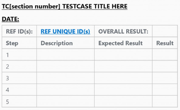
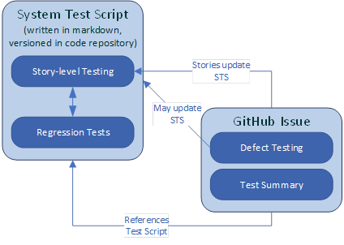
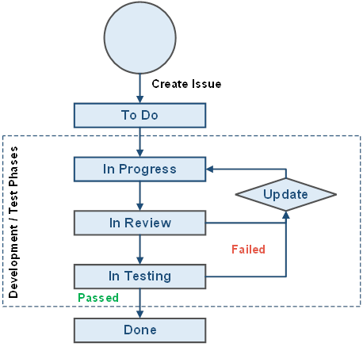

# 3 Testing Activities

All Capgemini staff working on this project will follow the Capgemini testing activities embodied in the Quality Manual and specified in this PTP.

## 3.1	Testing Scope

The scope of testing activities for project 10942 is as follows:

### 3.1.1	In Scope

*	Functional and quality (non-functional) requirements & user story testing
*	Unit and Integration testing for the developed code
*	UI testing for usability and performance scenarios
*	WebAPI endpoints tested for functional, performance and security scenarios
*	Compatibility testing – software and device
*	Localization testing
*	User Acceptance testing
*	Deployment testing in Test and Production environments

### 3.1.2	Out of Scope

*	Security Penetration Testing

## 3.2	Functional Requirements Testing

### 3.2.1	Development Testing

The development team will perform development testing continuously throughout the project. Development tools and frameworks are listed in section 4.

#### 3.2.1.1	Unit Testing

Individual developers will create unit tests.  Unit tests will be reviewed during Code Review (see 3.2.1.2).  Unit tests will be stored and maintained in the source code repository.

#### 3.2.1.2	Code Review

Code reviews will be performed via pull requests using GitHub.
In addition, a broad ranging, holistic code review will be performed to ensure overall conformance with coding style guidelines and good practice.
The Team Lead is responsible for ensuring that developers use the code review process throughout the project.

#### 3.2.1.3	Integration Testing

Automated integration tests will be written by the developers, where practical, using the unit test or other suitable test framework.  Integration tests will be stored and maintained in the source code repository.

#### 3.2.1.4	Backend Testing

Project tester(s) and developers will share backend testing (Infrastructure/deployment, database) activities.  All requirements will be tested using scripts to benefit the regression and maintenance.  Any issues identified will be raised with the developers as a defect which will then follow the defect management process (see section 3.3).

### 3.2.2	System Testing

System Testing will be performed by the project’s tester(s) to verify that the delivered system fulfils the documented user requirements.  System testing will begin when project development starts.  System testing will define test cases, continues with test execution, discovery of issues, recording of results and defects and concludes with regression and deployment testing in a production environment.  Where possible, automated regression tests shall be created by the development team and performed on a stable build and executed in a dedicated test environment using managed test data.

#### 3.2.2.1 System Test Script

A system test script will be created in markdown and version controlled as part of the code repository. The STS will comprise of regression and new feature testing, written as small, modular test cases to ensure easier maintenance and the ability to manage tests without a dedicated test management tool. As new features are created, they can be grouped by functional (or non-functional, such as performance, usability, etc, see section 3.3). Each new test case should have all corresponding GitHub ID references. The test case format contains: (see Figure 1)

 
Figure 1

*	TC (section number): This is the unique identifier for the test case, prefixed by TC for Test Case
*	DATE: Date test was run
*	Testcase Title: the high-level title description for what the test does
*	REF ID(s): The reference ID from the linked issues in Github (as a direct URL, if possible)
*	Overall Result: The overall result for the test case (PASS, FAIL or BLOCKED – test passes or fails or cannot be performed)
*	Step: Step Number
*	Description: instruction for the test case step
*	Expected Result: Expected behaviour after step is performed
*	Result: Result for the individual step (PASS, FAIL or BLOCKED – test passes or fails or cannot be performed)

#### 3.2.2.2	Test Summary Table

The story under test will include a Test Summary table within the GitHub issue description that contains the reference information to the STS. The summary table will include an entry for each applicable test case and contain the following:

| Category  | Description                       |
| ---       | ---                               |
| Test ID   | Test case reference from the STS  |
| Result    | Overall result for the test case  |
| Test Date | Date the test was run             |

The workflow for creating, executing and documenting the tests in the STS and GitHub is as follows:

  
Figure 2

The process for a new test run will be:

*	Add any new feature test cases to the STS and make changes to applicable regression tests
*	Leave previous test results that are not part of the new test run in the document
*	Save the STS
*	Include the updated STS as part of a new pull request for review
*	If the review is approved, run the STS against the deployed system on the test instance
*	Record the test results
*	Create a new pull request containing the STS with new/updated results
*	Document the results in each applicable Story/Defect’s Test Summary table in GitHub

#### 3.2.2.3	Story and Defect Work-flow

Stories and defects worked on during a sprint will follow the process in GitHub, as illustrated in figure 3.

 
Figure 3

*	To Do: Story/Defect has been assigned to the current sprint but development hasn’t begun
*	In Progress: Story/Defect is being worked on and is not complete
*	In Review: Story/Defect is complete and meets the criteria for peer review
*	In Testing: Story/Defect has been reviewed and is ready for the tester
*	Done: Story/Defect has passed all tests and meets the acceptance criteria

If a Story/Defect does not pass either the In Review or In Testing stage, it is sent back to In Progress for additional work  and further Review and Test cycles.

### 3.2.3	User Acceptance Testing

Completed requirements (including user stories) will be reviewed with the client product owner(s) at Sprint Review meetings.  If the PO(s) agree, stories which meet their acceptance criteria will be “closed”.  Stories which are not accepted (i.e. do not pass client or tester acceptance) will be returned to the product backlog for consideration in a future sprint.  If a user story is accepted and subsequently a bug is discovered or an enhancement is requested, a new user story to resolve the bug/enhancement will be created in the backlog.
If the PO(s) are not available to accept stories during sprint reviews, the stories deemed completed by the project team will be placed in a new “holding” column, waiting for the PO to review later – it is advisable to review these stories as quickly as possible, so any future development isn’t affected by previous stories that aren’t accepted later on.

### 3.2.4	Security Testing

Security testing will be performed by the project’s tester(s) to verify that the delivered system fulfils the documented security requirements. Functional security testing validates any system functions related to secure access (system logins, access rights to functions, etc). Functional security tests will be included in the STS as test cases, either as part of the core functionality (e.g. Login section) or as its own Security testing section.

### 3.2.5	Localization Testing

This testing confirms that approved localization formats for inputs and displays are behaving as expected (e.g. use of commas for decimal places, character sets for any translation, etc). The localization requirements will be included in any relevant stories, where necessary and documented in the STS.

### 3.2.6	Help and Documentation Testing

Help and documentation testing will be performed to ensure that all integrated system help is working and displaying the correct messages. Any support documentation will also be tested to determine it is up to date and correct when compared to the latest deployed system. Integrated help tests will be maintained in the STS and any errors discovered with documentation will be added as either new issues or defects in Jira.

### 3.2.7	Production-Deployment Testing

#### 3.2.7.1	Deployment Testing

Prior to release of the system to end-users, the project will perform tests to verify that deployment of the system to the production environment is successful. The majority of testing by the project team will be conducted initially via Docker containers installed locally on the team’s laptops. Once a server-based solution is available, testing will be performed via a test instance of the deployment.

#### 3.2.7.2	Production Testing

Production testing and any staged remote deployment will be documented later in the project.

## 3.3	Quality Requirements Testing

### 3.3.1	Usability Testing / User Interface Review.

Usability testing will be carried out informally during system testing of stories where user interfaces have been updated. Usability testing for key users will be managed by the project team and provide feedback for UI enhancements.

### 3.3.2	Performance (or Load) Testing

Performance testing will be performed by the project’s tester(s) to verify that the delivered system fulfils the documented performance requirements. The system is not expected to require heavy load testing simulation but will require some real-world user performance testing to ensure any implemented failure-messaging is working.

### 3.3.3	Compatibility Testing

Compatibility testing ensures the system behaves consistently and correctly across the required systems and software needed to access it. This project will be configured to run for Chrome and Edge browsers by the development team. If further software and/or hardware are required, they will be added to this plan.
Not all tests will be performed on both browsers throughout the project. There will be specific compatibility tests to check that the system is behaving correctly on the browser that isn’t primarily used during each sprint.

## 3.4	Defect Management

Defects will be managed according to the process described below:

*	Defects will be recorded in the issue tracking system (see section 4 Tools).
*	Defect severities are defined in the Testing GPG.
*	Defects identified during system testing will be recorded against the corresponding story under test as ‘Comments’ and the story’s accountable developer will be notified.  The accountable developer will assess the severity of the defect (taking input from other members of the development team, as required) and take appropriate action to resolve it.
*	Should the defect be considered out of scope for the story or a low priority issue, a new issue will be created and prioritised for a fix at a later time, depending on business priority.
*	Defects identified during user acceptance testing will be recorded as new issues.  The PM (or development team) and client representative will assess the severity of the defect.
*	Critical or Urgent priority issues will be scheduled by the project team for a prompt resolution.  If an issue is considered so severe as to be a "showstopper", it will be scheduled for immediate resolution.
*	Normal and Low priority issues will be moved into the backlog for future sprints.
*	Defects identified outside the story scope by the project team or business users will be recorded as new issues and prioritised according to defect severity.