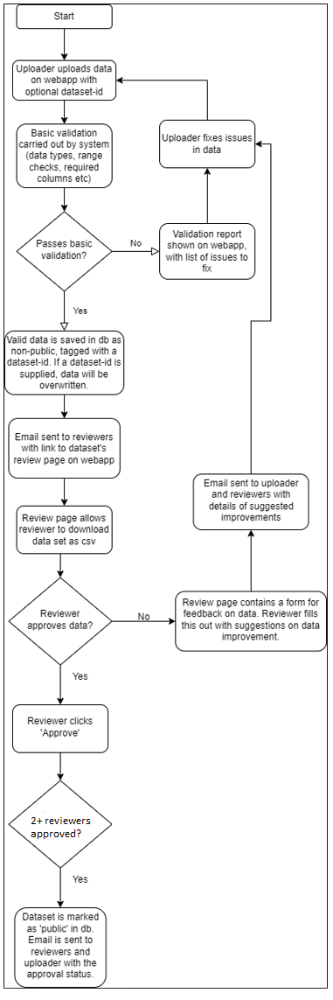

# Data Review Process

Date - 18/10/22

## Status
Accepted

## Context
When new data is uploaded to the site, it needs to be reviewed by a member of the Vector Atlas team before it is made publicly available.

We need to formalise a process for the review of data uploaded to the site.

## Decision
The review process is shown in the image below:

Additional comments from review:
 - The dataset will be read-only once approved
 - The templates will be available from the site before upload

## Consequences
New stories have been written covering technical implementation of this process.
We will be adding a new 'Dataset' table to the database, to hold the dataset-ids (linked to the parent entities) and the status of the dataset. The status can be one of three things:
 - Submitted - This is for data that has been uploaded to the db, but not yet reviewed. It is not public data and should not be viewable on the map.
 - In review - This is for uploaded data which is being actively reviewed. It is not public data and should not be viewable on the map.
 - Approved - This is for data which has been reviewed and approved. It is public data, and is now read-only.

### Workflow
Wireframes for the workflow are shown [here](./images/Review process.pdf). The pages in the following workflow correspond to the pages of the wireframes pdf.
1. A user with uploader role navigates to the upload page of the website (page 1). They specify the data type (bionomics/occurrence initially), do not enter a dataset-id for new data, and choose a csv file to upload. They then click 'Validate data', which calls the validate API endpoint with the csv data uploaded.
    - Database - no change
1. The validate API endpoint inspects the data and forms a list of validation issues, with suggestions to fix. It returns this to the UI, which displays them in a table (page 2)
    - Database - no change
1. The user corrects all validation issues locally and re-uploads the file. The user clicks 'Validate data' again, which calls the API endpoint.
    - Database - no change
1. When the validate endpoint is called with valid data, it returns a success message. The UI then displays a success message and gives the user the option to upload the data (page 3). The user clicks 'Upload data', and the UI calls the upload endpoint with the valid csv data. The UI then displays a success message if the upload succeeds (page 4)
    - Database - a new row is added to the Dataset table, with a GUID and numerical id, a lastUpdated field set to now, uploadedBy field set to the auth0 id of the user and a status field set to 'Submitted'. The valid data is saved in the relevant tables, and linked to the new row in the dataset table.
1. When valid data has been saved in the db, the API sends an email to the reviewers email list, containing details of the new data (data type, number of rows, user who uploaded) and a link to the review page for that data (page 5).
    - Database - no change
1. A reviewer navigates to the review page using the link in the email. They download the data for that dataset-id as csv and review. If there are any changes needed, they add comments in the free-text field (page 5) and click 'Request changes'. This calls an API endpoint which emails the original uploader with the suggested changes, along with a link to the upload page for that dataset.
    - Database - the row in the Dataset table has the status changed from 'Submitted' to 'In review'. The lastReviewed column is set to now, and the reviewedBy column is filled with the auth0 id of the reviewer.
1. The uploader uploads the fixed dataset to the upload page (with dataset-id filled in), and the upload goes through the validation process in steps 1-4.
    - Database - when valid data is uploaded with a valid dataset-id, all existing data linked to that dataset is deleted before new data is written.
1. If a reviewer clicks 'Approve data' on the review page, a dialog box appears confirming this choice (page 6). If the reviewer confirms this choice, a success message is displayed (page 7). This confirmation calls an API endpoint which emails the reviewer list and original uploader with the message that the data has been approved and is now publicly available.
    - Database - The status of the row in the dataset table is changed to 'Approved'. This marks the linked data as publicly available.