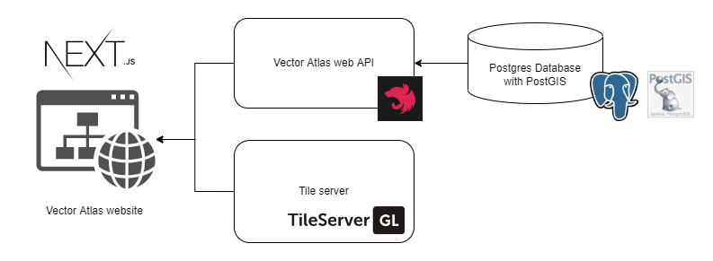

# Architectural Description

## Contents

* **[Introduction](#introduction)**
* **[Architectural Background](#architectural-background)**
* **[System Context](./02-architecture-context.md)**
* **[View-Points & Views](#view-points--views)**
    * [Functional view](./03-architecture-functional.md)
    * [Process view](./04-architecture-process.md)
    * [Security view](./05-architecture-security.md)
    * [Deployment view](./06-architecture-deployment.md)
    * [Development view](./07-architecture-development.md)
    * [Testing view](./08-architecture-testing.md)
* **[Architecture Decision Records](../decisions)**
* **[References](./09-architecture-references.md)**

## Introduction

This document is intended to provide an Architectural Description of the Vector Atlas system. This is a living record and will evolve as our understanding develops. As such, at any given time there may be placeholder sections which indicate our expected direction of travel (for the description and the System).

### High-level overview

The Vector Atlas is a system to allow researchers to upload vector data, currently constrained to mosquitos, have it reviewed and then published as part of an open dataset. The data is to be published as part of a website that allows users to download the entire set or to view and filter the data on an interactive map, then download that subset. The aim is to ensure that all of the data that is downloaded by users is attributed back to the original sources, both data providers as well as the original authors.

The high-level architecture of the system is as follows:
 - A [Next.js](https://nextjs.org/) web application, which gets data from
 - A [Nest.js](https://nestjs.com/) API, with [GraphQL](https://graphql.org/) endpoints for data exploration, serving data from
 - A [PostgreSQL](https://www.postgresql.org/) database, with the [PostGIS](https://postgis.net/) extension for spatial data.
 - A [tile server](https://github.com/maptiler/tileserver-gl) to serve our own map data.

### Scope

This architectural description is intended to describe the system components and
services, how they communicate and what technologies are being used. It is targeted at a technical audience with the intention of being both an introduction to the system and also a long term developer reference about how the System should be structured,
developed and deployed.

This description is not intended to cover the details of specific implementations,
or software maintenance and does not provide information about how to deploy, maintain or
support a production instance.

#### Related documents

Documents and artefacts addressing lower-level details of the System architecture are
[referenced here](./09-architecture-references.md).

## Architectural Background

### Architectural Constraints

The following constraints have been placed on the system:

#### Constraint 1

The system must use open-source technologies and itself be open-source due to the conditions of the funding.

#### Constraint 2

The system should initially load in a reasonable amount of time (less than 20 seconds, ideally less than 10) on a 1Mb/s connection. Many of our users will be on low speed connections so the site should accomodate those speeds, this might involve loading more in the background but without impacting the user's ability to interact with the site.

#### Constraint 3

There needs to be detailed documentation around how the system is built as well as how the system should be deployed and maintained. The Vector Atlas will eventually pass to the team at ICIPE to deploy and maintain from their systems, the documentation needs to be sufficient for them to do this.

### System Qualities

| Quality | Note |
|---------|------|
| **Reliability** | The Vector Atlas will be a public website, it should be up as much as possible but it is not a critical requirement - there will be a support team to deal with issues. |
| **Security** | The Vector Atlas will be a public system, while the data is open there needs to be secure access to upload data. This means that the site should use a https connection as well as authentication and authorisation to log in if uploading, reviewing or as an admin. |
| **Scalability** | While it is a public system, the Vector Atlas is not anticipated to be used by lots of users and so scalability is not a high concern. |
| **Useability** | Useability is key to get users to use the website and encourage them to upload data in order to see the value of it. |
| **Testability** | The system should be testable in order to aid automated testing creation - this reduces the burden of manual testing needed when the initial development team is no longer around. |
| **Maintainability** | The system needs to be maintainable in order to deal with production issues quickly as it is a live site in front of the public. |
| **Localisation** | Localisation is important but not a critical priority for the initial release. Many of the users will be science based and so have a background in English, however given the diverse languages across Africa this will be increasingly important once the technical feasability of the project is established. |
| **Extendability** | This will be a background concern, eventually the aim is to deploy different versions of the system for different parts of the world. We should consider this during any design decisions but not worry about it during implementation. |

### Engineering Principles

| Principle | Rationale | Architectural impacts |
|-----------|-----------|-----------------------|
| **Separation of concerns** | The application should be developed with clear boundaries between different areas | The system will use different architectural layers as well as layering within individual components to separate concerns. |
| **Use of frameworks and libraries** | The use of standard frameworks and libraries, where appropriate, will enable efficient development and ensure that industry best practice is followed. | Where possible, third party libraries and frameworks should be used to facilitate development. They should be carefully evaluated prior to use to ensure that they are under active development, have clear documentation and a large community. We should also audit the libraries for vulnerabilities. |
| **Error handling** | The system needs to ensure that unexpected errors do not stop the system working entirely, and should make the user aware of what has gone wrong and how to report it | Each component will use a consistent approach to error handling. |
| **Logging** | 	All components should implement logging appropriate to the components function. | Logging should be considered as a first class concern for all components since it will be important to diagnose issues quickly for a public facing website. |
| **Automated release** | The system will need to be regularly and and easily deployed to reduce maintenance | It will be key to get regular feedback from users so we should make it simple to deploy releases from completed code. |

### Architectural Styles

_Examples listed: update for your system_

| Style | Description |
|-------|-------------|
| **Modular architecture** | So that we can keep different concerns separated and allow more refined deployment of changes, components will be separated in to modules (e.g. tile server for mapping, api for dealing with data, the website for presentation) |
| **Route-based bundle splitting** | To optimise performance, we will adopt route-based bundle splitting so that only the minimum code is transferred to users as and when they need it to help with slow connections. |
| **GraphQL API** | We will use a GraphQL based API to reduce the number of network calls needed as well as providing a flexible API for researchers. |
| **Federated authentication** | To minimise the complexity and risks around storing user data, we will use and external authentication provider and integrate with the vector atlas. |

## System Context

The Vector Atlas system context is [covered here](./02-architecture-context.md)

## View Points & Views

In this architectural description the following view points are chosen to describe the architecture:

* [Functional view](./03-architecture-functional.md)
* [Process view](./04-architecture-process.md)
* [Security view](./05-architecture-security.md)
* [Deployment view](./06-architecture-deployment.md)
* [Development view](./07-architecture-development.md)
* [Testing view](./08-architecture-testing.md)

## Architecture Decision Records

We are using ADRs to record decisions with architectural impacts. These can be viewed
[here](../ADRs).
