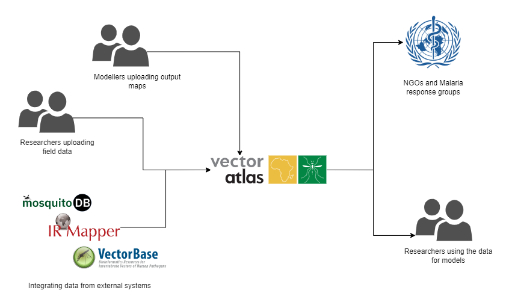

# System Context

This section details the context that the Vector Atlas system operates within.

* **[System context](#system-context)**
* **[User types](#user-types)**
* **[Associated systems](#associated-systems)**
* **[Environmental constraints](#environmental-constraints)**
* **[Related sections](#related-sections)**

[Return to overview](./01-architecture-overview.md)

## System context

The Vector Atlas system context is shown below:

The Vector Atlas is designed to pull together data from many different systems but in a reviewed fashion to produce gold-standard data that is open to all to use. The aim is that data would be useable both by other researchers but also NGO groups to plan malaria responses across Africa.

## User types

**Field researchers**: Groups uploading data gathered from field observations or from published literature.

**Modellers generating maps for the Vector Atlas**: These are modellers linked to the platform using data from the Vector Atlas to generate output maps that can be used by others in their resulting models.

**External partner data systems**: These systems already contain a wealth of information and the aim would be to make that accessible to others whilst attributing back to them. These systems may also pull updates from the system in future so they benefit from a broader set of data.

**Modellers using the Vector Atlas**: Groups who want to use both the raw data and output maps to work as inputs to their own models that might be targeting a larger complex system.

**NGOs and malaria response units**: Groups who want to visualise the current data and use it to inform their strategies for malaria responses.

**Admins and reviewers**: Users with the ability to review uploaded data before being published as well as system admins managing the site.

## Associated systems

Currently the data is manually curated but in future we may want to automatically synchronise data with external systems like MosquitoDB, IR Mapper or VectorBase.

## Related sections

[Functional View](./03-architecture-functional.md)