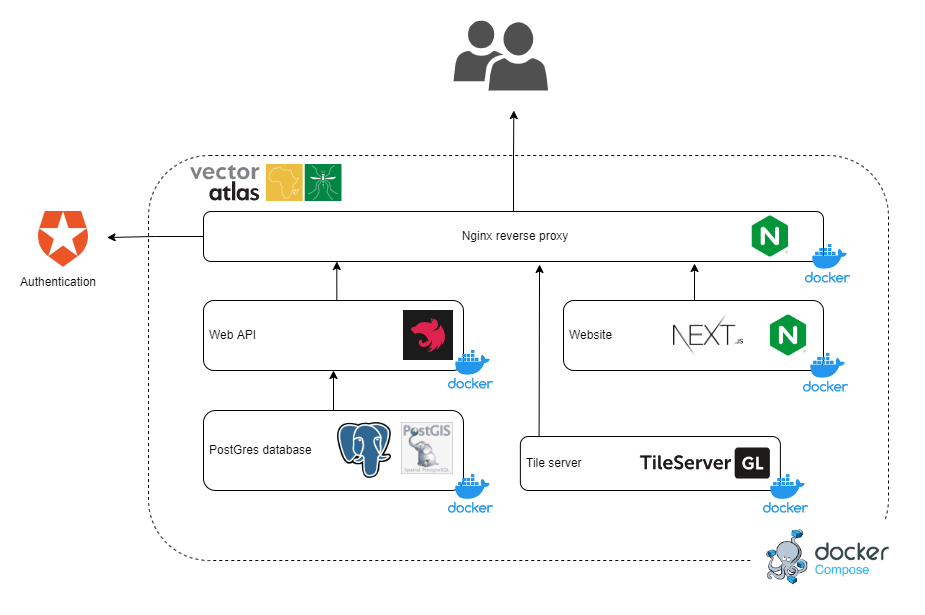

# Functional View

This section details the System architecture from the view-point of its functional
structure.

* **[System context](#system-context)**
* **[High-level components](#high-level-components)**
* **[GIS data in Postgres](#gis-data-in-postgres)**
* **[Tile server with TileServer-GL](#tile-server-with-tileserver-gl)**
* **[Tile server with TileServer-GL](#tile-server-with-tileserver-gl)**
* **[Web API using Nest.js](#web-api-using-nestjs)**
* **[Website using Next.js](#website-using-nextjs)**

[Return to overview](./01-architecture-overview.md)

## System context

The Vector Atlas system context is [covered here](./02-architecture-context.md). This section builds on that context.

## High-level components

The high-level components that the Vector Atlas system will need to fulfil the demands of its context are shown below.

The primary components that make up the vector atlas platform are:
1. **The Postgres database** that stores all of the occurence, bionomics and insecticide resistance data. The data for case studies and news items may also be stored here as well.
1. **Web API** that connects to the database and provides a GraphQL interface both for users and the website.
1. **Tile server** serves simplified maps and overlays both in order to not have to pay for access to a commercial license server as well as for speed in low connection areas.
1. **Website** is the main user interface for the system allowing publishing of case studies and interactive searching of data.
1. **Nginx reverse proxy** provides a single entry point to the system and directs traffic to the appropriate component. It can also provide proxy caching for map tiles so they are not generated on demand for each request.
1. **Authentication** is delegated out to Auth0 as a managed system with a free tier in order to lower the risk of a security breach.

## GIS data in Postgres

The Postgres database will use the PostGIS plugin to provide GIS-based searches on the occurrence data. The data model is relatively simple with a series of initial spreadsheets with multiple tabs and this corresponds well to a relational database.

## Tile server with TileServer-GL

Multiple options were considered as part of an initial technical investigation that came to the conclusion that TileServer-GL offers a lightweight solution that can be run within docker and serves both raster and vector tiles.

## Web API using Nest.js

Nest.js is a relatively new framework for building services in Node.js, it has a lot of built in capabilities around logging and monitoring (designed primarily for micro-service systems) that should speed up development. There are additional extensions to incorporate a GraphQL API in to the service.

## Website using Next.js

Next.js is a relatively new framework for building websites with React. It incorporates a lot of functionality around server-side rendering that we are not making use of as part of the Vector Atlas system. The primary benefit is the built in route-based bundling splitting that will allow us to optimise loading times for slow connections.

## Related sections

[System Context](./02-architecture-context.md)

[Deployment concerns](./06-architecture-deployment.md)
