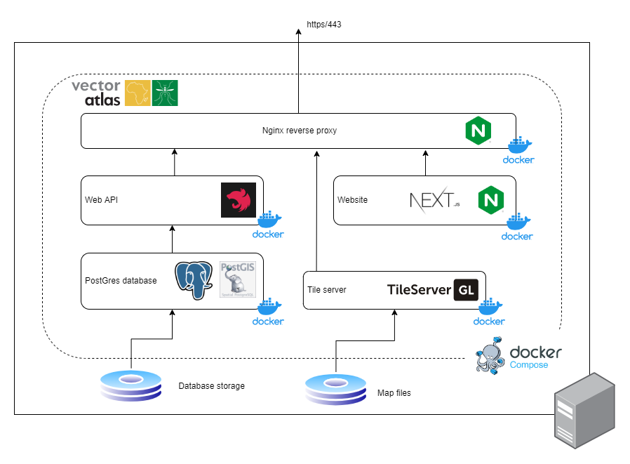
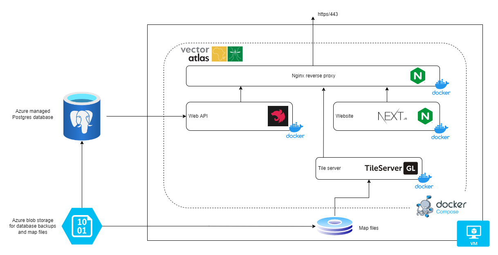

# Deployment View

This section details the System architecture from the view-point of its deployment.

* **[Overall approach](#overall-approach)**
* **[Container packaging design](#container-packaging-design)**
* **[Cloud deployment](#cloud-deployment)**
* **[Environment handling](#environment-handling)**

[Return to overview](./01-architecture-overview.md)

## Overall approach

The Vector Atlas will be deployed as a series of Docker containers in order to aid portability to different host environments. The containers will be linked together by deploying them as a Docker Compose environment, depending on the environment this may or may not include the database.

The initial deployment will be to a single virtual machine and access through a single port to the main website.

The database storage will be mounted as a volume to allow restarts and upgrades of the system. Similarly map files will be served from the disk to allow updates without having to rebuild the code.

In the future when the system is moved to ICIPE then it will be deployed into Azure instead and will use a slightly modified deployment where the database is managed and the map files are hosted in storage.

## Container packaging design

Containers should make use of [multi-stage builds](https://docs.docker.com/develop/develop-images/multistage-build/) to optimise the final image size as well as reducing security attack vectors in the deployed system.

## Cloud deployment

As users will primarily be in Africa then it will be good to move the deployment to an African data centre at some point in the future to reduce the latency of the system.

Initially due to the reduced development costs, the system will be deployed on a virtual machine within the University of Oxford data centre.

The cloud environment is simple as the entire system can be deployed to a single virtual machine and exposed to the outside world through a single secure https port. The main complexity will be around directing the domain name to the deployment machine.

### Cost Analysis

The cost analysis of the deployment was done as part of the [deployment investigation](https://github.com/icipe-official/vectoratlas-software-code/issues/45) and is summarised below.

#### Multi-container support
Multi-container support with an individual Azure App Service is possible but still in preview (https://docs.microsoft.com/en-us/azure/app-service/tutorial-multi-container-app) and therefore not recommended without risk at this time. It is potentially a cost effective mechanism at £720/year but this would depend on whether it is used alongside a managed database. Note we wouldn't be able to connect directly to the container stack to take back ups and we'd have to work out what the logging and debugging process would be.

#### Host in Kubernetes
The docker compose stack could be encapsulated within a Kubernetes pod and run as part of a Kubernetes cluster. This would allow compute costs to be shared across many different apps and make the most efficient use of resources. There isn't an existing Kubernetes cluster at either Oxford or ICIPE and so this isn't an option for now - using Kubernetes only works if there are many applications sharing the hardware and the cost.

#### Azure virtual machine with managed database
An Azure virtual machine could be used to host the docker-compose stack, potentially with or without a managed postgres database. A D4a machine with 4 CPUs, 16GB RAM in South Africa North would cost £1850/year (alternatively a D2a v4 would be £940/year if an external database is used). A managed postgres instance with 50GB of data would be £870/year

There is an option to reserve machines for 3 years which significantly reduces the cost, the D4a machine would come down to £720/year and the D2a would be £360/year.

There would also be additional costs around Azure storage for hosting some small amounts of data as well as the costs of public IPs and networking but these should all be minor.

#### Virtual machine within the Oxford data centre
The University of Oxford provides an internal data centre for projects to use where at the moment a 4 CPU, 4GB RAM costs £350/year.

Additionally there is the ability to get 1TB of storage for a one off cost of £350 to the project.

#### Summary:
- Azure app service: £720/year for the VM, £870/year for the database (£1590/year)
- Azure VM and self-hosted DB: £1850/year
- Azure VM with managed DB: £940/year, £870/year for DB (£1810/year)
- 3 yr reserved Azure VM self-hosted DB: £720/year
- 3 yr reserved Azure VM with managed DB: £360/year, £870/year for DB (£1230/year)
- Oxford VM: £350/year + £350

## Environment handling

We will build deployment artifacts once, and then promote them (subject to passing test gates) through the environments to PRODUCTION.

This means all services must allow runtime configuration of all dependencies and settings. These will be read from environment variables on load, and missing configuration will cause the service to exit with an error and description of its required configuration.

Default values may not be used for any required settings since, whilst convenient, this hides the dependency and may result in silent misconfiguration.

### Environment overview

There is a test and production environment - these will be deployed to the same virtual machine initially due to minimising costs of infrastructure. The aim will be to isolate each environment in a different docker-compose network.
