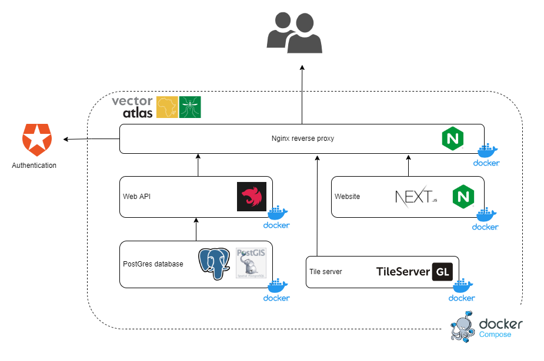

# Development View

This section details the System architecture from the view-point of its development.

* **[Technical Stack overview](#technical-stack-overview)**
* **[Language choices](#language-choices)**
* **[Technology choices](#technology-choices)**
* **[Development Tooling and Process](#development-tooling-and-process)**

[Return to overview](./01-architecture-overview.md)

## Technical Stack overview

The following diagram gives an overview of the Technologies being used by the System.

The website is all built using [Next.js](https://nextjs.org/) to provide a modern framework for building a React-based website using modern code splitting and building technologies.

The web API is built using [Nest.js](https://nestjs.com/) to provide a lot of built-in features for running services like logging and health-checks. There is also an integration for [GraphQL](https://graphql.org/) that the Vector Atlas makes use of.

The database uses [Postgres](https://www.postgresql.org/) and the [PostGIS](https://postgis.net/) extension as it is open-source and provides the ability to perform geographically based queries.

All of our components are containerised using [Docker](https://www.docker.com/) and orchestrated together using [Docker Compose](https://docs.docker.com/compose/).

## Language choices

JavaScript in the form of React and Node.js will be used for both the front and back end in order to reduce the number of languages needed for the system. TypeORM will also be used so that JavaScript code is used to query the database (this is transformed within the library to an efficient SQL query), again reducing the languages needed - however some knowledge of SQL will be needed to debug the system and explore the database in the event of bugs or issues.

## Technology choices

We have selected a number of technologies to help us build and host services effectively:

### System hosting

| Name | Role | Reason for use |
| ---- | ----------- | -------------- |
| **University of Oxford virtual machine**  | Cloud hosting platform | We want to host our systems in the cloud to off-load all of the management issues associated with self hosting. We chose the Oxford machine to minimise running costs. |
| **Docker** | Containerisation | We will use containerisation as it gives us light-weight, isolated components that can be run with confidence across different environments. Docker is the leading technology for containerisation.
| **Docker compose** | Container orchestration | Docker compose provides an orchestration solution for a small self-contained system. |

### System infrastructure

| Name | Role | Reason for use |
| ---- | ----------- | -------------- |
| **Auth0** | Authentication | For shore-side systems, Auth0 gives us an easy way to consume federated identity services. By using a commercial service we save the development effort and risk of building a secure authentication framework. |
| **Postgres** | Relational data store | Some of the data in the System will best suit a relational data store. Postgres is a widely used database and is available as a service in AWS, meaning we can easily provision production-ready instances in the cloud. |
| **Tileserver-GL** | Map tile server | A lightweight solution to serve our own map data as tiles to reduce the amount of map data transferred to the user at once. |
| **Nginx reverse proxy** | Directing traffic and caching | Directing traffic to isolated modules of the system as well as providing caching of static files (mainly the tiles generated by the tile server) |

## Development Tooling and Process

Notes and guidance on our development tooling and processes are maintained in the [System Maintenance Guide](../../SMG/01-introduction.md).

