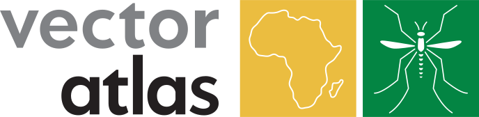
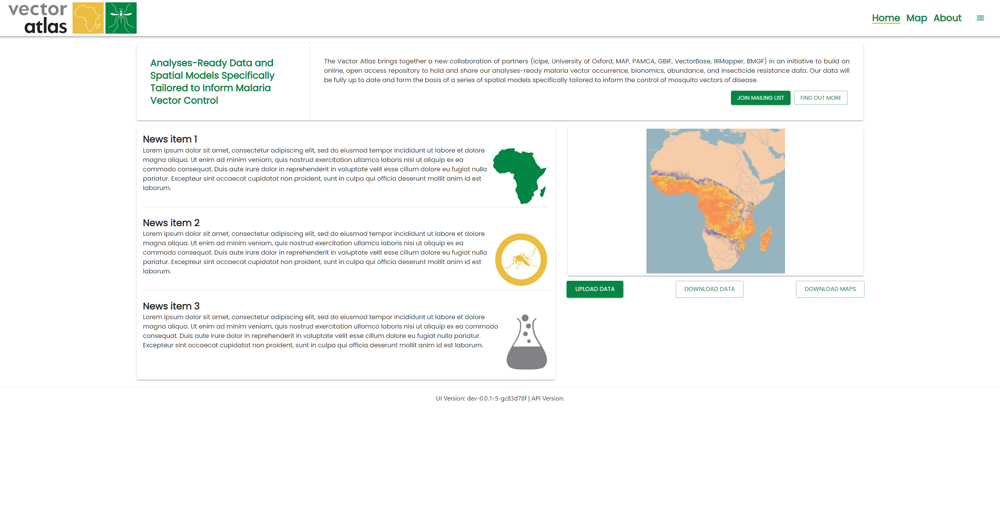
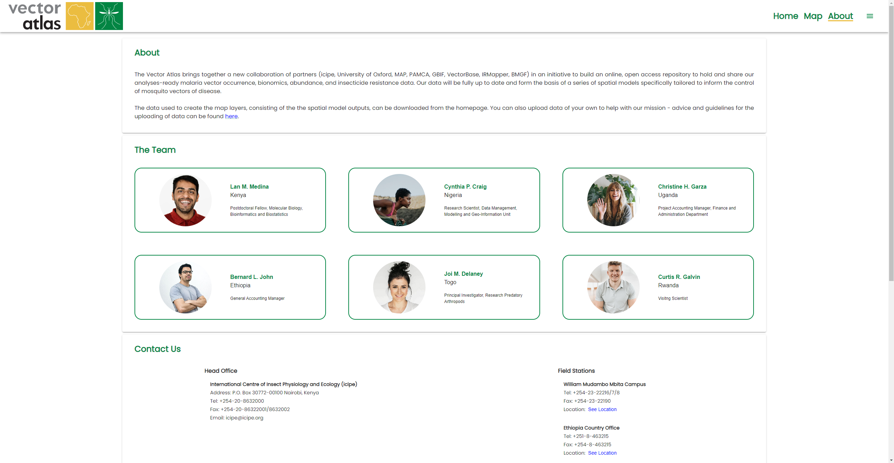
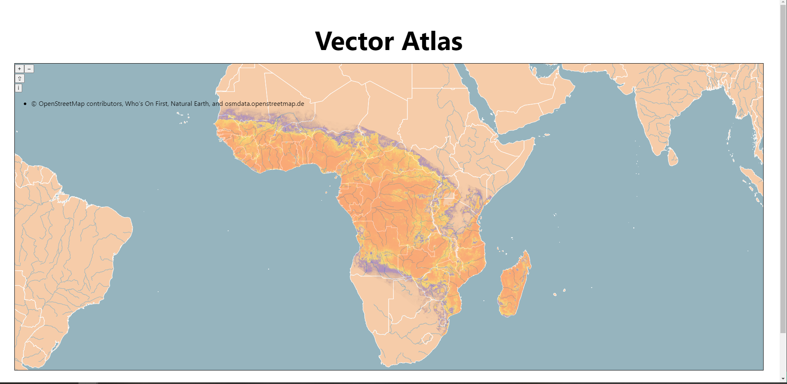

  

# Vector Atlas Platform Sprint 0 Report

## Executive summary
This was the initial sprint review for the work that has been done to set up the foundations for the website and the apis needed behind it. We have a placeholder structure for the homepage and the about page.

A lot of the stories covered setting up the supporting documentation like the Architectural Design Document, System Maintenance Guide as well as an initial User Guide. We also have a containerised build created to allow us to deploy to any environment that supports Docker and build pipelines when merging changes in from a pull request.

While there isn't a lot of visual progress, we have tackled most of the technical investigations and significantly reduced the risk of delivering a platform with the right information shown.

Now that the foundations are in place we should be able to make more progress on the website faster.

Below are some screenshots of the pages so far and the output from the tile server investigation.

## Top risks
- **(Increasing)** Deciding and procuring hardware to deploy an environment to.
  - We're aiming to deploy an initial version that can be shown to users at the end of September.
  - We need to provision an environment soon in order to create and test the deployment process and configure the domain name re-direct.
- **(Decreasing)** Getting timely feedback for content for the website.
  - There is a risk we won't be able to show a good demonstration of the site in September without meaningful content for the homepage and the about page.
  - This risk should be decreasing as we move out of holiday season for lots of the team.
- **(Decreasing)** Clarifying the data model to be stored in the system.
  - The data model is still in flux from a scientific point of view and it's unclear what we should be ingesting.
  - There is an initial model we can work off and start planning ingestions from that, it should be simple to update it in the future.
  - This should also become clearer as more data workshops happen.

## Points summary

We currently don't have points marked against the stories and need to start doing this in the next sprint.

With regards to story counts:
- Done: 1,
- In testing: 20,
- In review: 3,
- In progress: 2,
- To do: 1,
- Backlog: 22

There is a lot in the testing column, we are still finalising the testing process and this is harder without a deployed instance of the site. This should become clearer in the next sprint.

## Stories done
### Last sprint actions
No previous sprint.

### Stories

1. #4 Add code quality targets for linting, unit tests and code coverage.
1. #8 Set up a new Architectural Design Document with Architectural Decision Records.
1. #9 Add a System Maintenance Guide
1. #13 Create a docker build for the website and the api
1. #15 Create a build for the website with PR triggers
1. #16 Create a build for the API with PR triggers
1. #19 Investigate and document the process of migrations for the database
1. #38 Investigate using https with the site
1. #21 Create an initial homepage with just the top navigation bar and routing
1. #22 Display the main structure of the page on the homepage
1. #12 Add versioning and feature flags for the website and api
1. #35 Investigate how we might allow users to login with GitHub or Gmail
1. #56 Add auth0 login to the UI
1. #10 Set up a new user guide
1. #3 Create a basic api with Nest.js and GraphQL
1. #17 Set up a new Postgres database with the PostGIS extension
1. #18 Configure a basic model for the database and integrate with the API
1. #6 Investigate displaying our own GeoJSON as a base layer for the map.
1. #5 Investigate different map providers for displaying an interactive map.
1. #7 Investigate what would be needed to run our own tile server.
1. #51 Create an initial data model
1. #55 Change text on the homepage

### Stories missed
None, mainly because we aren't doing formal sprint planning yet. The plan is to do this from the next sprint.

## Review minutes

The team demo'd the list of stories done in this sprint, a lot of them where background development tasks without anything visual to see.

We talked through the initial look and feel for the home page and saw how the integration with Auth0 worked for authenticated users to use. Public users only looking to download items wouldn't need this and so the 7000/users per month limit for Auth0 should be fine. There is still a question of how we track unique users and their locations purely from a statistics point of view.

There are still questions outstanding about how we're going to deploy the system and onto what hardware, this needs to be our highest priority now. The aim is to try and have something we can point people to for the PAMCA conference on the 26th September. We should also be aiming to have a lot of our functionality done by the 5th December so we can get feedback from the main stakeholder meeting, especially around the modelling outputs.

### Actions:
- (Ray) Add stories to cover adding content to the ADD and SMG.
- (Ray) Confirm model output formats with the modelling team.
- (Andrew) Assemble a list of questions to get feedback on from Marianne when back from holiday and after initial weekly meetings.
- (Chris) Get more feedback from the team about the content for the about page.
- (Ray) Send round the current state of deployment hardware needed so a decision can be made. 

## Current code analysis state

### UI
- eslint: 1 warning
- tests: 37 tests, 89% branch coverage, 95% line coverage

### API
- eslint: 8 errors
- tests: 1 test, 7% coverage (this needs to be improved)