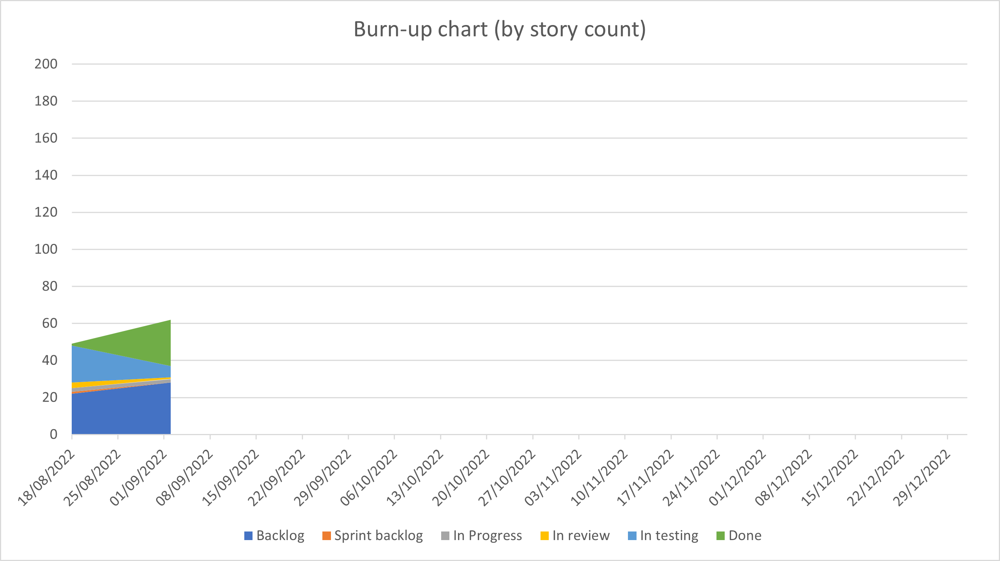

  

# Vector Atlas Platform Sprint 1 Report

## Executive summary
TODO

## Top risks
- **(Same)** Deciding and procuring hardware to deploy an environment to.
  - We're aiming to deploy an initial version that can be shown to users at the end of September.
  - We need to provision an environment soon in order to create and test the deployment process and configure the domain name re-direct.
  - We've now established that an environment at Oxford will be difficult to create and so progressing with getting Azure infrastructure at ICIPE.
- **(Decreasing)** Getting timely feedback for content for the website.
  - There is a risk we won't be able to show a good demonstration of the site in September without meaningful content for the homepage and the about page.
  - We're getting feedback for the about pages but it would be good to get more if we want to be ready for a release at the end of September.
- **(Decreasing)** Clarifying the data model to be stored in the system.
  - The data model is still in flux from a scientific point of view and it's unclear what we should be ingesting.
  - We've had a lot of clarification from Marianne now and we have a good starting point. The model may change but we believe the risk is low and we can modify the system easily.

## Points summary

Sprint 1 points:
 - Done: 0
 - In testing: 34
 - In review: 2
 - In progress: 18
 - To do: 0

 At the moment we are still catching up on the testing backlog with everything clearer from Sprint 0. We should be able to start collecting velocities from next sprint, an approximated velocity can be built from the stories in testing at the moment.

With regards to story counts:
- Done: 25,
- In testing: 6,
- In review: 1,
- In progress: 2,
- To do: 0,
- Backlog: 28

The story data can now be tracked to monitor the growth of the backlog.

## Stories done
### Stories

1. #72 Update the contents of the ADD
1. #57 Add auth workflow to the backend
1. #32 Add an about us page
1. #52 Develop a script to build the base map
1. #59 Create initial tables for the data model
1. #53 Add a tile server to the system
1. #45 Investigate deployment options
1. #54 Add a new interactive map using OpenLayers

### Stories missed
1. #60 Load initial data in to new tables from spreadsheets
    - there was a higher complexity to this than we estimated for and it's a key bit of the system that we need to make sure is right.

## Review minutes

### Actions:
- (Ray) Confirm model output formats with the modelling team.

## Current code analysis state

### UI
- eslint: 2 warnings
- tests: 52 tests, 73.9% branch coverage, 95.7% line coverage

### API
- eslint: 8 errors
- tests: 1 test, 7% coverage (this needs to be improved)