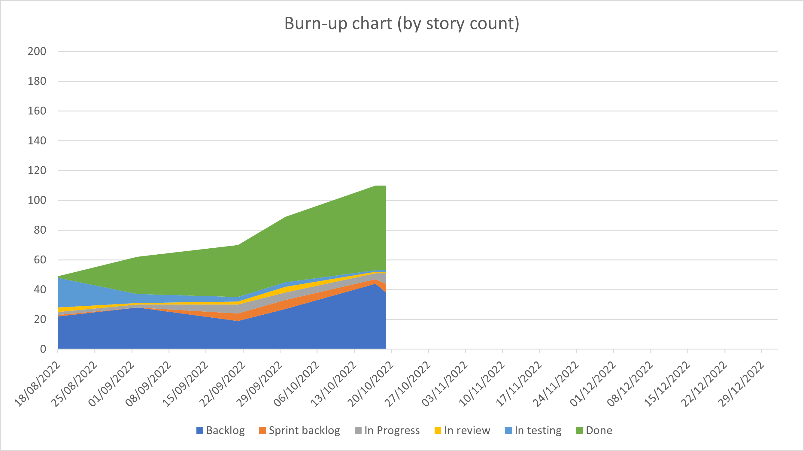

  

# Vector Atlas Platform Sprint 3 Report

## Executive summary

We've had a good double length sprint due to the PAMCA conference, where we've made a lot of progress with the map view part of the site and wiring together the foundations needed to display data on the map. 

The visual updates are now making it a lot easier for stakeholders to provide feedback and make improvements to the system.

We're progressing towards getting all of the pieces in place to allow users to find, filter and download the data they need. This is both good for the feedback coming from questionnaires as well as for the overall status fed back to BMGF.

The priorities going forward are to complete source creation and display, getting upload working so we can push realistic data in to the system, and getting filtering and download working for data.

## Top risks
- **(Increasing)** Getting realistic data into the system so we can test with realistic conditions and establish how users are likely going to want to use the site.

- **(Decreasing)** The team has expanded a lot recently and we need to build up enough of a backlog for each of the team to work on non-conflicting areas of the code base. Many of the team are junior as well and there needs to be enough guidance to share experience.

   (19/10 update) The team are starting to work together to solve each others problems which is a good sign. We've also got more of a backlog in place but we need to stay on top of building and prioritising this - although the feedback in sprint reviews is helping this a lot.

## Story summary

At the end of Sprint 3 the story counts are:
- Done: 57,
- In testing: 1,
- In review: 1,
- In progress: 4,
- To do: 3,
- Backlog: 44

The burn-up chart below shows the backlog and the amount of work done both growing, at this stage of the project that is okay but later in the project we will want to project on whether the backlog portion is going to get done and prioritise what needs to be done before the end of the project.

## Stories done
### Stories

- [64. Deploy the system to the test environment](https://github.com/icipe-official/vectoratlas-software-code/issues/64)
- [58. Set up certificates on the server](https://github.com/icipe-official/vectoratlas-software-code/issues/58)
- [95. Prepare the UI for alpha deployment](https://github.com/icipe-official/vectoratlas-software-code/issues/95)
- [134. Improve the test coverage for the code base](https://github.com/icipe-official/vectoratlas-software-code/issues/134)
- [39. Investigate what the list of filters are for data on the interactive map](https://github.com/icipe-official/vectoratlas-software-code/issues/39)
- [74. Add a filters and layers component to the map](https://github.com/icipe-official/vectoratlas-software-code/issues/74)
- [98. Add and API route to load occurrence data for the map](https://github.com/icipe-official/vectoratlas-software-code/issues/98)
- [99. Load occurrence data on map](https://github.com/icipe-official/vectoratlas-software-code/issues/99)
- [109. Add download everything button](https://github.com/icipe-official/vectoratlas-software-code/issues/109)
- [62. Split species table](https://github.com/icipe-official/vectoratlas-software-code/issues/62)
- [136. Document how to connect to the Azure database using an ssh tunnel](https://github.com/icipe-official/vectoratlas-software-code/issues/136)
- [116. Investigate method of applying migrations to the production/test db](https://github.com/icipe-official/vectoratlas-software-code/issues/116)
- [131. Add test data to the source repository](https://github.com/icipe-official/vectoratlas-software-code/issues/131)
- [111. Add tile caching to improve performance](https://github.com/icipe-official/vectoratlas-software-code/issues/111)

### Stories missed
1. #70, #77, #69 These are all linked to the sources page and the functionality has been demo'd but needs styling to be finished off.
1. #102 Creating a secured upload page is done but needs to finish going through the review, test, done cycle.
1. #105 The investigation into the review process for data has started and just needs to be documented and new stories created after Andrew has got back from leave.
1. #109 The download all button was pulled into the sprint and wasn't expected to finish by the end of the sprint.

## Review minutes

During the review we worked through demonstrating all of the stories above. Chris demonstrated loading the occurrence points on the map as well as what the API route behind that looked like. He described the pagination process where the aim is to allow users to start working with some data faster whilst the remaining data loads. There was a question raised out of this of whether we should load data in a particular order, should we retrieve the newest data first?

There was also a discussion about what the markers should look like as we've only added in a placeholder for now. The result of that discussion was to have circular markers with some transparency so you can see overlapping markers and the colour solidifies with higher densities. We also want the colour to reflect the species.

We also discussed about what information should be seen for each point. We discussed whether we should have a hover over capability to show some information but the conclusion is that we might have a lot of points close by and this would flicker a lot. The resulting decision was to show more information when the user clicks on a particular point. This will also help with limiting the amount of data transferred - the map only needs limited data like location and count, but then we can retrieve the full information for a particular point when it's clicked. The WHO Malaria Thread Map can be used for inspiration.

Marianne commented that this was all good as it feeds back into the questionnaire responses and the priorities for the BMGF report. Users want the ability to find, filter and download a particular subset of data. All of the current map work is building to that. Another key priority is selecting data by area but this will be more technically difficult - we should prioritise investigating this soon.

There is an updated species list in the latest data model spreadsheet sent by Marianne and we need to update the system to reflect that.

Kennedy has worked with the ICIPE IT team to get the www version of our url to redirect to vectoratlas.icipe.org which is great as I was expecting to have to update the nginx configuration to redirect once the traffic reached the server.

This led to the discussion that vectoratlas.icipe.org is not appearing in any search results. We will need to investigate why and what we need to do to get it to appear.

We also noticed that certain parts of lakes and the whole of Lake Malawi weren't showing on the map, this is a bug that needs fixing.

Peter gave a demo of the secured upload pages which was good and can be used across the site to secure other pages.

Sheila presented her work on creating and displaying new sources, a lot of this is coupled together but working well at the moment. The remaining part is to finish off the styling.

Ray presented Andrew's work whilst he was on leave about the updates to the data model and the species table. Ray also presented some of the technical stories about connecting to the test database via an ssh tunnel and about improving the test coverage. There were also some demos for the new alpha site released for PAMCA and about improving the performance when loading tiles for the map.

We discussed the priorities for the next sprint around completing the sources work, prioritising upload so we can get some realistic data into the system and reviewing the feedback from the questionnaire responses to prioritise work.

### Actions:

- (Marianne) Decide if we want to load data on the map in a particular order? e.g. newest first.
- (Ray) Add a new story to update the marker style.
- (Ray) Add stories for displaying detailed information for a particular point.
- (Ray) Add a story to update the data model and species table based on the latest spreadsheet from Marianne.
- (Ray) Add a story to register the site with Google and see what else is needed to appear in search results.
- (Ray) Add a bug to fix the display of lakes on the system.

## Current code analysis state

### UI
- eslint: 2 warnings
- tests: 78 tests, 79.31% branch coverage, 92.38% line coverage

### API
- eslint: 0 errors, 0 warnings
- tests: 57 tests, 74.62% branch coverage, 97.28% line coverage (we still need to boost branch coverage)