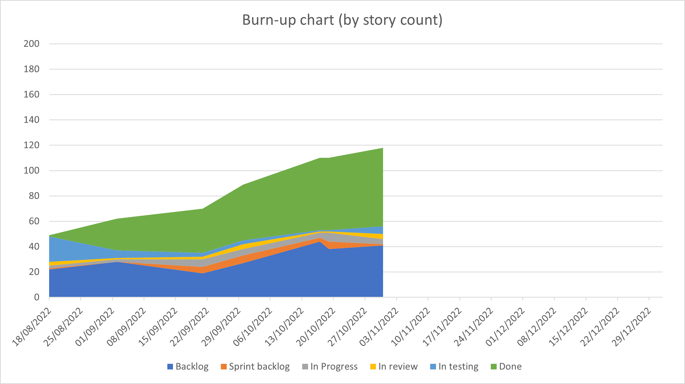

  

# Vector Atlas Platform Sprint 4 Report

## Executive summary

We've made progress with displaying realistic data, basic filters and downloading all of the data. We've also made a lot of changes to the sources page to show sources as well as adding new sources - however, we need to restructure this to make it easier to see many sources at once.

The pace of work has slowed and so we're looking to set more longer term goals to focus the delivery more and work out how to increase the rate of story delivery again.

## Top risks
- **(Increasing)** Pace of development is slowing down and we still have a lot of major areas to cover. We need to be proactive with some team React training.

- **(Increasing)** Getting realistic data into the system so we can test with realistic conditions and establish how users are likely going to want to use the site.

## Story summary

At the end of Sprint 3 the story counts are:
- Done: 63,
- In testing: 5,
- In review: 4,
- In progress: 4,
- To do: 1,
- Backlog: 41

The burn-up chart below shows that the backlog hasn't grown significantly since last sprint but that is more likely because we have been focussing on delivery rather than backlog refinement. There are still a lot of stories to go in around handling modelling outputs.

## Stories done
### Stories

- [163. Get realistic data into the system](https://github.com/icipe-official/vectoratlas-software-code/issues/163)
- [106. Add filters to the map markers API route](https://github.com/icipe-official/vectoratlas-software-code/issues/106)
- [109. Add download everything button](https://github.com/icipe-official/vectoratlas-software-code/issues/109)
- [162. Update the marker style](https://github.com/icipe-official/vectoratlas-software-code/issues/162)
- [166. Wire up the ability to turn layers on and off](https://github.com/icipe-official/vectoratlas-software-code/issues/166)
- [164. Update the data model with the latest columns and species](https://github.com/icipe-official/vectoratlas-software-code/issues/164)
- [67. Add a page to display a list of sources](https://github.com/icipe-official/vectoratlas-software-code/issues/67)
- [70. Add a form to the sources page for adding a new source](https://github.com/icipe-official/vectoratlas-software-code/issues/70)
- [77. add a secured API route for creating a new source](https://github.com/icipe-official/vectoratlas-software-code/issues/77)
- [121. Update the UI to display well on mobile devices](https://github.com/icipe-official/vectoratlas-software-code/issues/121)
- [160. Fix the display of lakes on the map](https://github.com/icipe-official/vectoratlas-software-code/issues/160)
- [161. Register the vector atlas site with Google Search](https://github.com/icipe-official/vectoratlas-software-code/issues/161)

### Stories missed
- 107 Update the map to show available filters and wire in to marker route.
   - this was pulled in late in the sprint.

## Review minutes

Andrew demonstrated loading realistic data in to the system and filtering on that data - there is a bug with 4000+ rows of data being imported.

We showed filtering from the API and discussed that it's important to be able to filter on more than one country and species.

We showed the new marker styles and discussed what we should do if there is a count of 0, it's important to know there are zeros but we don't know how to show it. Do we show some sort of message at the bottom about downloading all the data to get the absences.

When displaying the list of species we would want the most important at the top. There's a question around how we choose the colour for each species? We've decided that we would show one colour until a user has picked more than one species, then we would work down a defined list and show that link in a key on the map.

It would be good to show a terrain map so we can do a sanity check with some of the overlays. We need a new story for this. There were questions around what sort of map do we want, satellite imagery or something simpler? Should we just include the ability to export a transparent layer so users could overlay this on their own satellite image?

Sheila showed the updates for the sources form. Marianne asked how we display all of the sources at once. We're going to restructure the sources page to show a table. We should look at how EndNote does this as a model. We also need a way of bulk uploading sources, we also need a way of sorting and filtering that table.

Peter has made a lot of changes to make the site work on mobile.

Priority for future work:
1. Getting sources running with a constantly increasing ID number.
1. Downloading an image of the map
1. Download csv of the filtered data.
1. Download a shape file/geotiff of the overlay

### Actions:
- **Marianne**: Think about how we want to show absenses (0s) if at all on the map?
- **Ray**: Add a new story to include a terrain overlay.
- **Ray**: Add stories for restructuring the sources page.

## Current code analysis state

### UI
- eslint: 0 warnings
- tests: 103 tests, 75% branch coverage, 96.91% line coverage

Branch coverage has dropped and needs to be improved.

### API
- eslint: 0 errors, 0 warnings
- tests: 75 tests, 74.66% branch coverage, 88.68% line coverage 

Api coverage has dropped but still a good level above 85%.