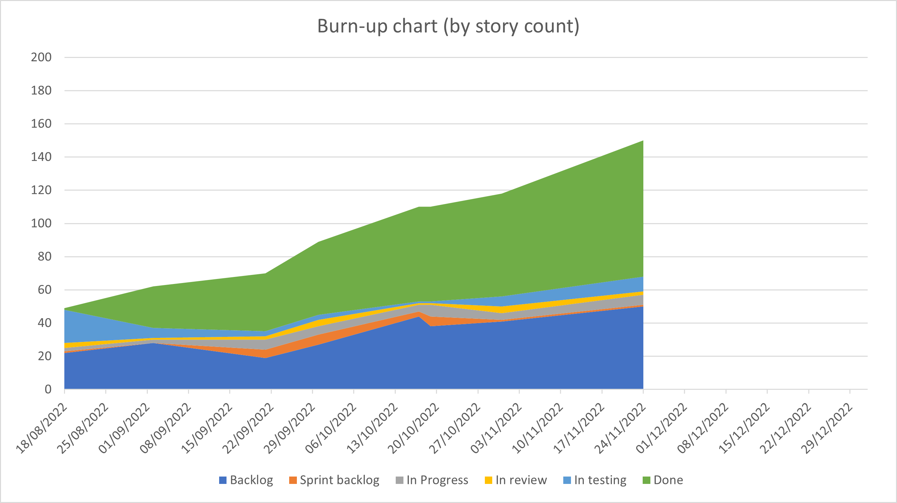

  

# Vector Atlas Platform Sprint 5 Report

## Executive summary
This report covered 4 weeks worth of work given various holidays and time pressures when scheduling the intermediate review.

We've made a lot of progress on the map view with the ability to filter data, download that filtered data and modify the colours of layers on the map view. We've de-risked being able to send emails as well as changes to the way we display sources.

With the Mbita workshop coming up we will likely create an offline sprint review for the next two weeks of work and run the next online review after the Christmas break. With this in mind we're doing planning to focus on what we need to do in the next 4 weeks, we will focus on:
- downloading output model data from each overlay.
- showing species information pages
- filtering by area of interest
- creating a user landing page to bring together data upload/model upload etc.

## Top risks
- **(Increasing)** The test environment is beginning to be treated as the production one as we are wanting to use it to track sources. This means we can't freely deploy changes and there is a risk new updates will bring down the site. We need a production environment ASAP (we need to initiate the conversation with Kennedy and ICIPE to organise this - we've now validated that the current specifications are sufficient).

- **(Stable)** Pace of development is slowing down and we still have a lot of major areas to cover. We need to be proactive with some team React training.

- **(Decreasing)** Getting realistic data into the system so we can test with realistic conditions and establish how users are likely going to want to use the site. *Update:* We now have some realistic data in the system but we need more.

## Story summary

At the end of Sprint 3 the story counts are:
- Done: 82,
- In testing: 9,
- In review: 2,
- In progress: 6,
- To do: 1,
- Backlog: 50

The burn-up chart below shows that we've been able to accelerate progress as well as adding more stories to the backlog to do more future planning.

## Stories done
### Stories
- 225 - Navigation to source pages
- 165 - Send emails
- 207 - add num_id to table
- 200 - Occurrence NaN bug
- 228 - sorting and filtering
- 209 - details on clicked data
- 204 - add sources table
- 107 - Update Map to show available filters and wire in marker route
- 108 - Download data button based on current view selection
- 220 - Bug: Map not displaying correctly
- 240 - Bug: 403 page displayed to users has some errors
- 244 - Bug: Backslash not escaped when adding source
- 242 - Bug: Reference form not being reset
- 206 - add ability to filter on more than one country and species.
- 224 - make all map marker api filters accept arrays(hopefully)
- [160. Fix the display of lakes](https://github.com/icipe-official/vectoratlas-software-code/issues/160)
- Fix map flickering on data load
- Fix layer toggles not remembering state
- [88. Investigate the best method to incorporate colour styling in overlay maps](https://github.com/icipe-official/vectoratlas-software-code/issues/88)
- [167. Allow users to change the opacity and colour of layers](https://github.com/icipe-official/vectoratlas-software-code/issues/167)
- Added the latest news item.
- [110. Add download map image button](https://github.com/icipe-official/vectoratlas-software-code/issues/110)

### Stories missed

None - we actually pulled in several during the sprint.

## Review minutes

Andrew talked through the output of the email investigation and how we're going to integrate this into the system in future stories. He also talked through various bug fixes.

Andrew showed the new sources table along with the unique ID that goes with them. This led to the discussion around wanting to use the system to track sources now - we really need a production system to do this so we don't introduce bad data in to the system in order to test it.

Andrew also showed how to sort and filter the table. Marianne said it would be good to filter on author as well and we should make this change.

We still need an ability to bulk upload a set of sources.

Andrew then showed how to get the details for particular points on the map. This led to the discussion about whether we can show an exploded view of the points so you can either click on a specific one of see the various sources for the points at that location. We need to investigate what is possible as well as what is the best way to represent this.

Peter showed the new ability to include a list of items in the filters for the data points. This is tricky because we need to work out how to handle not given/empty/null values.

Sheila demonstrated her work to download the map image. The subject of showing the vector atlas logo came up again and it is already a story on the backlog but demonstrates it's important so the platform gets credit. We should email MAP as they've done this and might have more information on how to do it technically.

Chris demonstrated the new filters and how this fits in to Peter's work. We discussed what the wording should be for "empty" and agreed to try "not given" and see what the users say.

Chris demonstrated various bug fixes and we noticed that the email is wrong on the not authorised page - this needs to be updated to the icipe.org one.

Whilst demonstrating the fix for the sources page, Marianne asked if we could put a validation on the date field. The sources page currently doesn't include any validation beyond being non-empty and there is a story for this on the backlog that we need to get to.

Ray demonstrated the updated news story for the Mbita workshop. He also showed the updated lakes on the map and explained how that was a lot of open street map data compressed in to a tile format because it was missing from the natural earth data.

Ray also demonstrated the ability to change the colour of each of the layers and explained about the trade off of rendering speed vs being able to colour the raster layers. Marianne is going to ask end users whether they need this level of control at the workshop and if so if they're willing to accept the slower performance.

Ray finally demonstrate the new automated deployment pipeline in GitHub that makes it smoother to release to the test environment without having to log into the virtual machine and run through a set of commands. This has an approval step on it so we can just check that it is a good time to deploy as well as knowing that it is one of the core team doing that deployment.

### Actions:
- **Andrew**: Add a new story to add author as a filter to the sources table.
- **Ray**: Add a new story to bulk upload sources.
- **Chris**: Fix email in the not authorised page.
- **Marianne**: Check with the end users about what level of control they need when colouring layers.

## Current code analysis state

### UI
- eslint: 0 warnings
- tests: 203 tests, 84.47% branch coverage, 97% line coverage

A significant improvement in branch coverage since last sprint.

### API
- eslint: 0 errors, 0 warnings
- tests: 111 tests, 78.44% branch coverage, 91.54% line coverage 
