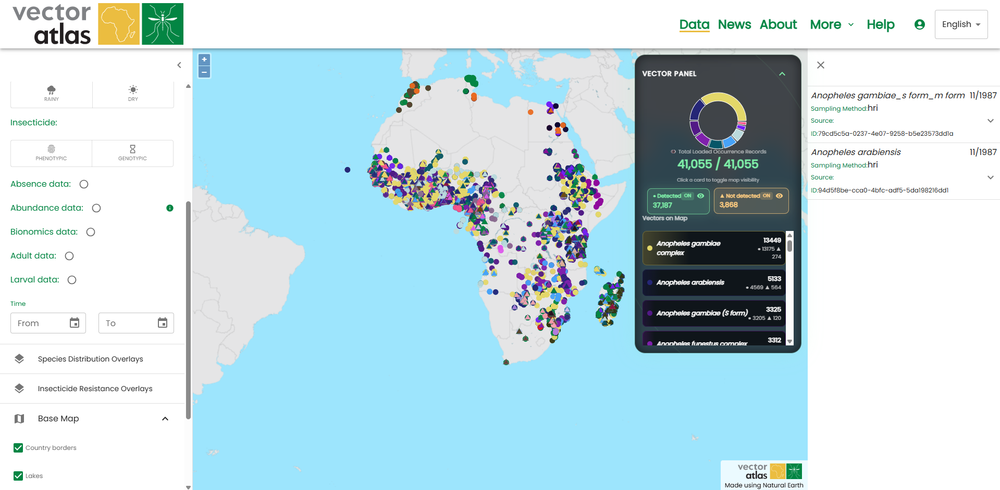

# Vector Atlas Help

User documentation for the [Vector Atlas](https://vectoratlas.icipe.org), built with
[Sphinx](https://www.sphinx-doc.org/) using Markdown ([MyST](https://myst-parser.readthedocs.io/))
and the Read the Docs theme. The site is published on Read the Docs in three languages:
**English (EN)**, **French (FR)** and **Portuguese (PT)**.

## Folder structure

```
src/Help/
├── conf.py                          # Sphinx configuration (languages, theme, image rules)
├── index.md                         # Home page and navigation (toctrees)
├── quick-start.md
├── exploring-the-data/              # Section: map, filters, species, sources, downloads
│   ├── *.md
│   └── images/  (+ fr/, pt/)
├── finding-out-about-the-project/   # Section: news, about us
│   ├── *.md
│   └── images/  (+ fr/, pt/)
├── contributing-data-to-the-atlas/  # Section: sign up, sources, upload, review
│   ├── *.md
│   └── images/  (+ fr/, pt/)
├── images/                          # Screenshots used by quick-start.md (+ fr/, pt/)
├── locale/                          # Translations
│   ├── fr/LC_MESSAGES/              # French .po / .mo files, one per page
│   └── pt/LC_MESSAGES/              # Portuguese .po / .mo files, one per page
├── _static/                         # Custom CSS, JS, logo
├── requirements.txt                 # Python dependencies
├── Dockerfile
└── _build/                          # Generated output (not committed)
```

English text lives in the `.md` files. French and Portuguese text lives in the `.po`
files under `locale/`. Screenshots live in each section's own `images/` folder.

## Running the help site locally

All commands run from `src/Help`.

### 1. One-time setup

```bash
python3 -m venv .venv            # or use your existing virtualenv
source .venv/bin/activate
pip install -r requirements.txt
```

### 2. Build the three languages

```bash
sphinx-build -E -a -b html . _build/html                      # English  -> /
sphinx-build -E -a -b html -D language=fr . _build/html/fr    # French   -> /fr/
sphinx-build -E -a -b html -D language=pt . _build/html/pt    # Portuguese -> /pt/
```

Build English first. The French and Portuguese output goes inside the English output
folder so that all three languages are served from one place, the same layout the
EN | FR | PT switcher links to.

`-E -a` forces a full rebuild. Use it whenever you add, rename or replace an image;
otherwise Sphinx can reuse old files.

### 3. View it

```bash
cd _build/html
python3 -m http.server 8005
```

Open <http://localhost:8005>. Use the **EN | FR | PT** links at the top right of any
page to switch language.

> **Browser cache:** Chrome caches images aggressively and may keep showing an old
> screenshot after a rebuild. Open DevTools (F12), tick **Disable cache** on the Network
> tab, and hard-reload (Ctrl+Shift+R).

### Starting from scratch

```bash
rm -rf _build
```

then run the three build commands again.

## Editing content

### Edit an English page

1. Edit the `.md` file (for example `exploring-the-data/using-the-map.md`).
2. Rebuild and check it locally.

### Add a new page

1. Create the `.md` file in the right section folder.
2. Add it to the relevant `toctree` (see `index.md`) so it appears in the sidebar.
3. Add its translations (see below).

### Add or replace a screenshot

Image paths are relative to the page that uses them:

```markdown

```

This points to the `images/` folder **next to that page's `.md` file**, so a page in
`exploring-the-data/` uses `exploring-the-data/images/`. If the page and the image
folder are in different places, use a relative path such as `../images/name.png`.

If the browser shows a broken image and the terminal shows a 404 for
`.../images/name.png`, the path is wrong or the file is missing.

## Translations

### Translated text

1. Update the `.po` file for the page under `locale/<lang>/LC_MESSAGES/`. The folder
   structure mirrors the docs folders, for example
   `locale/fr/LC_MESSAGES/exploring-the-data/using-the-map.po`.
2. Fill in `msgstr` for each `msgid`.
3. Rebuild. The `.mo` files are compiled automatically during the build.

When English text changes, the matching `msgid` in the `.po` file changes too. Update
the `.po` file or that paragraph shows in English.

To regenerate `.po` files after English changes (requires `sphinx-intl`):

```bash
sphinx-build -b gettext . _build/gettext
sphinx-intl update -p _build/gettext -l fr -l pt
```

### Translated screenshots

The screenshots in French and Portuguese must show the app in that language.
`conf.py` sets:

```python
figure_language_filename = '{path}{language}/{basename}{ext}'
```

This means that for any English image, Sphinx looks for the translated one in a
`fr/` or `pt/` subfolder next to it:

```
exploring-the-data/images/point-details.png        # English
exploring-the-data/images/fr/point-details.png     # French
exploring-the-data/images/pt/point-details.png     # Portuguese
```

Rules:

- Use the **same filename** in the language folder.
- Put the language folder next to **that section's** English image. A file in
  `images/fr/` is not used by pages in `exploring-the-data/`.
- If the translated file does not exist, Sphinx silently uses the **English** image.
  That is the usual reason a French or Portuguese page shows English screenshots.
- Take translated screenshots with the app's language switched to French or Portuguese.

### Find untranslated screenshots

After building all three languages, run this from `_build/html` to list built French
and Portuguese images that are identical to the English ones:

```bash
cd _build/html
md5sum _images/* | awk '{print $1}' | sort -u > /tmp/en_hashes.txt
for lang in fr pt; do
  echo "=== $lang ==="
  for f in $lang/_images/*; do
    h=$(md5sum "$f" | awk '{print $1}')
    if grep -q "$h" /tmp/en_hashes.txt; then
      echo "  $(basename "$f")"
      grep -rl "_images/$(basename "$f")" "$lang" --include=*.html | sed 's/^/      used on: /'
    fi
  done
done
```

Anything listed is either untranslated or genuinely language-neutral (for example a
screenshot with no text).

## Read the Docs

The documentation is built and hosted by Read the Docs from this repository.

- The Sphinx configuration is `src/Help/conf.py`.
- Each language is a separate Read the Docs project, linked to the main (English)
  project under **Admin → Translations**. Each translation project is set to its
  language and builds the same source with that language.
- Pushing to the tracked branch triggers a new build.
- The EN | FR | PT links in the page header come from this setup.

To check the build configuration in the repository:

```bash
git ls-files | grep -i readthedocs
```

If a Read the Docs build fails but your local build works, compare
`requirements.txt` with the packages Read the Docs installs, and check the build log
for `WARNING` and `ERROR` lines.

## Troubleshooting

| Problem | Cause and fix |
| --- | --- |
| Broken image, 404 in terminal for `.../images/name.png` | Wrong relative path in the `.md`, or file missing. Check the file is in the `images/` folder next to the page. |
| French or Portuguese page shows an English screenshot | No file at `<images folder>/fr/<same name>.png`, or the file in `fr/` is an English screenshot. |
| Old screenshot still showing after replacing the file | Browser cache. Disable cache in DevTools and hard-reload; rebuild with `-E -a`. |
| Text is in English on a French or Portuguese page | The `.po` file has no translation (`msgstr` is empty) or the English text changed. |
| `Document headings start at H2, not H1` warnings | Known, from MyST heading levels in `using-the-map.md`. They do not affect the output. |
| `rm -rf _build` and the server shows nothing | Stop the server (Ctrl+C), rebuild all three languages, and start it again from `_build/html`. |

## Docker

