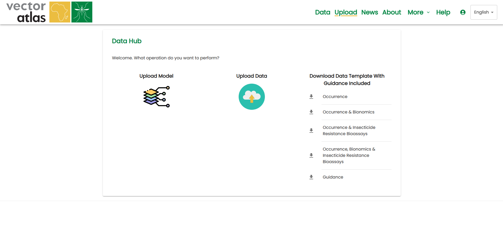
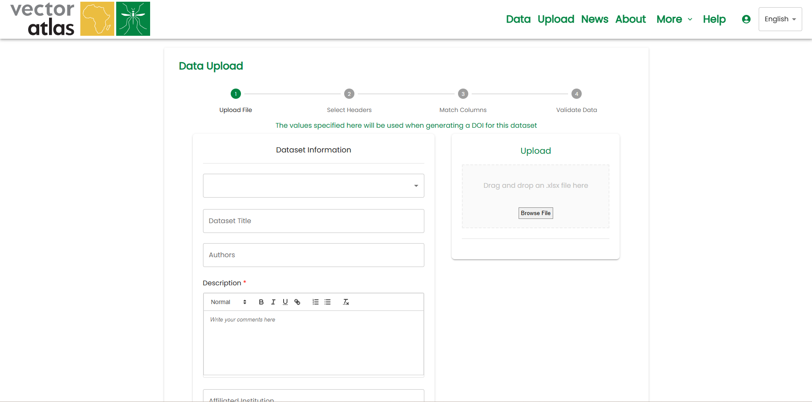
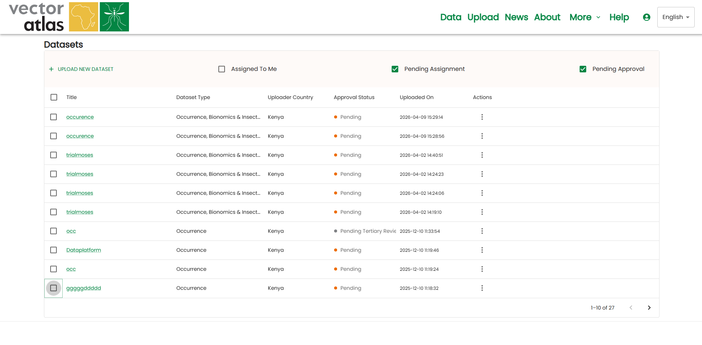
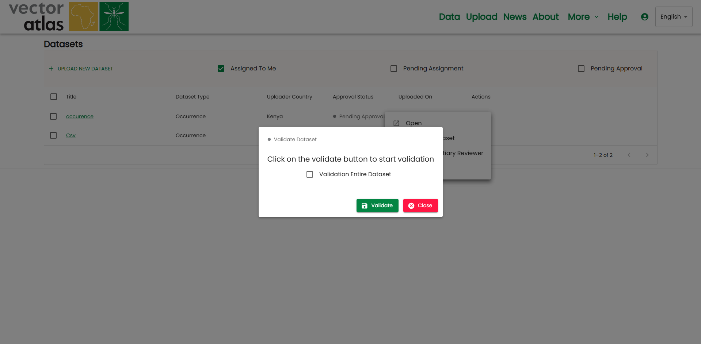

# DATA UPLOAD

- Click on the `upload` link in the navigation bar.
- You will be directed to the upload interface.

## Downloading Templates

- Templates help users upload data in a system-compatible format.
- Click on the `download arrow icons` on the right side of the panel to download templates.
- Four major templates are available:
  - **First template**: Contains the "Occurrence" section only.
  - **Second template**: Contains "Occurrence" and "Bionomics" sections.
  - **Third template**: Contains "Occurrence" and "IR Bioassays" sections.
  - **Final template**: Contains all three sections: "Occurrence," "Bionomics," and "Insecticide Resistance."

## Uploading Data

- After downloading and filling out the template:
  - Click on the `Upload Data` icon.
  - Follow the four-step upload process.
- **Step 1**: Select the dataset and enter details:
  - Dataset title, description, authors, affiliated institutions, and DOI (if available).
- **Step 2**: Choose to either:
  - Upload directly to blob storage for review, OR
  - Continue with column matching and validation before uploading to blob storage.

## Visualization of Uploaded Datasets by Reviewer Manager

- Navigate to the `Uploaded Datasets` page:
  - Click `More` in the top navigation and select `Datasets`.
- Filter datasets using checkboxes:
  - Assigned to you.
  - Pending assignment.
  - Pending approval.

## Assignment of Uploaded Datasets to Reviewers

- Reviewer managers can assign datasets by clicking the three dots in the action column.
- **Before assignment**: Status is `Pending`.
- **After assigning a primary reviewer**: Status changes to `Primary Review`.

  

- Primary reviewers must review the dataset before re-uploading.
- The reviewer manager can assign a tertiary reviewer, changing the status to `Tertiary Review`.
- Reviewers can:
  - Request a dataset re-upload from the primary reviewer.
  - Send an email to the uploader or tertiary reviewer.
  - Reject the dataset if it does not meet the required standards.

## Approval of Uploaded Datasets

- Once all necessary steps are completed, the dataset can be approved by the reviewer manager.
- The reviewer manager can also:
  - Validate the dataset before approval.
  - Send an email for further communication.

## Ingestion to VA Database and Notifying the Uploader

- Once the dataset is approved, it is automatically ingested into the Vector Atlas database.
- The dataset is stored in the database and appears on the map, making it visible to all users.
