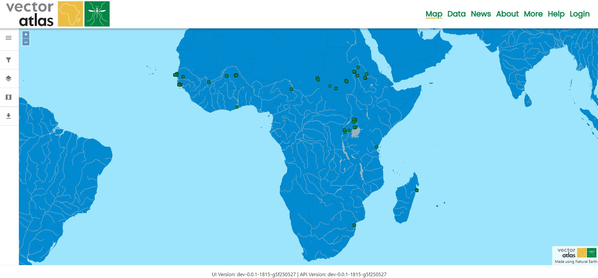
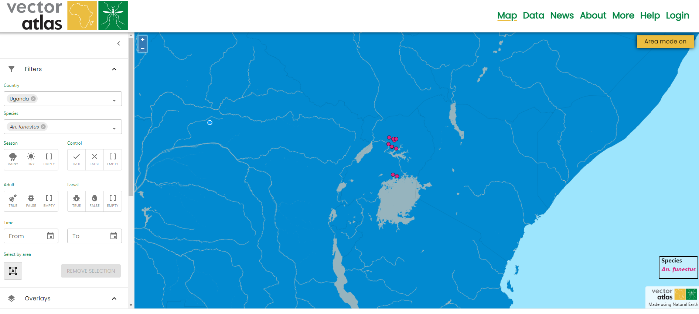
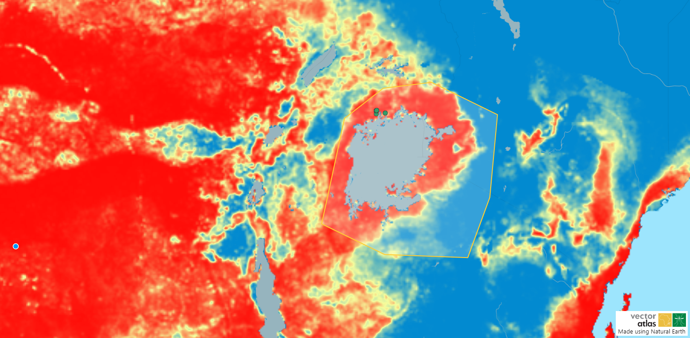

# Quick start guide

The sections on the left provide a more detailed description of what the different paths through the system are but this guide provides a quick guide to understand what the Vector Atlas can do and how you can explore the data.

The [home](https://vectoratlas.icipe.org/) page provides the initial landing point for users and the purpose of the Vector Atlas - to provide analyses-ready data and spatials models tailored for malaria vector control. You can click through to the map with the `Explore the data` button, read the latest news from the team as well as learning about the project and the team with the `Find out more` button.

Click on `Explore the data` to navigate to the map page. This displays all of the data within the system that has been published.

Click on the filter icon on the map tools in the left hand menu.

This opens the filters where you can choose some countries and/or species to filter by. Filter by `Uganda` and the species `An. funestus` to see how the data is reduced on the map. You can also zoom in and out on the map either with the scroll wheel, the buttons in the top left of the map or pinching if on a touch device.

You can then further refine with the area select tool. Turn the mode on by clicking the button below the "Select by area" filter, click the points of your polygon and then click the first one again to complete the polygon. Click the mode button again to turn the mode off.

Expand the overlays section and click on the check box for an overlay to turn it on.

Maybe you need to alter the appearance of the base map for a report, for example to emphasise the country borders click on the base map section of the tools. Then click on the colour circle next to country borders, this will open the colour picker. Choose a new colour for the country borders, the map will update immediately. Click on the close button to the right of the `Country borders` layer name to close the picker.

Scroll down to the final map tools section and expand the `Download` section. Click on `Download map image` to get a copy of your map that can be used in a report. The output would look like the image below.

That's the basic process for exploring, viewing and downloading data. You can catch up with the latest news from the project using the [News](https://vectoratlas.icipe.org/news) link in the top navigation bar or find out more about the project in the [About](https://vectoratlas.icipe.org/about) page.

