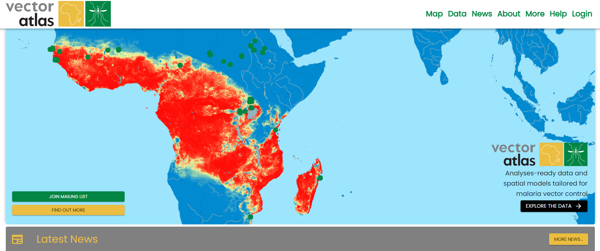
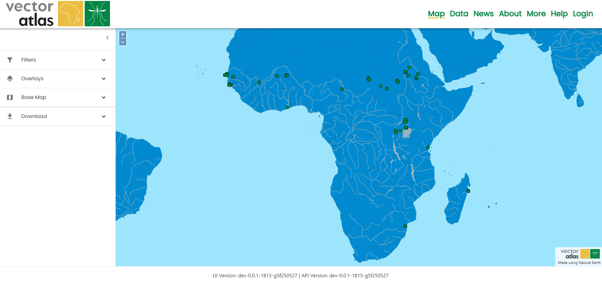
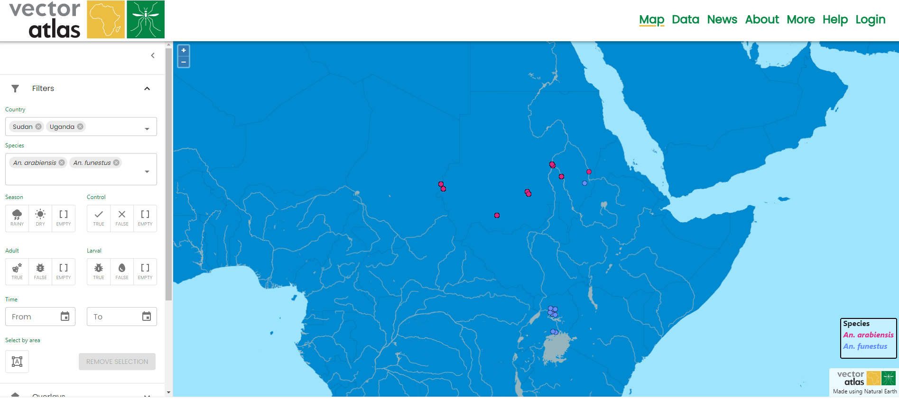
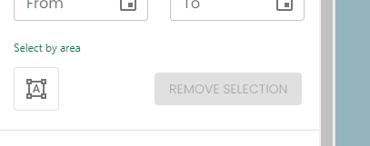
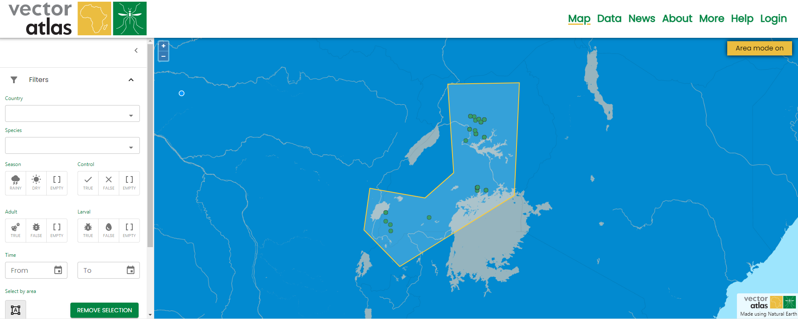
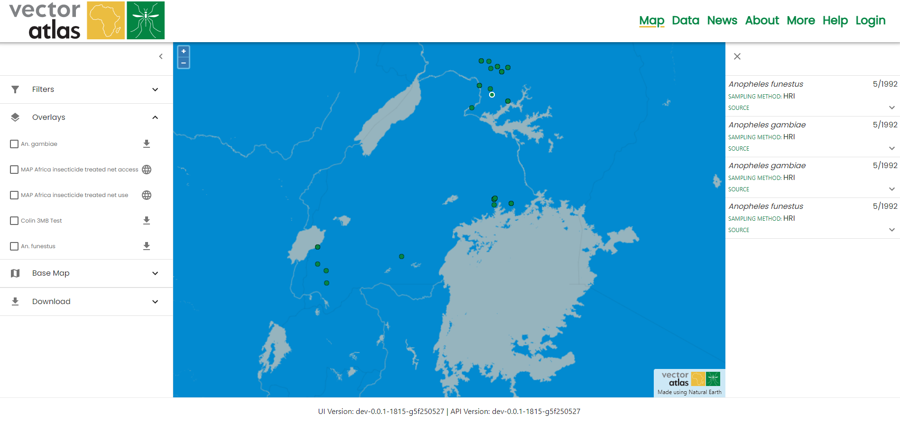
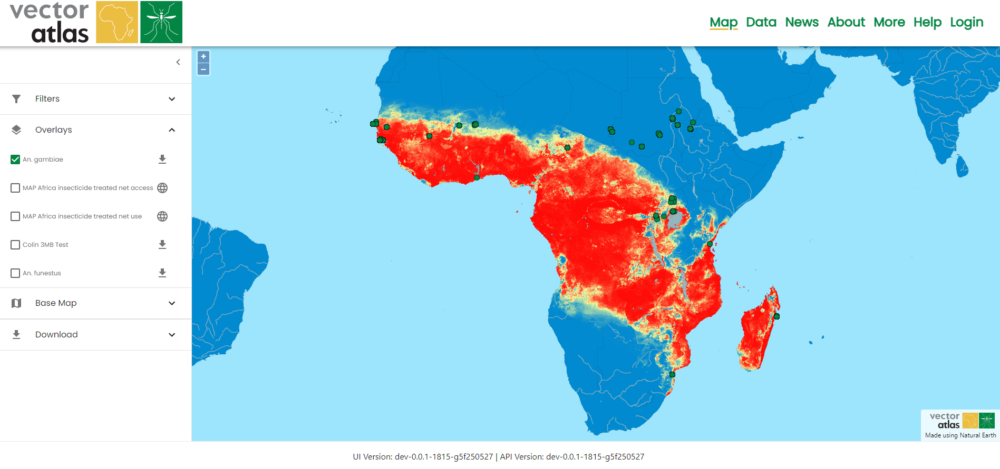
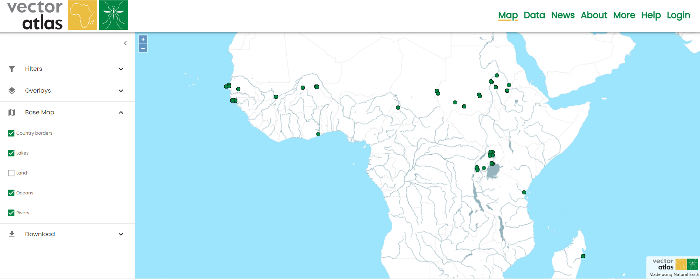

# Using the map

The main feature of the Vector Atlas is the map view that can be used to explore the data that the Atlas holds; this data can be filtered, examined and downloaded.

## Getting to the map
To get to the map click on the map on the homepage, or use the map link in the top navigation bar - both will redirect to the [/map](https://vectoratlas.icipe.org/map) route.

The map tools are in the menu on the left and include tools for filtering, displaying overlays, altering the display of base layers and downloading data.

## Filtering data

Multiple data filters can be applied using the filters available in the first section of the tools on the left. Data can be filtered by:
- country,
- species,
- season,
- control,
- whether adult data is present,
- whether larval data is present,
- the time range of the data (down to month and year)
- selected area (more details below)

The different filters act as an AND condition, e.g. selecting Uganda and An. arabiensis gets only the data in Uganda with An. arabiensis species. However, within an individual filter it acts as an OR condition, e.g. selecting Uganda and Sudan in the countries filter will get all data for both countries.

### Area select mode

Data can also be filtered by area; to activate the area select mode, click on the mode button below the "Select by area" filter.

This changes the mode on the map so each click is a point on the boundary of the selection polygon, clicking on the original point again will complete the polygon. Once a polygon is completed then the data will be filtered to that area. A new polygon can be created after the first is completed, the first polygon is removed once the second is completed - i.e there is only ever one polygon at once.

Clicking the area mode button again turns the mode off but doesn't remove the selected polygon. This means you can click on points inside the polygon to get more information. Clicking on the `Remove selection` button will clear the polygon and remove any area filter on the data.

## Getting more information about points

Clicking on points on the map opens the information panel on the right showing extra details about each of the points under the click (which could be many points close together).

The details panel can be closed with the close button in the top left of the panel.

## Overlaying surfaces

Overlays provide various modelling outputs that can be visualised together and combined with the data to find new insights. Each overlay can be turned on and off independently.

Currently the order of the overlays can't be changed but this is a planned feature for the future.

## Altering the base map

The base map can be altered by turning features and layers on or off. This provides the capability to customise the visualisation that can then be downloaded for reports and publications.

