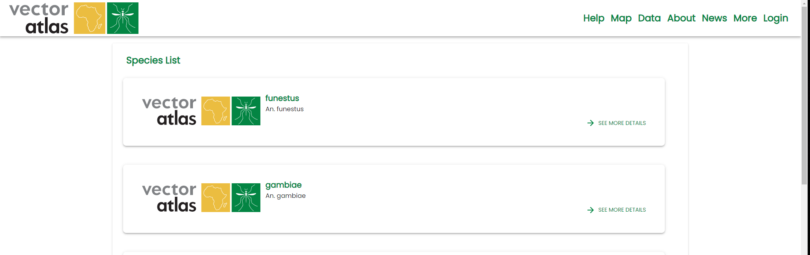
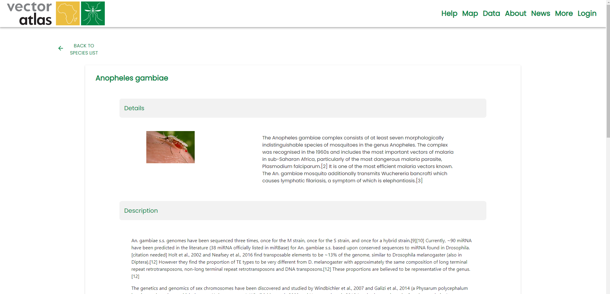

# Learning about different species

The Vector Atlas includes a lot of information about the different species of mosquitos on the [Species list](https://vectoratlas.icipe.org/species) page, this can be found from the top navigation menu under `More > Species List`. This includes information about the species, its history and distribution.

Clicking on one of the items in the list will take you to a page with more details about that given species.

