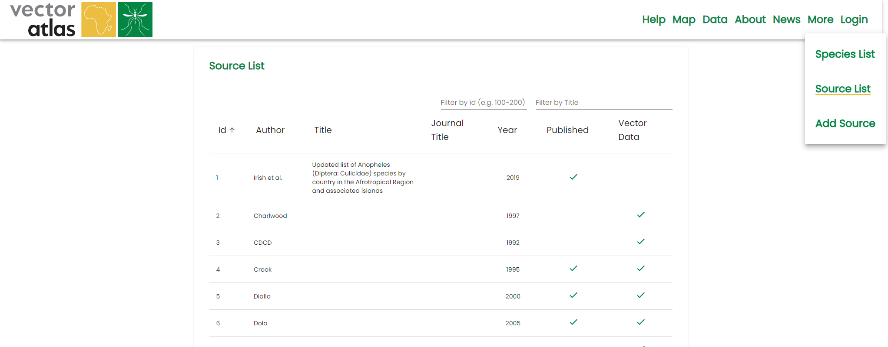

# Listing the sources

The Vector Atlas tracks the sources used in the data within the system and lists them on the [Sources](https://vectoratlas.icipe.org/sources) page, this can be navigated to from the top navigation menu in `More > Sources List`.

