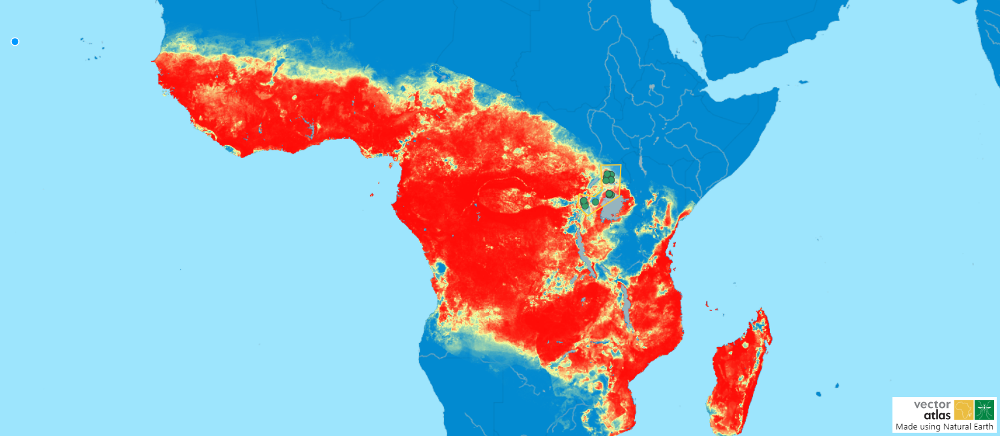

# Downloading data

Data can be downloaded from the system from the map page. The final section in the map tools on the left has buttons for downloading various data, whether that is an image of the current selection of data or the raw data itself.

The `Download map image` button will download an image file with the current state of the map showing only the data that results from the filters as well as an area polygon if one has been selected.

The `Download filtered data` button will download a csv with the raw data relating to the filtered points and can be used for further analysis.

An example of the input and output of the map image is shown below.

