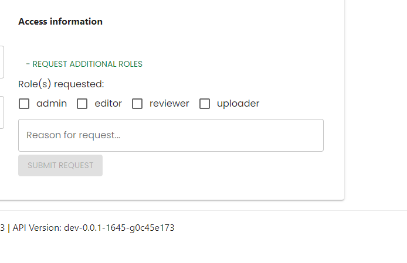

# Signing up the the site

Most operations do not require a log in as the data is intended to be open. The time that a log in is required is when contributing data to the site, this means we can assign roles to users who are uploaders, those who are reviewers and those who are editors for the site.

To sign up to the site, click on the `Login` button in the top right of the navigation menu.

This will redirect you to the Vector Atlas' authentication provider, Auth0. Click on the `Sign up` option below the "Continue" button.

Enter your email, create a password and click `Continue`. This will register you for the site and redirect you to the homepage but you won't have any roles by this point.

You will receive an email from Auth0 asking you to verify your email address by clicking on a button in the email. Once this verification is done then the system team can assign roles.

To request new roles, go to the `Settings` page in the user menu.

On the user settings page click on the `Request additional roles` button to open the roles form. Select the roles that you require; uploader to upload data or model overlays, reviewer to review data before it is published, editor to edit news and species information, admin to be a site admin.

Enter a reason for the request and then click submit request, this will then email the admins with your requested roles, Auth0 id and the reason for the request. They should then respond directly to you.

Equally, you don't need to know the roles you need ahead of time. The system will display an unauthorised message is you try to perform an operation that you don't have the right role for. For example, if you navigate to the Data Hub page and select `Upload Model` then you will get the message that you are not an uploader and be directed to the user settings page.

