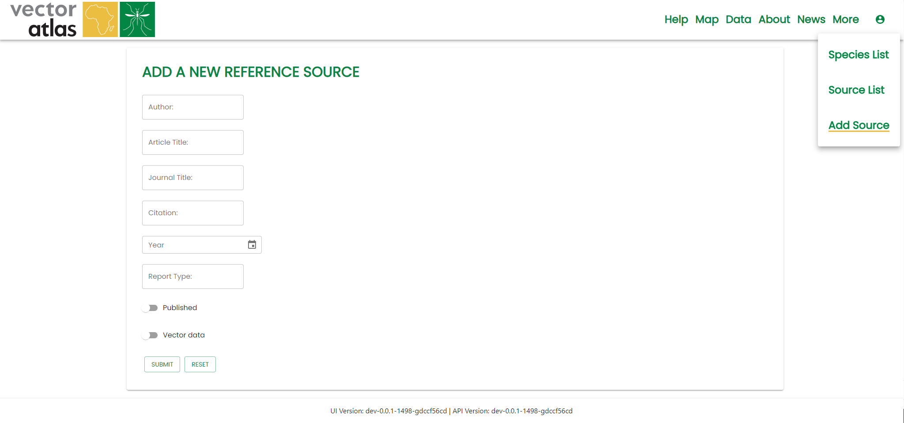

# Creating sources

To create a source you need the `uploader` role. Navigate to the `More > Add Source` option in the navigation menu. Fill in the details for a source and click `Submit`. Use the `Reset` button to clear the form.

