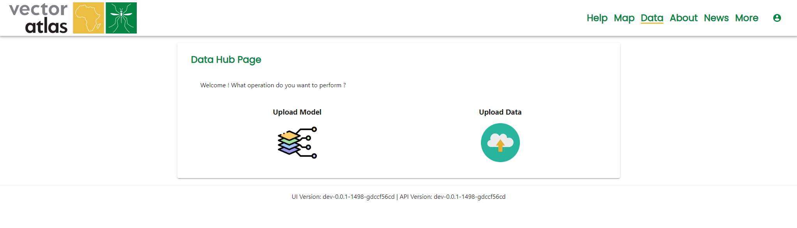
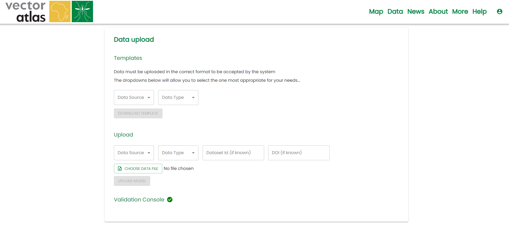
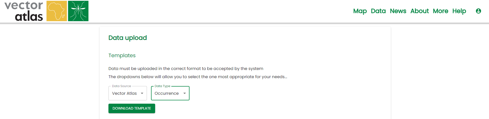

# Uploading data

Uploading data requires the `Uploader` role.

To upload data, go to the [data hub](https://vectoratlas.icipe.org/dataHub) page and click on `Upload Data`.

## Getting a template to input data

For data to be accepted by the system, it has to be uploaded using one of the pre-defined templates. These are available to download on the Data upload page:

Select the appropriate `Data Source` and `Data Type` and click the `DOWNLOAD TEMPLATE` button to download the csv template file, containing the data headers.

## Uploading a template with data

Once you have downloaded and filled in the template, upload it using the `Upload` form on the page.

Select the correct Data Source and Data Type for the uploaded data. The Dataset Id and DOI fields are optional.

If this is a re-upload of reviewed data, input the dataset id in the appropriate field.

If the DOI for this data is known, enter it in the appropriate field. If the DOI already exists in the system, the upload will not succeed.

## Uploading a corrected data set

