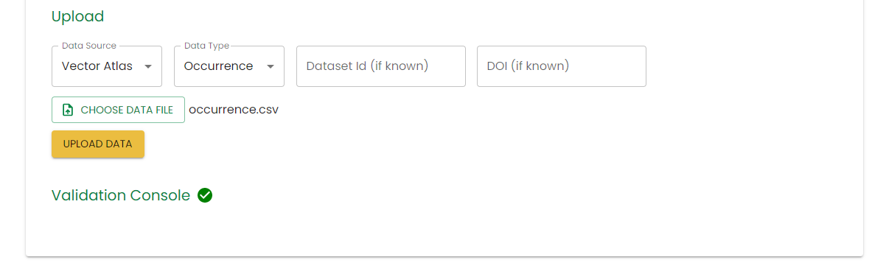
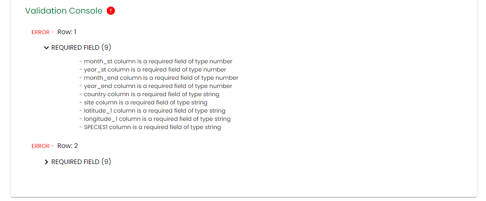

# Uploading data

Uploading data requires the `Uploader` role.

To upload data, go to the [data hub](https://vectoratlas.icipe.org/dataHub) page and click on `Upload Data`.

## Getting a template to input data

For data to be accepted by the system, it has to be uploaded using one of the pre-defined templates. These are available to download on the Data upload page:

Select the appropriate `Data Source` and `Data Type` and click the `DOWNLOAD TEMPLATE` button to download the csv template file, containing the data headers.

## Uploading a template with data

Once you have downloaded and filled in the template, upload it using the `Upload` form on the page.

Select the correct Data Source and Data Type for the uploaded data. The Dataset Id and DOI fields are optional.

If this is a re-upload of reviewed data, input the dataset id in the appropriate field.

If the DOI for this data is known, enter it in the appropriate field. If the DOI already exists in the system, the upload will not succeed.

Click the `CHOOSE DATA FILE` button and select the data file. Only csv files will be accepted. Click `UPLOAD DATA` to upload the data.

## Data validation

Once data has been uploaded, the system will run basic validation checks on the data. If there are any issues that need to be fixed, they will be listed in the `Validation Console` at the bottom of the page.

The row number of the issue is shown, alongside the issue type. These issues are expandable so you can see exactly what needs to be fixed in the data.

These issues will need to be corrected in the data before the system will accept it. Once the data has been corrected, it can be re-uploaded using the same process as before.

## Next steps

Once the data has been successfully uploaded, it will be reviewed by the Vector Atlas team. You will receive an email to the email addess you signed up with when this has taken place.

If any corrections are needed to the data, it will need to be re-uploaded with the Dataset Id parameter filled in. The email will contain this value.
