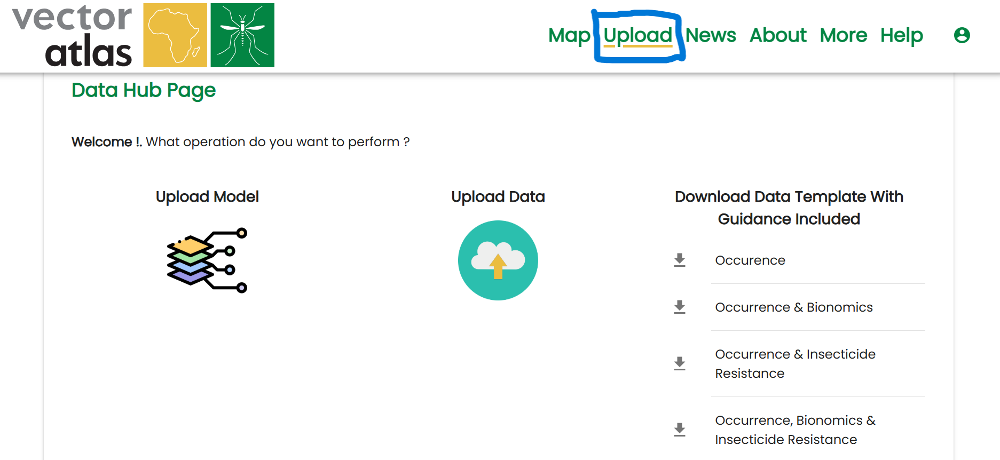
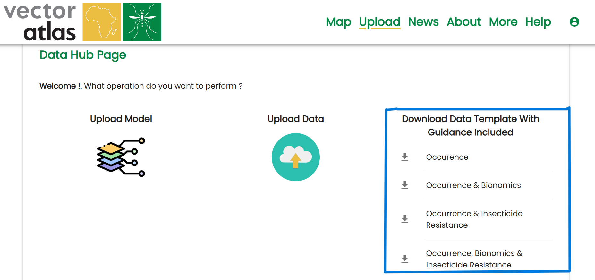
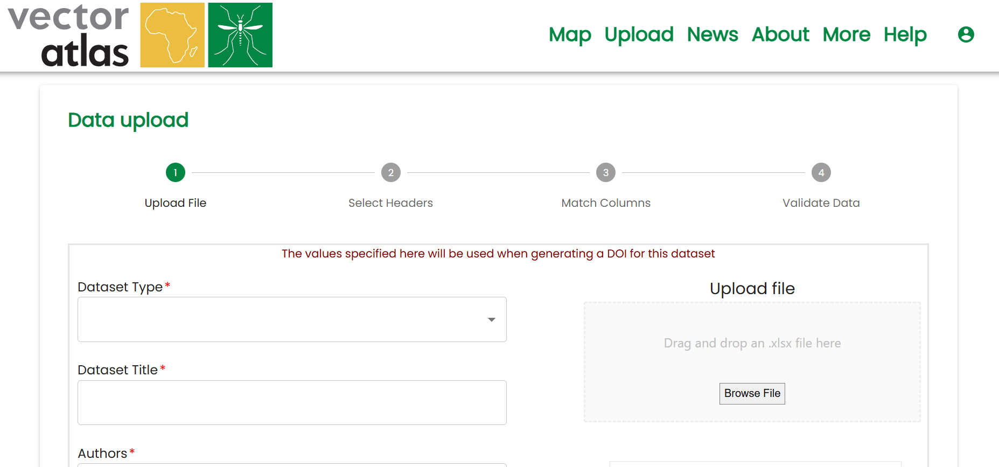
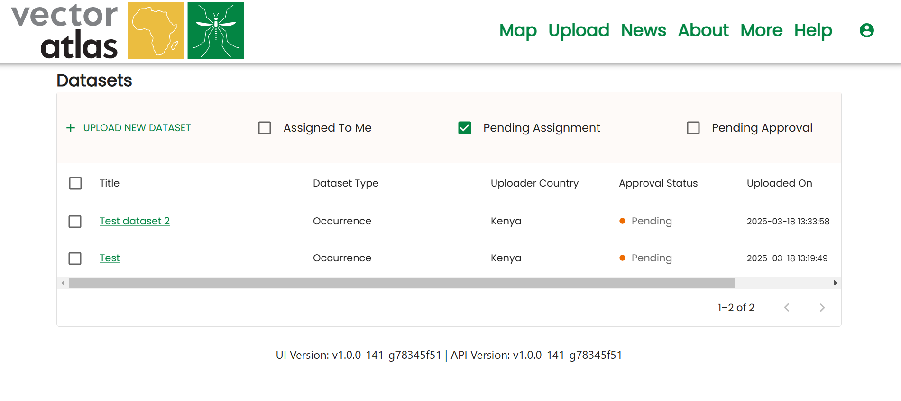
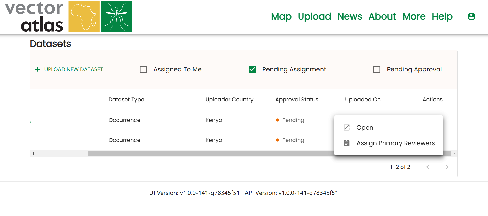
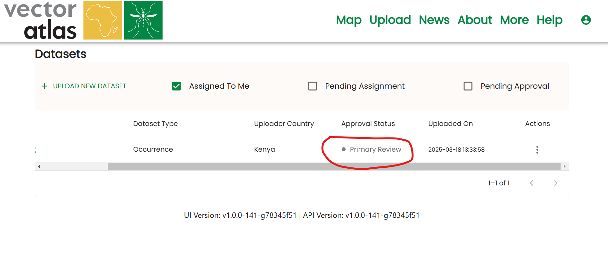
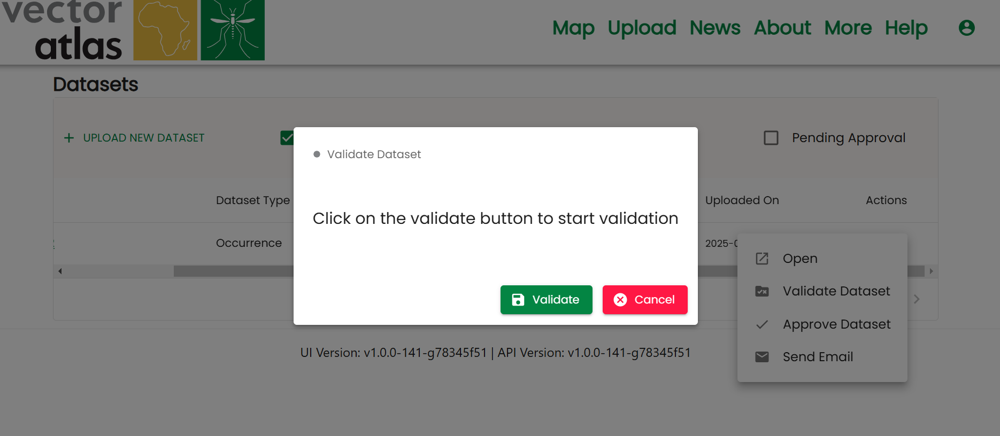

### DATA UPLOAD

To upload datasets to the Vector Atlas Platform, click on the `upload` link in the navigation bar at the top. From there, you will be directed to the upload interface.

### Downloading Templates

Templates are intended for users who want to upload data to the Vector Atlas, providing them with pre-populated data in a format that our system can easily validate and ingest. This also helps abstractors when reviewing uploaded datasets.
To download the templates, click on the `download arrow icons` on the right side of the panel. The Vector Atlas comes with four major templates, each containing different sections:
The first template has the "Occurrence" section only.
The second template has both the "Occurrence" and "Bionomics" sections.
The third template contains the "Occurrence" and "Insecticide Resistance" sections.
The final template includes all three sections: "Occurrence," "Bionomics," and "Insecticide Resistance."

### Uploading Data

After downloading the template and filling in your data, you are ready to upload. Click on the `Upload Data` icon, and you will be taken to another interface with sections to follow during the upload process. There are four sections in total.
In the first section, you will select the dataset and fill in form details such as the dataset title, description, authors, and affiliated institutions. You will also provide a DOI for the dataset if one exists. After completing this, you can choose to either upload the dataset directly, which will send the data to blob storage awaiting review, or click "Or continue with matching columns," which allows you to go through header selection, column matching, and final dataset validation. After validation, the dataset will be uploaded to the cloud's blob storage.

### Visualization of Uploaded Datasets by Reviewer Manager

If you are a reviewer or reviewer manager, you can view a list of uploaded datasets by navigating to the "Uploaded Datasets" page. To do this, click on `Datasets` in the dropdown that appears when you click `More` in the top navigation.
From here, you can filter datasets by clicking the checkboxes at the top of the interface. You can filter datasets by those assigned to you, those pending assignment, and those pending approval.

### Assignment of Uploaded Datasets to Reviewers

As a reviewer manager, you can assign reviewers to datasets by clicking the three dots in the action column of the displayed dataset list.
Before assignment, the dataset will have a `Pending` status. Once a primary reviewer is assigned, the status will change to `Primary Review`.

The reviewer will need to review the data before re-uploading it to the system, where it will enter the assignment phase again for the reviewer manager.
After the first phase of review is complete, the reviewer manager can assign a tertiary reviewer, and the status will change to `Tertiary Review`.
Additionally, a reviewer can request a re-upload of the dataset from the primary reviewer, send an email to the uploader or tertiary reviewer about the dataset, or reject the dataset entirely if it fails to meet the standards.

### Approval of Uploaded Datasets

After the dataset has gone through all the necessary steps, it can be approved by the reviewer manager. Alternatively, the reviewer manager may decide to validate the dataset first or send an email to the concerned party if further communication is required.

### Ingestion to VA Database and Notifying the Uploader

Once the dataset is approved by the reviewer manager, it can be automatically ingested into the Vector Atlas database. The data from the dataset will be stored in the database and will also appear on the map, making it visible to all users.