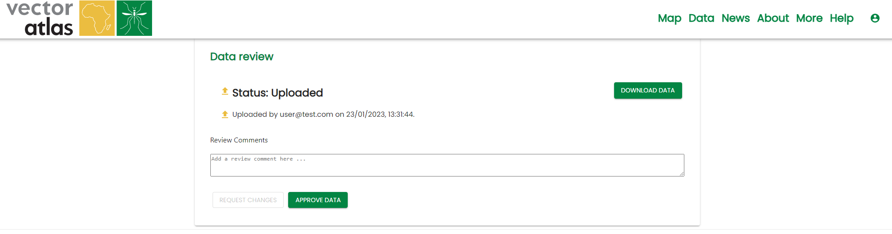
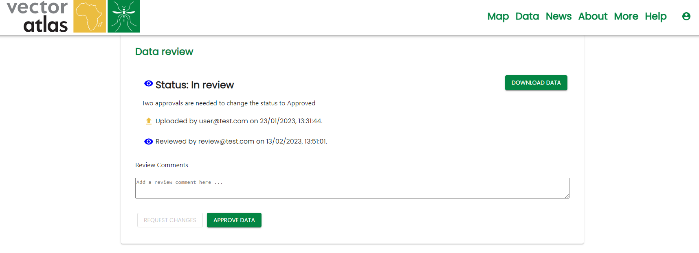
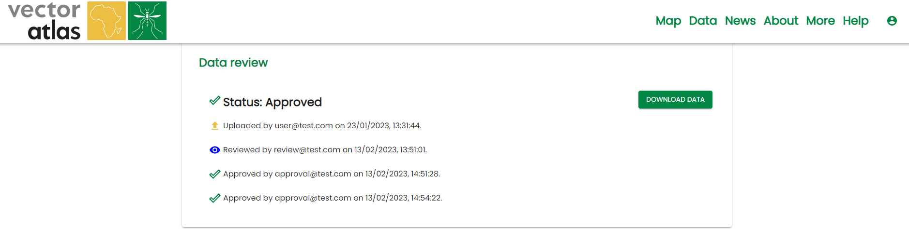

# Reviewing data

When data has been successfully uploaded, the system will send an email to all users with the `reviewer` role, containing a link to the review page:

To see the data uploaded, click the `DOWNLOAD DATA` button. This will download the data as a csv file.

To leave any comments on the data for the uploader to address, type them into the `Review Comments` box and click `REQUEST CHANGES`. This will send an email to the uploader and all other reviewers with the comments. It will also change the status of the dataset to 'In review':

To approve data, click on the `APPROVE DATA` button. This will send an email to the uploader and all other reviewers, saying that you have approved the data.

Two approvals are needed to fully approve data - once two reviewers have approved, the data will be made public, and the review page will be updated:

