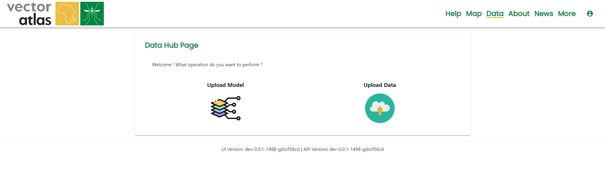

# Uploading model overlays

Uploading model overlays requires the `Uploader` role.

To upload model overlays, go to the [data hub](https://vectoratlas.icipe.org/dataHub) page and click on `Upload Model`.

The model upload page requires a display name, maximum value for the data and the model file itself. The display name is the name used on the map in overlays section of the map tools. 

The maximum value is needed because the overlay is transformed into a tiled version for use in the map - this involves re-scaling the data to match the grey scale colour map used by the system. It also means that two overlays can be compared fairly, suppose two overlays represent a percentage but the first has values between 0 and 10 but the second is between 0 and 90. If the system scaled off the maximum value in the data then it wouldn't be a fair comparison, by telling the system both have a maximum value of 100 then the two layers can be compared.

The model file must currently be a geotiff so that we can support transformation into an mbtiles format. In the future there is planned support for shape files as well as external tile servers (via wms).

Once you click `Upload model` then the system will notify when the file has been uploaded and that it's started to run the transformation, it will then notify again if the transformation is successful or fails.

