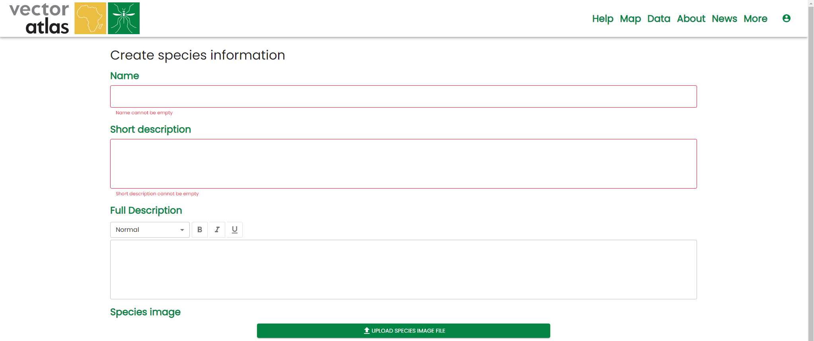
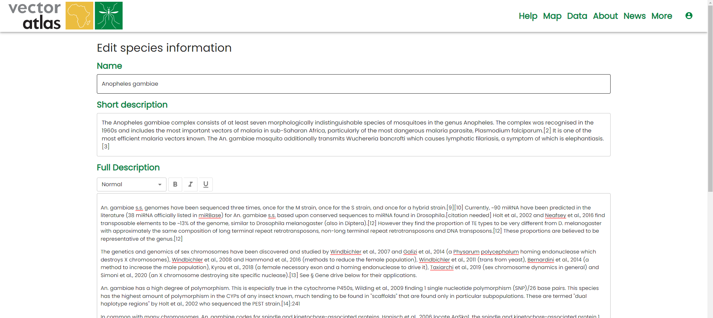

# Editing species information

To edit species pages you will need the `Editor` role. 

## Creating a new species page

To create a new species page go to the [/species/edit](https://vectoratlas.icipe.org/species/edit) route. This will bring up the species editor where you can include a name, short description and full description for the species. An image can also be uploaded for the species but currently this is restricted to 512KB so that users on low bandwidth connections do not have to download too much information.

Once the page is ready then click `Create`.

## Editing a species page

Currently there is no direct route for an editor to load the details for an existing page into the editor. To get there an editor has to go to the [species list](https://vectoratlas.icipe.org/species) page, click on the item to be edited to go to the details page. The details page will be a url like `/species/details?id=8abc-123`, change this to the `/species/edit` route instead of `/species/details`, so the result will be something like `/species/edit?id=8abc-123`

Once finished editing, click `Update` to apply the changes.

