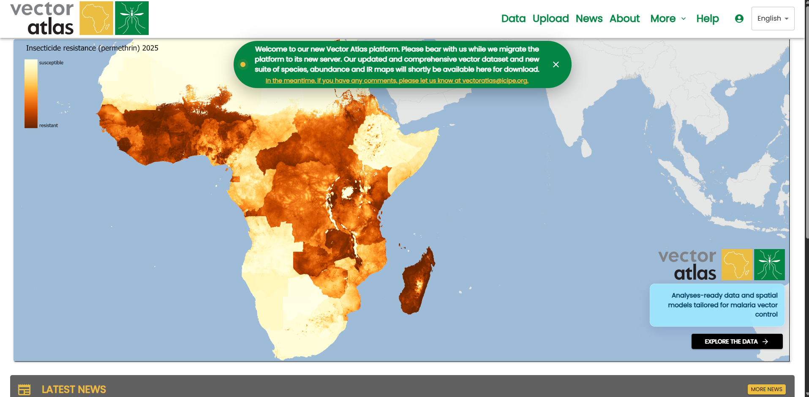
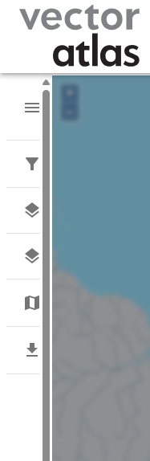
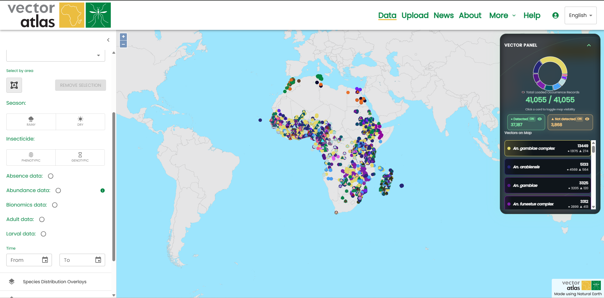
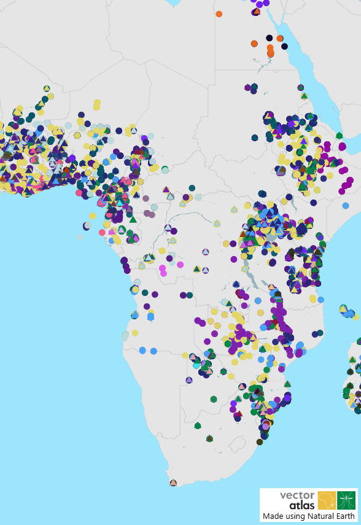

# Guide de démarrage rapide

Les sections à gauche fournissent une description plus détaillée des différents parcours dans le système, mais ce guide fournit un aperçu rapide de ce que Vector Atlas peut faire et comment vous pouvez explorer les données.

La page [Accueil](pathname:///) est le point d'entrée initial pour les utilisateurs. Vous pouvez accéder à la carte avec le bouton `Explorer les données`, lire les dernières nouvelles de l'équipe et en savoir plus sur le projet avec le bouton `En savoir plus`.

Cliquez sur `Explorer les données` pour accéder à la page de la carte. Cela affiche toutes les données publiées dans le système.

Cliquez sur l'icône de filtre dans le menu des outils de la carte à gauche.

Cela ouvre les filtres où vous pouvez choisir des pays et/ou des espèces. Filtrez par `Uganda` et l'espèce `An. funestus` pour voir comment les données sont réduites sur la carte.

Vous pouvez ensuite affiner davantage avec l'outil de sélection de zone. Activez le mode en cliquant sur le bouton sous le filtre "Sélectionner par zone".

Développez la section des superpositions et cochez la case d'une superposition pour l'activer.

Faites défiler vers le bas jusqu'à la dernière section des outils de carte et développez la section `Télécharger`. Cliquez sur `Télécharger l'image de la carte` pour obtenir une copie de votre carte.

