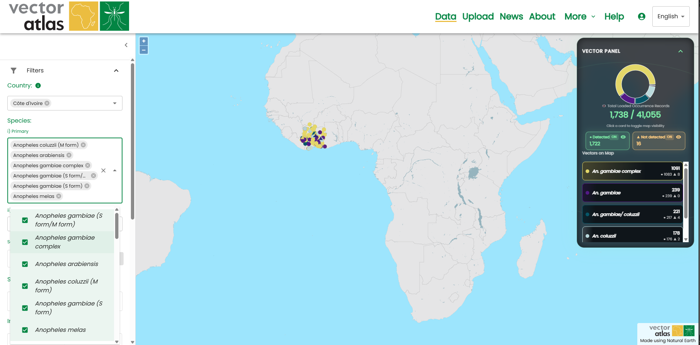
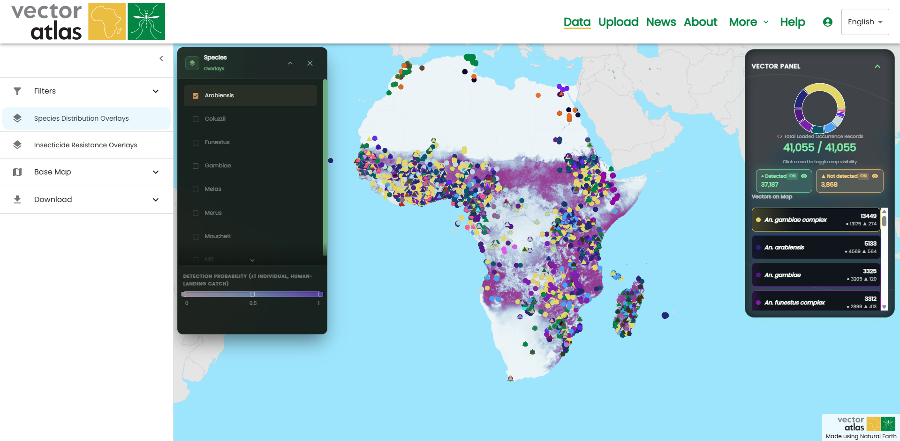

# Guia de início rápido

As seções à esquerda fornecem uma descrição mais detalhada dos diferentes caminhos pelo sistema, mas este guia fornece uma visão geral rápida do que o Vector Atlas pode fazer e como você pode explorar os dados.

A página [Início](pathname:///) é o ponto de entrada inicial para os usuários. Você pode acessar o mapa com o botão `Explorar os dados`, ler as últimas notícias da equipe e saber mais sobre o projeto com o botão `Saiba mais`.

Clique em `Explorar os dados` para navegar até a página do mapa. Isso exibe todos os dados publicados no sistema.

Clique no ícone de filtro no menu de ferramentas do mapa à esquerda.

Isso abre os filtros onde você pode escolher países e/ou espécies. Filtre por `Uganda` e a espécie `An. funestus` para ver como os dados são reduzidos no mapa.

Você pode refinar ainda mais com a ferramenta de seleção de área. Ative o modo clicando no botão abaixo do filtro "Selecionar por área".

Expanda a seção de sobreposições e marque a caixa de seleção de uma sobreposição para ativá-la.

Role para baixo até a última seção de ferramentas do mapa e expanda a seção `Download`. Clique em `Baixar imagem do mapa` para obter uma cópia do seu mapa.

